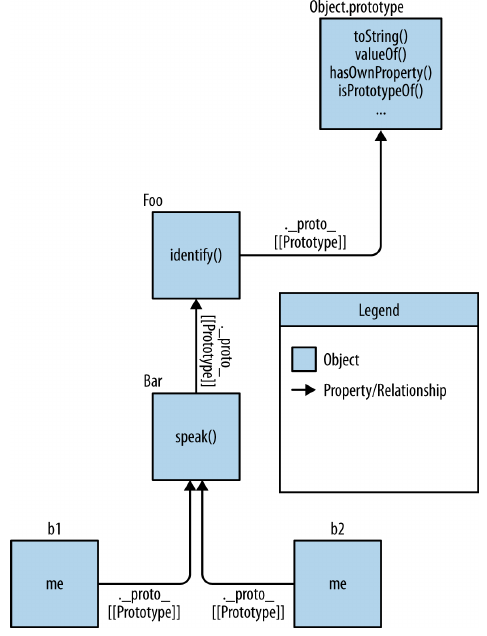

# this & Object Prototypes

## 1. this or That ?

_this_  is a special identifier keyword that's automatically defined in the scope of every function

### Why this?

Let's try to illustrate the motivation and utility of _this_

```js
function identify() {
  return this.name.toUpperCase();
}

function speak() {
  var greeting = "Hello, I'm " + identify.call( this );
  console.log( greeting );
}

var me = {
  name: "Kyle"
};

var you = {
  name: "Reader"
};

identify.call( me ); // KYLE
identify.call( you ); // READER

speak.call( me ); // Hello, I'm KYLE
speak.call( you ); // Hello, I'm READER
```

- The _how_ will be addressed later, let's look on the _why_

- This code snippet allows the `identify()` and `speak()` functions to be reused against multiple _context_ objects(`me` and `you`)

  - Rather than needing a separate version of the function for each object

Instead of relying on _this_ you could have explicitly passed in a context object to both `identify()` and `speak()`

```js
function identify(context) {
  return context.name.toUpperCase();
}

function speak(context) {
  var greeting = "Hello, I'm " + identify( context );
  console.log( greeting );
}

identify( you ); // READER
speak( me ); // Hello, I'm KYLE
```

- _this_ provides a more elegant way of implicitly "passing along" an object reference, leading to cleaner API design and easier reuse

- The more complex the model, more messier gets to pass explicit _context_

### Confusions

_this_ creates confusion when developers try to think about it too literally. There are two meanings often assumed, both incorrect

#### Itself

The first common temptation is to assume _this_ refers to the function itself

Consider the following code, where we attempt to track how many times a function was called

```js
function foo(num) {
  console.log( "foo: " + num );

  // keep track of how many times `foo` is called
  this.count++;
}

foo.count = 0;
var i;

for (i=0; i<10; i++) {
  if (i > 5) {>
    foo( i );
  }
}

// foo: 6
// foo: 7
// foo: 8
// foo: 9

// how many times was `foo` called?
console.log( foo.count ); // 0 -- WTF?
```

- `foo.count` is still 0, but `foo(..)` was in fact called four times
  - The frustration stems from a too literal interpretation of what _this_ (in `this.count++`) means

- `foo.count=0` is adding a property `count` to the function object `foo`
  - But `this.count` reference inside the function, `this` is not pointing to that function object

- Accidentally a global variable `count` with a value of `NaN` was created

Some developers would then, hack the solution creating another object to hold the `count` property

```js
function foo(num) {
  console.log( "foo: " + num );

  // keep track of how many times `foo` is called
  data.count++;
}

var data = {
  count: 0
}

var i;

for (i=0; i<10; i++) {
  if (i > 5) {
    foo( i );
  }
}

// foo: 6
// foo: 7
// foo: 8
// foo: 9

// how many times was `foo` called?
console.log( data.count ); // 4
```

To reference a function object from inside itself, `this` by itself will typically be insufficient, you need a reference to the function via a lexical identifier (variable) that points at it

```js
function foo(num) {
  foo.count = 4; // 'foo' refers to itself
}

setTimeout( function(){
  // anonymous function (no name), cannot
  // refer to itself
}, 10 );
```

- The function callback passed to `setTimeout` has no name identifier, so there's no proper way to refer to the function object itself

```js
function foo(num) {
  console.log( "foo: " + num );

  // keep track of how many times `foo` is called
  foo.count++;
}

foo.count = 0

var i;

for (i=0; i<10; i++) {
  if (i > 5) {
    foo( i );
  }
}

// foo: 6
// foo: 7
// foo: 8
// foo: 9

// how many times was `foo` called?
console.log( foo.count ); // 4
```

Another way of approaching the issue is to force `this` to actually point at the `foo` function object using `call`

```js
function foo(num) {
  console.log( "foo: " + num );

  /// keep track of how many times `foo` is called
  // Note: `this` IS actually `foo` now, based on
  // how `foo` is called (see below)
  this.count++;
}

foo.count = 0

var i;

for (i=0; i<10; i++) {
  if (i > 5) {
    // using `call(..)`, we ensure the `this`
    // points at the function object (`foo`) itself
    foo.call( foo,i );
  }
}

// foo: 6
// foo: 7
// foo: 8
// foo: 9

// how many times was `foo` called?
console.log( foo.count ); // 4
```

#### Its Scope

The next most common misconception about the meaning of `this` is that is somehow refers to the functions scope

`this` does not in any way, refer to a functions lexical scope

### Whats this?

- `this` is not an author-time binding, but a _runtime biding_
- It is contextual based on the conditions of the functions invocation
- `this` binding has nothing to do with where a function is declared, but has to do with the manner in which the function is called

When a function is invoked, an activation record, (execution context) is created

- This record contains info about where the function was called from (the call-stack)

- _HOW_ the function was invokes and _WHAT_ parameters were passed

- One of the properties of this record is the `this` reference, which will be used for the duration of that functions execution

### Review

- `this` is neither a reference to the function itself, nor is it a reference to the functions lexical scope

- `this` is actually a binding that is made when a function is invoked, and _what_ it references is determined entirely by the call-site where the function was called

## 2. this All Makes Sense Now

_this_ is a binding for each function invocation, based entirely on its call-site (how the function is called)

### Call-site

To understand _this_ binding, we have to understand the _call-site_, the location in code where a function is called (not where it's declared)

We must inspect the call-site to answer the question, what is _this_ referencing to ?

Its important to think about the _call-stack_ (the stack of functions that have been called to get us to the current moment in execution)

The _call-site_ we care about is in the invocation _before_ the currently execution function

```js
function baz() {
  // call-stack is: `baz`
  // so, our call-site is in the global scope

  console.log( "baz" );
  bar(); // <-- call-site for `bar`
}

function bar() {
  // call-stack is: `baz` -> `bar`
  // so, our call-site is in `baz`

  console.log( "bar" );
  foo(); // <-- call-site for `foo`
}

function foo() {
  // call-stack is: `baz` -> `bar` -> `foo`
  // so, our call-site is in `bar`

  console.log( "foo" );
}

baz(); // <-- call-site for `baz`
```

### Nothing but Rules

Lets learn how the _call-site_ determines where _this_ will point during the execution of a function

You must inspect the _call-site_ and determine which of 4 rules applies

#### Default Binding

The most common case of function calls: standalone function invocation. Think of this as the default catch-all rule

```js
function foo() {
  console.log(this.a)
}

var a = 2
foo() // 2
```

- Variables declares in the global scope (`var a=2`) are synonymous with _global-object properties_ of the same name

- When `foo()` is called, `this.a` resolves to our global variable `a`

  - The _default binding_ for `this` applies to the function call, an points `this` to the global object

- We examine the call-site to se how `foo()` is called

  - `foo()` is called with a plain, undecorated function reference. None of the other rules apply here, so the _default binding_ applies

If `strict mode` is in effect, the global object is not eligible for the _default binding_

```js
function foo() {
  'use strict'

  console.log(this.a)
}

var a = 2
foo() // TypeError: `this` is `undefined`
```

#### Implicit Binding

Another rule is whether the _call-site_ has an _context object_ (also referred to as an owning or containing object)

```js
function foo() {
  console.log(this.a)
}

var obj = {
  a: 2,
  foo: foo
}

obj.foo(); // 2
```

1. Notice how `foo()` is declared and then added as a reference property onto `obj`

    - The function is not really "owned" or "contained" by the `obj` object

    - However, the _call-site_ uses the `obj` context to reference the function. So you could say the `obj` object "owns" or "contains" the _function reference_ at the time the function is called

2. At the point that `foo()` is called, it's preceded by and object reference to `obj`

    - When there is a context object for a function reference, the _implicit binding_ rule says that it's that object that should be used for the function calls `this` binding

    - Because `obj` is the `this` for the `foo()` call, `this.a` is synonymous with `obj.a`

Only the top/last level of an object property reference chain matters to the _call-site_

```js
function foo() {
  console.log(this.a)
}

var obj2 = {
  a: 42,
  foo: foo
}

var obj1 = {
  a: 2,
  obj2: obj2
}

obj1.obj2.foo(); // 42
```

##### Implicitly lost

One of the most common frustrations that `this` binding creates is when an implicitly bound function loses that binding, which usually falls back to the _default binding_

```js
function foo() {
  console.log(this.a)
}

var obj = {
  a: 2,
  foo: foo
}

var bar = obj.foo

var a = "oops global" // 'a' also property on global object
bar(); // oops global
```

1. `bar` appears to be a reference to `obj`, it's really just another reference to `foo` itself

    - The _call-site_ is what matters, and the _call-site_ is `bar()`, which is a plain, undecorated call, and thus the _default binding_ applies

The more subtle, more common, and unexpected way this occurs is when we consider passing a callback function

```js
function foo() {
  console.log( this.a );
}

function doFoo(fn) {
  // `fn` is just another reference to `foo`

  fn(); // <-- call-site!
}

var obj = {
  a: 2,
  foo: foo
};

var a = "oops, global"; // `a` also property on global object
doFoo( obj.foo ); // "oops, global"
```

1. Parameter passing is just an implicit assignment

    - Since we're passing a function, it's an implicit reference assignment, the end result is the same as the previous snippet

Que pasa si a la función a la que le pasamos el _callback_ no es nuestra función sino una que viene por defecto en el lenguaje. No  hay diferencia, es el mismo resultado

```js
function foo() {
  console.log( this.a );
}

var obj = {
  a: 2,
  foo: foo
};

var a = "oops, global"; // `a` also property on global object

setTimeout(obj.foo, 100) // oops, global
```

Think about this crude theoretical pseudoimplementation of `setTimeout()`

```js
function setTimeout(fn, delay) {
  // wait for the delay
  fn(); // <-- call-site!
}
```

1. Es común que nuestra function callback pierda su `this` binding

2. Pero, otra manera en que `this` nos sorprende es cuando la función a la cual le estamos pasando el _callback_ intencionalmente cambia el `this` for the call

    - Event handlers in JS libraries are quite fond of forcing your callback to have a `this` that points to, for instance, the DOM elements that triggered the event

#### Explicit Binding

All functions have some utilities available to them (via their `[[Prototype]]`), specifically `call(..)` and `apply(...)` methods

This both methods take, as their first parameter, an object to use for the `this` and then invoke the function with that `this` specified.

Since you are directly stating what `this` to be, is called _explicit binding_

```js
function foo() {
  console.log( this.a );
}

var obj = {
  a: 2,
  foo: foo
};

foo.call(obj) // 2
```

- If you pass a simple primitive value (string, boolean or number) as the `this` binding, the primitive value is wrapped in its objects form (`new String(..)`, `new Boolean(..)`, `new Number(...)`), this is called boxing

- _explicit binding_ alone still doesn't offer any solution to a function losing its intended `this` binding

##### Hard binding

```js
function foo() {
  console.log( this.a );
}

var obj = {
  a: 2,
};

var bar = function() {
  foo.call(obj)
}

bar() // 2
setTimeout(bar,100) // 2

// hard-bound `bar` can no longer have its `this` overridden
bar.call( window ); // 2
```

1. We create a function `bar()`, internally, manually calls `foo.call(obj)`

    - Forcibly invoking `foo` with `obj` binding for `this`
    - No matter how you later invoke the function `bar`, it will always invoke `foo` with `obj`
    - This binding is both explicit and strong, we call it _hard binding_

The most typical way to wrap a function with a _hard binding_ creates a pass-through of any arguments passed and any return value received

```js
function foo(something) {
  console.log( this.a, something );
  return this.a + something
}

var obj = {
  a: 2,
};

var bar = function() {
  return foo.apply(obj,arguments)
}

var b = bar(3) // 2 3
console.log(b) // 5
```

Another way to express this pattern is to create a reusable helper:

```js
function foo(something) {
  console.log( this.a, something );
  return this.a + something
}

// simple 'bind' helper
function bind(fn, obj) {
  return function() {
    return fn.apply(obj,arguments)
  }
}

var obj = {
  a: 2,
};

var bar = bind(foo, obj)

var b = bar(3) // 2 3
console.log(b) // 5
```

Since _hard binding_ is such a common patter, it's provided with a built-in utility as of ES5, `Function.prototype.bind`

```js
function foo(something) {
  console.log( this.a, something );
  return this.a + something
}

var obj = {
  a: 2,
};

var bar = foo.bind(obj)

var b = bar(3) // 2 3
console.log(b) // 5
```

1. `bind(...)` return a new function that is hardcoded to call the original function with the `this` context set as you specified

##### API call "contexts"

Many libraries functions, and many new built-in functions in JS and host environment, provide an optional parameter usually called "context" which is designed as a work-around for not having to use `bind(..)`

```js
function foo(el) {
  console.log( el, this.id );
}

var obj = {
  id: "awesome",
};

// use `obj` as `this` for `foo(..)` calls
[1, 2, 3].forEach( foo, obj );
// 1 awesome 2 awesome 3 awesome
```

1. Internally, these functions almost certainly use _explicit binding_ vial `call(...)` or `apply(...)`

#### new Binding

In JS, constructors are just functions that happen to be called with the `new` operator in front of them.
    - They are not attached to classes, nor are they instantiating a class
    - They are not special types of functions
    - They are just regular functions that are, in essence, hijacked by the use of `new` in their invocation

There's really no such thing as "constructor functions" but rather construction calls of functions

When a function is invoked with `new` in front of it, otherwise known as a _constructor call_

  1. A brand new object is created (aka constructed) out of thin air
  2. The newly constructed object is `[[Prototype]]` linked
  3. The newly constructed object is set as the `this` binding for that function call
  4. Unless the function returns its own alternate object, the new invoked function call will _automatically_ return the newly constructed object

```js
function foo(a) {
  this.a = a;
}
var bar = new foo( 2 );
console.log( bar.a ); // 2
```

1. By calling `foo(...)` with `new` in front of it
    - We've constructed a new object
    - Set that new object as the `this` for the call of `foo(..)`

### Everything in Order

1. _explicit_ takes precedence over _implicit_ binding
    - You should ask first if _explicit_ applies before checking for _implicit_

#### Determining `this`

We can summarize the rules for determining `this` from a function calls _call-site_, in their order of precedence

Ask these questions in this order, and stop when the first rule applies

1. Is the function called with `new`, if so, `this` is the newly constructed object

    > var bar = new foo()

2. Is the function called with `call` or `apply` (_explicit_) even hidden inside a `bind` hard binding. If so, `this` is the explicitly specified object

    > var bar = foo.call(obj2)

3. Is the function called with a context (_implicit_) object. If so, `this` is that context object

    > var bar = obj1.foo()

4. Otherwise, default the `this`. If in `strict mode` pick `undefined`, otherwise the `global` object

    > var bar = foo()

### Binding Exceptions

#### Ignored this

If you pass `null` or `undefined` as a `this` binding parameter to `call`, `apply`, or `bind` those values are effectively ignored, and instead the _default binding_ rule applies to the invocation

```js
function foo() {
  console.log(this.a)
}

var a = 2;
foo.call(null) // 2
```

It's quite common to use `apply(..)` for spreading out arrays of values as parameters to a function call. `bind(...)` can curry parameters (preset values), which can be helpful

```js
function foo(a,b) {
  console.log( "a:" + a + ", b:" + b )
}

// spreading out array as parameters
foo.apply( null, [2, 3] ); // a:2, b:3

// currying with `bind(..)`
var bar = foo.bind( null, 2 );
bar( 3 ); // a:2, b:3
```

- ES6 has the _spread operator `...`_, which let you syntactically spread out an array as parameters without `apply(...)`

    > foo(...[2,3]) is equal to foo(1,2)

- If you always use `null`, when using third-party libraries functions, it might inadvertently reference (or mutate) the global `object`

##### Safer this

A safer practice is to pass a object for `this` that is guaranteed not to be an object that can create problematic side effects

We create a DMZ (De-militarized zone) object, a completely empty object

The easiest way to set it up as totally empty is `Object.create(null)`, this is similar to {}, but without the delegation to `Object.prototype`

```js
function foo(a,b) {
  console.log( "a:" + a + ", b:" + b );
}

// our DMZ empty object
var ø = Object.create( null );

// spreading out array as parameters
foo.apply( ø, [2, 3] ); // a:2, b:3

// currying with `bind(..)`
var bar = foo.bind( ø, 2 );
bar( 3 ); // a:2, b:3
```

#### Indirection

You can intentionally or not create "indirect references" to functions, and in those cases, when that function reference is invoked the _default binding_ rule applies

```js
function foo() {
  console.log( this.a );
}

var a = 2;
var o = { a: 3, foo: foo };
var p = { a: 4 };

o.foo(); // 3
(p.foo = o.foo)(); // 2
```

1. The _result value_ of the assignment `p.foo = o.foo` is a reference yo just the underlying function object.

    - The effective _call-site_ is just `foo()`, default binding applies

### Lexical this

Normal functions abide by the four rules we just covered. ES6 introduce arrow functions

Arrow functions, don't follow the 4 rules, they adopt the `this` binding from the enclosing (function or global) scope

```js
function foo() {
  // return an arrow function
  return (a) => {
    // `this` here is lexically inherited from `foo()`
    console.log(this.a)
  }
}

var obj1 = {
  a: 2
};

var obj2 = {
  a:3
}

var bar = foo.call(obj1);
bar.call(obj2); // 2, not 3 !
```

1. The arrow-function crated in `foo()` lexically captures whatever `foo()`s `this` is at its _call-time_

    - Since `foo()` was `this`-bound to `obj1`, `bar` (a reference to the returned arrow-function) will also be bounded to `obj1`
    - The lexical binding of an arrow function cannot be overridden (even with `new`)

The most common use case is in the use of callbacks, such as event handlers or timers

```js
function foo() {
  setTimeout(() => {
    // `this` here is lexically inherited from `foo()`
    console.log( this.a );
  },100);
}

var obj = {
  a: 2
};

foo.call( obj ); // 2
```

While arrow functions provide an alternative to using `bind(...)` on a function to ensure its `this`, they essentially are disabling the traditional `this` mechanism in favor of more widely understood lexical scoping

Pre-ES6, we already have a fairly common patter for doing so

```js
function foo() {
  var self = this; // lexical capture of `this`
  setTimeout( function(){
    console.log( self.a );
  }, 100 );
}

var obj = {
  a: 2
}

foo.call(obj) // 2
```

1. `self=this` and arrow-functions seem like good solutions to not use `bind(..)` they are fleeing from `this` instead of understanding and embracing it

You should

1. Use only lexical scope and forget the false pretense of `this`-style code
2. Embrace `this`-style mechanisms completely including using `bind(...)` where necessary and tru to avoid `self=this` and arrow-function lexical tricks

## 3. Objects

### Syntax

Objects come in two forms, the declarative (literal) form and the constructed form

Literal syntax

```js
var myObj = {
  key: value
  // ...
};
```

Constructed form

```js
var myObj = new Object();
myObj.key = value;
```

1. The only difference is that you can add one or more key/value pairs on the literal declaration, with constructed-form you must add properties one by one

### Type

Objects are one of the six primary types (called "language types" in the specification) in JS

- `string`
- `number`
- `boolean`
- `null`
- `undefined`
- `object`

Note that the simple primitives (string, boolean, number, null and undefined) are not themselves `objects`
    - Null is sometimes as an object type because of an error, `typeof` null return the string "object". In fact, `null` is its own primitive type

There are a few special object subtypes, which we can refer as _complex primitives_

`function` is a subtype of object (technically, a callable object).
    - Functions in JS are said to be "first class" they are basically just normal object (with callable behavior semantics bolted on) and they can be handled like any other plain object

Arrays are also a form of objects, with extra behavior. The organization of contents in arrays is slightly more structured than for general objects

#### Built-in Objects

There are other object subtypes, usually referred to as built-in objects

- `String`
- `Number`
- `Boolean`
- `Object`
- `Function`
- `Array`
- `Date`
- `RegExp`
- `Error`

These built-ins have the appearance of being actual types, but are actually just built-in functions

- Each of there built-in functions can be used as a constructor (function call with the _new_ operator)
- With the result being a newly constructed object of the subtype in question

```js
var strPrimitive = "I am a string";
typeof strPrimitive; // "string"
strPrimitive instanceof String; // false

var strObject = new String( "I am a string" );
typeof strObject; // "object"
strObject instanceof String; // true

// inspect the object sub-type
Object.prototype.toString.call( strObject ); // [object String]
```

1. The primitive value "I'm a string" is not an object, it's a primitive literal and immutable value

    - To perform operations on it, such as checking its length, accessing its individual character contents, etc, a `String` object is required

Luckily, the language automatically coerces a string primitive to a `String` object when necessary, which means you almost never need to explicitly create the `Object` form

It is strongly preferred to use the literal form for a value, where possible, rather than the constructed object form

```js
var strPrimitive = "I am a string";

console.log( strPrimitive.length ); // 13

console.log( strPrimitive.charAt( 3 ) ); // "m"
```

1. In both cases, we call a property or method on a string primitive, and the engine automatically coerces it to a `String` object so that the property/method access work

2. The same sort of coercion happens between the number literal primitive `42` and the `new Number(42)` object wrapper. Likewise for `Boolean` objects from "boolean" primitives

3. `null` and `undefined` have no object wrapper form, only their primitive values

4. `Date` values can only be created with their constructed object form, as they have no literal form counterpart

5. `Objects`, `Arrays`, `Functions` and `RegExps` are all objects regardless of whether the literal or constructed form is used

6. `Error` objects are rarely created explicitly in code, but usually created automatically when exceptions are thrown. They can be created with the constructed form `new Error(...)`

### Contents

The contents of an object consist of values (any type) stored at a specifically named locations, which we call properties

The engine stores values in implementation-dependent ways, what is stored in the container are these property names, which act as pointers (technically, references) to where the values are stored

```js
var myObject = {
  a: 2
};

myObject.a; // 2
myObject["a"]; // 2
```

1. To access `a` we need either the `.` operator or the `[]` operator.
    - The `.a` is referred as _property access_
    - The `["a"]` is referred as _key access_
    - They both access the same location, and pull the same value

    - The `.` operator requires and `Identifier`-compatible property name after it
    - The `[".."]` can take any UTF-8/Unicode-compatible string as the name for the property

Since the `["..."]` syntax uses a strings value to specify the location this means the program can programmatically build up the value of the string

```js
var myObject = {
  a: 2
}

var idx;

if (wantA) {
  idx = "a"
}

// later
console.log(myObject[idx]) // 2
```

In objects, property names are _always_ strings. If you use any other values besides a _string_ as the property, it will first be converted to a string.

```js
var myObject = { };

myObject[true] = "foo";
myObject[3] = "bar";
myObject[myObject] = "baz";

myObject["true"]; // "foo"
myObject["3"]; // "bar"
myObject["[object Object]"]; // "baz"
```

#### Property Versus Method

It´s tempting to think of the functions as belonging to the object, and in other languages, functions that belong to objects (aka "classes") are referred as _methods_

Technically functions never "belong" to objects, saying that a function that happens to be _accessed_ on an object reference is a method is a stretch

Every time you access a property on an object, that is a property access, regardless of the type of value you get back

```js
function foo() {
  console.log("foo")
}

var someFoo = foo;

var myObject = {
  someFoo: foo
}

foo; // function foo(){..}
someFoo; // function foo(){..}
myObject.someFoo; // function foo(){..}
```

1. `someFoo` and `myObject.someFoo` are just two separate references to the same function

    - If `foo()` was defined to have a `this` reference inside it, that `myObject.someFoo` _implicit binding_ would be the only observable difference between the 2 references

The safest conclusion is probably that "function" and "method" are interchangeable in JS

```js
var myObject = {
  foo: function () {
    console.log("foo")
  }
}

var someFoo = myObject.foo
someFoo; // function foo(){..}
myObject.foo // function foo(){..}
```

#### Arrays

Arrays also use the `[]` access form, but as mentioned earlier, they have slightly more structured organization for how and where values are stored.

Arrays assume numeric indexing, at positive integers begin in 0

```js
var myArray = [ "foo", 42, "bar" ];
myArray.length; // 3
myArray[0]; // "foo"
myArray[2]; // "bar"
```

Arrays are objects, so even though each index is a positive integer, you can also add properties onto the array

```js
var myArray = [ "foo", 42, "bar" ];
myArray.baz = "baz";
myArray.length; // 3
myArray.baz; // "baz"
```

1. Adding named properties (regardless of `.` or `[]` operator syntax) does not change the reported `length` of the array

Use objects to store key/value pairs, and arrays to store values at numeric indices

If you try to add a property to an array, but the property name looks like a number, it will end up instead as a numeric index (modifying the array contents)

```js
var myArray = [ "foo", 42, "bar" ];
myArray["3"] = "baz";
myArray.length; // 4
myArray[3]; // "baz"
```

#### Duplicating Objects

It's not fully clear what, by default, should be the algorithm for the duplication

```js
function anotherFunction() { /*..*/ }

var anotherObject = {
  c: true
};

var anotherArray = [];
var myObject = {
  a: 2,
  b: anotherObject, // reference, not a copy!
  c: anotherArray, // another reference!
  d: anotherFunction
};

anotherArray.push( anotherObject, myObject );
```

We should answer if it should be a _shallow copy_ or _deep copy_

1. A _shallow copy_ would end up with `a` on the new object as a copy of the value 2, but the `b`, `c`, and `d` properties as just references to the same places as the references in the original object

2. A _deep copy_ would duplicate not only `myObject` but `anotherObject` and `anotherArray`

    - But `anotherArray` has references to `anotherObject` and `myObject` in it, so those should also be duplicated rather than reference-preserved. Infinite circular duplication problem because of the circular reference

A _shallow copy_ is fairly understandable and has far fewer issues, ES6 has now defined `Object.assign(...)` for this task

- Takes a target object as its first parameter, and one more source objects as its subsequent parameters

- It iterates over all the enumerable owned keys (immediately present) on the source object and copies them (via `=` assignment) to the target

- It also returns the target as you can see

```js
var newObj = Object.assign( {}, myObject );

newObj.a; // 2
newObj.b === anotherObject; // true
newObj.c === anotherArray; // true
newObj.d === anotherFunction; // true
```

#### Property Descriptors

As of ES5, all properties are described in terms of a _property descriptor_

```js
var myObject = {
  a: 2
};

Object.getOwnPropertyDescriptor( myObject, "a" );
// {
//   value: 2,
//   writable: true,
//   enumerable: true,
//   configurable: true
// }
```

We can use `Object.defineProperty(..)` to add a new property or modify an existing one (if it's `configurable`)

```js
var myObject = {};

Object.defineProperty( myObject, "a", {
  value: 2,
  writable: true,
  configurable: true,
  enumerable: true
} );

myObject.a; // 2
```

##### Writable

The ability to change the value of a property

```js
var myObject = {};

Object.defineProperty( myObject, "a", {
  value: 2,
  writable: false, // not writable!
  configurable: true,
  enumerable: true
});

myObject.a = 3;
myObject.a; // 2
```

If we use `strict mode` we will get a `TypeError`

##### Configurable

As long as a property is currently configurable, we can modify its descriptor definition using `defineProperty(..)`

```js
var myObject = {
  a: 2
};

myObject.a = 3;
myObject.a; // 3

Object.defineProperty( myObject, "a", {
  value: 4,
  writable: true,
  configurable: false, // not configurable!
  enumerable: true
} );

myObject.a; // 4
myObject.a = 5;
myObject.a; // 5

Object.defineProperty( myObject, "a", {
  value: 6,
  writable: true,
  configurable: true,
  enumerable: true
} ); // TypeError
```

If you attempt yo change the descriptor definition of a nonconfigurable property, you get a `TypeError`

Another thing `configurable: false` prevents is the use of `delete` to remove an existing property

##### Enumerable

Controls whether a property will show up in certain object-property enumerations such as the `for...in` loop

#### Immutability

ES5 adds support for handling immutability

All of the approaches create shallow immutability, only affect the object and its direct characteristics. If an object has a reference to another (array, object, function) the contents of that object are not affected and remain mutable

##### Object constant

By combining `writable: false` and `configurable: false` you essentially create a constant as an object property

```js
var myObject = {}

Object.defineProperty(myObject, "favorite_number", {
  value: 42,
  writable: false,
  configurable: false,
})
```

##### Prevent extensions

If you want to prevent an object from having new properties added to it, but leve the rest of the objects properties alone

```js
var myObject = {
  a: 2
};

Object.preventExtensions( myObject );

myObject.b = 3;
myObject.b; // undefined
```

##### Seal

`Object.seal(..)` creates a sealed object, which means it takes an existing object and essentially calls `Object.preventExtensions(..)` on it, but also marks all its existing properties as `configurable: false`

You can not add any more properties, but also cannot reconfigure or delete any existing properties (you can still modify their values)

##### Freeze

`Object.freeze()` creates a frozen object, it takes an existing object and calls

1. `Object.seal(...)` and marks all "data accessor" as `writable: false` so that their values cannot be changed

This is the highest level of immutability

##### `[[Get]]`

There's a subtle but important detail about how property accesses are performed

```js
var myObject = {
  a: 2
};

myObject.a; // 2
```

The `myObject.a` is a property access but it doesn't just look in `myObject` for a property of the name `a` as it might seem

The previous code actually performs a `[[Get]]` operation (kinda like a function call: `[[Get]]()`) on the `myObject`

- The default built-in `[[Get]]` operation for an object _first_ inspects the object for a property of the requested name, and if it finds it, it will return the value accordingly

If `[[Get]]` cannot come up with a value for the property, returns `undefined`

```js
var myObject = {
  a: 2
};

myObject.b; // undefined
```

This behavior is different from when you reference _variables_ by their identifier names.
    - If you reference a variable that cannot be resolved within the applicable lexical scope, the result is not `undefined` as it is for _object properties_, but instead `ReferenceError`

```js
var myObject = {
  a: undefined
};

myObject.a; // undefined
myObject.b; // undefined
```

1. The `[[Get]]` operations potentially performed a bit more "work" for the reference `myObject.b` than for `.a`

2. Inspecting only the value results, you cannot distinguish whether a property exist and holds the explicit value `undefined` or whether the property does not exist and `undefined` was the return value after `[[Get]]` failed

#### `[[Put]]`

His behaves differs based on a number of factors, including whether the property is already present or not

If is present, will roughly check:

1. Is the property an accessor descriptor? If so, call the setter, if any
2. Is the property a data descriptor with `writable` of `false`? If so, fail in `non-strict` or throw `TypeError` in `strict mode`
3. Otherwise set the value to the existing property as normal

#### Getters and Setters

`[[Put]]` and `[[Get]]` control how values are set to existing or new properties

ES5 introduced a way to override part of these default operations

When you define a property to have either a getter or a setter, its definition becomes an _accessor descriptor_ (as opposed to a _data descriptor_)

For _accessor descriptor_ the `value` and `writable` characteristics of the descriptor are moot and ignored, and JS considers the `set` and `get` (as well as `configurable` and `enumerable`)

```js
var myObject = {
  // define a getter for `a`
  get a() {
    return 2;
  }
};

Object.defineProperty(
  myObject, // target
  "b",  // property name
  {     // descriptor
    // define a getter for `b`
    get: function(){ return this.a * 2 },

    // make sure `b` shows up as an object property
    enumerable: true
  }
);

myObject.b; // 4
```

1. Either trough object-literal syntax with `get a() {..}` or explicit definition with `defineProperty(..)` in both cases we created a property on the object that actually doesn't hold a value

    - But whose access automatically results in a hidden function call to the getter function, with whatever value it returns being the result of the property access

```js
var myObject = {
  // define a getter for `a`
  get a() {
    return 2;
  }
};

myObject.a = 3;
myObject.a; // 2
```

1. Since we only defined a getter for `a`, the `set` operation won't throw an error but will just silently throw the assignment away

    - Even if there was a `setter` our custom getter is hardcoded to return only `2`, the `set` operation would be moot

Properties should be defined with setter, which overrides the `[[Put]]` operation (aka assignment)

```js
var myObject = {
  // define a getter for `a`
  get a() {
    return this._a_;
  },

  // define a setter for `a`
  set a(val) {
    this._a_ = val * 2;
  }
};

myObject.a = 2;
myObject.a; // 4
```

#### Existence

We can ask an object if it has a certain property without asking to get that property's value

```js
var myObject = {
  a: 2
}

("a" in myObject) // true
("b" in myObject) // false

myObject.hasOwnProperty("a"); // true
myObject.hasOwnProperty("b"); // false
```

1. The `in` operator will check to see if the property is in the object or if it exists ay any higher level of the `[[Prototype]]` chain object traversal

    - `in` checks for the existence of a property name
    - This difference is important to note with arrays, as the temptation to try a check link `4 in [2,4,6]`, will not behave as expected

2. `hasOwnProperty(..)` checks to see if _only_ `myObject` has the property or not and will not consult the `[[Prototype]]` chain

##### Enumeration

```js
var myObject = { };

Object.defineProperty(
  myObject,
  "a",
  // make `a` enumerable, as normal
  { enumerable: true, value: 2 }
);

Object.defineProperty(
  myObject,
  "b",
  // make `b` NON-enumerable
  { enumerable: false, value: 3 }
);

myObject.b; // 3
("b" in myObject); // true
myObject.hasOwnProperty( "b" ); // true

// .......
for (var k in myObject) {
  console.log( k, myObject[k] );
}
// "a" 2
```

1. `myObject.b` exists, has an accessible value but it doesn't show up in a `for..in` loop

    - It's a good idea to use `for..in` loops only on objects and `for` loops with numeric index iteration for arrays

Another way that enumerable and nonenumerable properties can be distinguished

```js
var myObject = { };

Object.defineProperty(
  myObject,
  "a",
  // make `a` enumerable, as normal
  { enumerable: true, value: 2 }
);

Object.defineProperty(
  myObject,
  "b",
  // make `b` NON-enumerable
  { enumerable: false, value: 3 }
);

myObject.propertyIsEnumerable("a") // true
myObject.propertyIsEnumerable("b") // false

Object.keys(myObject); // ['a']
Object.getOwnPropertyNames(myObject) // ['a','b']
```

1. `propertyIsEnumerable` test whether the given property name exists _directly_ on the object and is also `enumerable:true`
2. `Object.keys(...)` returns an array of all enumerable properties
3. `Object.getOwnPropertyNames(...)` returns an array of all properties

`Object.keys(...)` and `Object.getOwnPropertyNames(...)` both inspect _only_ the direct object specified

### Iteration

The `for...in` loop iterates over the list of enumerable properties on an object.

If you want to iterate over the values, with numerically indexed arrays is possible with a `for` loop

```js
var myArray = [1, 2, 3];

for (var i = 0; i < myArray.length; i++) {
  console.log( myArray[i] );
}
// 1 2 3
```

- This isn't iterating over the values, it is iterating over the indices, then using the index to reference de value as `myArray[i]`

ES5 added several iteration helpers for arrays, these helpers accepts a function callback to apply to each element in the array, differing only in how they respectively respond to a return value from the callback

1. _forEach(...)_

    Will iterate over all values in the array, and it ignores any callback return values

2. _every(..)_

    Keeps going until the end or the callback returns a `false` or `falsy` value

3. _some(...)_

    Keeps going until the end or the callback return a `true` or `truthy` value

These special return values inside `every(..)` and `some(...)` act like a `break` statement inside a normal `for` loop

If you want to iterate over the values directly instead of the array indices (or object properties?), ES6 adds a `for...of` loop

```js
var myArray = [ 1, 2, 3 ];

for (var v of myArray) {
  console.log( v );
}
// 1
// 2
// 3
```

The `for..of` asks for an iterator object (from a default internal function know as `@@iterator` in spec-speak) of the _thing_ to be iterated
    - The loop then iterates over the successive return values from calling that iterator object's `next()` method, once for each loop

Arrays have a built-in `@@iterator`, so `for...of` works easily on them, let's manually iterate the array using the built-in `@@iterator`

```js
var myArray = [1,2,3];
var it = myArray[Symbol.iterator]();

it.next(); // { value:1, done:false }
it.next(); // { value:2, done:false }
it.next(); // { value:3, done:false }
it.next(); // { done:true }
```

1. We get at the `@@iterator` internal property of an object using an ES6 `Symbol.iterator`

    - You will always want to reference such special properties by `Symbol` name reference instead of by the special value it may hold

    - Despite the names implications, `@@iterator` is not the iterator object itself, but a function that returns the iterator object

2. The return value from an iterator's `next()` call is an object of the form `{value:..., done:...}`. Value is the current iteration value, and done is a boolean that indicated whether there's more to iterate

3. The `value` 3 was returned with a `done:false`, you have to call the `next()` a fourth time to get `done:true`. The reason for this comes from the semantics of ES6 generator functions

Regular objects do not have a built-in `@@iterator`, but it is possible to define your own

```js
var myObject = {
  a: 2,
  b: 3,
}

Object.defineProperty( myObject, Symbol.iterator, {
  enumerable: false,
  writable: false,
  configurable: true,
  value: function() {
    var o = this;
    var idx = 0;
    var ks = Object.keys(o);
    return {
      next: function() {
        return {
          value: o[ks[idx++]],
          done: (idx > ks.length)
        }
      }
    }
  }
})

// iterate `myObject` manually
var it = myObject[Symbol.iterator]();
it.next() // {value:2, done: false}
it.next() // {value:3, done: false}
it.next() // {value:undefined, done: true}

// iterate `myObject` with `for..of`
for (var v of myObject) {
  console.log( v );
}
// 2
// 3
```

1. We used `Object.defineProperty(...)` do define `@@iterator` and to make it nonenumerable, it could also be defined using the `Symbol` as a _computed property name_, we could have declared ir directly

    ```js
      var myObject = {
        a: 2,
        b: 3,
        [Symbol.iterator]: function () {
          ....
        }
      }
    ```

2. Each time the `for..of` loop calls `next()` on `myObject`, the internal pointer will advance and return back the next value from the object's properties list

3. You can define arbitrarily complex iterations for your data, _custom iterators_ combined with ES6 `for...of` loop are a powerful new syntactic tool for manipulating user-defined objects

### 3. Review

Objects have a literal form `var a = {...}` and a constructed form `var a = new Array(...)`

Objects are one of the six primitive types, objects have subtypes, including `function` and can be behavior-specialized like `[object Array]`

Objects are collections of key/values, values can be accessed as properties via the `.propName` or `["propName"]`
    - Whenever a property is accessed, the engine invokes the internal default `[[Get]]` (`[[Put]]` for setting values)
    - The property is locked directly on the object, and on the `[[Prototype]]` chain if not found

Properties have certain characteristics that can be controlled trough property descriptors, such as `writable` and `configurable`

In addition, objects can have their mutability controlled to various levels using:

  > Object.preventExtensions(..)
  > Object.seal(...)
  > Object.freeze(...)

Properties don't have to contain values, they can be _accessor properties_ as well, with getters/setters

Properties can be either enumerable or not, which controls wether they show up in `for..in` loop iterations

You can iterate over the values in data structures (arrays, objects, etc) using the ES6 `for...of`, which looks for either a built-in or custom `@@iterator` object consisting of a `next()` method to advance through the data values one at a time

## 4. Mixing Up Classes

1. Classes are a design pattern. JS has a similar syntax, but it behaves very differently from what your'e used to with classes in other languages

2. Classes mean copies

3. When traditional classes are instantiated, a copy of behavior from class to instance occurs

4. When classes are inherited, a copy of behavior from parent to child occurs

5. Polymorphism (having different functions at multiple levels of an inheritance chain with the same name) is just a result of copy behavior
    - May seem like it implies a referential relative link from child back to parent, but it's not the case

6. JS does not automatically create copies (as classes imply) between objects

7. The _mixin pattern_ (explicit & implicit) is used to sort of emulate class copy behavior, but this usually leads to ugly and brittle syntax like explicit pseudopolymorphism

    > OtherObj.methodName.call(this,...)

8. Explicit mixins are not exactly the same as class-copy behavior, since objects (and functions) only have shared references duplicated, not the object/functions themselves

## 5. Prototypes

### `[[Prototype]]`

Objects in JS have an internal property, `[[Prototype]]`, which is a reference to another object

```js
var anotherObject = {
  a: 2
}

var myObject = Object.create(anotherObject)

myObject.a; // 2
```

1. `myObject` is `[[Prototype]]` linked to another object
2. `myObject.a` doesn't actually exists, but the property is access via the `[[Prototype]]` chain and finds the value 2 o `anotherObject`

The `[[Prototype]]` chain is consulted, one link at a time, when you perform property lookups and stops once the property is found or the chain ends

#### Object.prototype

The _end_ of every normal `[[Prototype]]` chain is the built-in `Object.prototype`

This object includes a variety of common utilities used all over JS, all normal objects in JS "descend" from the `Object.prototype` object

#### Setting and Shadowing Properties

> myObject.foo = "bar"

1. If `myObject` object already has a normal data accessor property called `foo` directly present on it, the assignment is simple and change the value of the existing property

2. If `foo` is not already on `myObject`, the `[[Prototype]]` chain is traversed, like for the `[[Get]]` operation. If `foo` is not found anywhere in the chain, the property is added directly to `myObject`

3. If `foo` exist on `myObject` and at a higher level of the `[[Prototype]]`, this is called _shadowing_

    - The `foo` on `myObject` _shadows_ any `foo` that appears higher in the chain

    - The lookup would always find the `foo` that's lowest in the chain

4. If `foo` exist on a higher level and not on `myObject` there are 3 scenarios

    1. If `foo` exist up on the chain and is not marked as read-only (`writable: false`), a new `foo` is added to `myObject` _shadowing_ the property

    2. If `foo` exist up and is marked as read-only. Setting that existing property and creating a shadowed property on `myObject` are disallowed

    3. If `foo` exist up and is a setter, the setter will always be called. No `foo` will be added to `myObject`, nor will the `foo` setter be redefined

Most developers assume that assignment of a property (`[[Put]]`) will always result in shadowing if the prop already exist higher, this is only true on case 4.1

To shadow `foo` in cases 4.2 and 4.3 you cant use `=` assignment, you must use `Object.defineProperty(...)` to add `foo` to `myObject`

Usually _shadowing_ is more complicated and nuanced than it's worth, so you should try to avoid if possible

Shadowing can occur implicitly in subtle ways

```js
var anotherObject = {
  a: 2
}

var myObject = Object.create(anotherObject)

anotherObject.a; // 2
myObject.a; // 2

anotherObject.hasOwnProperty( "a" ); // true
myObject.hasOwnProperty( "a" ); // false

myObject.a++; // oops, implicit shadowing!

anotherObject.a; // 2
myObject.a; // 3

myObject.hasOwnProperty( "a" ); // true
```

1. It may appear that `myObject.a++` should via delegation look up and just increment `anotherObject.a`, instead the `++` is equal to

    > myObject.a = myObject.a + 1

    The result is

    - `[[Get]]` looking up `a` via `[[Prototype]]` to get the value 2 from `anotherObject.a`

    - Increment the value by one, then `[[Put]]` assigning the 3 value to a new shadowed property `a` on `myObject`

### "Class"

#### "Class" Functions

All functions by default get a public, nonenumerable property on them called `prototype` which points at an otherwise arbitrary object

```js
function Foo() {
  // ...
}

Foo.prototype; // { }
```

1. Each object created from calling `new Foo()` will end up `[[Prototype]]` linked to this `Foo.prototype` object

```js
function Foo() {
  // ...
}

var a = new Foo();
Object.getPrototypeOf(a) === Foo.prototype; // true
```

1. When `a` is created by calling `new Foo()`, `a` gets an internal `[[Prototype]]` link to the object that Foo.prototype is pointing at

2. In _class-oriented_ languages, multiple copies (instances) of a class can be make, instantiating a class means _copy the behavior plan from that class into a physical object_

3. In JS there are no copy actions performed, you don't create multiple instances of a class

    - You can create multiples objects that are `[[Prototype]]` linked to a _common object_

    - By default, no copying occurs, these objects _don't end up totally separate and disconnected from each other_, but rather they are _linked_

4. `new Foo()` results in a new object, and that new object is internally `[[Prototype]]` linked to the `Foo.prototype` object

5. We end up with 2 objects, linked to each other
    - We didn't instantiate a class
    - We didn't copy any behavior from a class to a object

#### "Constructors"

```js
function Foo() {
  // ...
}

Foo.prototype.constructor === Foo; // true
var a = new Foo();
a.constructor === Foo; // true
```

The `Foo.prototype` object by default (at declaration-time on line 1) gets a public, nonenumerable property called `.constructor` and this _property_ is a reference back to the function (`Foo` in this case)

`Foo` is no "constructor", functions themselves are not constructors.

However, when you put `new` in front of a normal function call, that makes that function call a constructor call. `new` hijacks any normal function and calls it in a fashion that _constructs_ and object, in addition to whatever else it was going to do

```js
function NothingSpecial() {
  console.log( "Don't mind me!" );
}

var a = new NothingSpecial();
// "Don't mind me!"

a; // {}
```

In JS a _constructor_ is any function called with the `new`  keyword in front of it

#### Mechanics

JS developers have strived to simulate as much as they can of class orientation

```js
function Foo(name){
  this.name = name
}

Foo.prototype.myName = function() {
  return this.name
}

var a = new Foo( "a" );
var b = new Foo( "b" );

a.myName(); // "a"
b.myName(); // "b"
```

1. `this.name = name` adds the `.name` property onto each object
2. `Foo.prototype.myName = ....` adds a property to the `Foo.prototype`
3. When `myName()` is invoked, the engine fail to find them on `a` and `b` but find it on the `Foo.prototype`

##### "Constructor" redux

Recall the `.constructor` and how `a.constructor === Foo` make it see like `a` has an actual `.constructor`

1. `.constructor` reference is delegated up to `Foo.prototype` which happens to, by default, have a `.constructor` that points to `Foo`

2. It's just coincidence that `a.construct` points to `Foo` via the default `[[Prototype]]` delegation

3. `.constructor` property on `Foo.prototype` is only there by default on the object created when `Foo` the function is declared

    - If you create a new object, and replace a function's default `.prototype` object reference, the new object will not get a `.constructor` on it

```js
function Foo() { /* .. */ }

Foo.prototype = { /* .. */ }; // create a new prototype object

var a1 = new Foo();
a1.constructor === Foo; // false!
a1.constructor === Object; // true!
```

1. `a1` has no `.constructor` so delegates to `[[Prototype]]` chain to `Foo.prototype`, this doesn't have a `.constructor` either so it keeps delegating this time to `Object.prototype` the _top_ of the delegation chain

### Object Links

#### Creating Links

`[[Prototype]]` mechanism is not like classes, instead creates links between proper objects

```js
var foo = {
  something: function() {
    console.log( "Tell me something good..." );
  }
};

var bar = Object.create( foo );
bar.something(); // Tell me something good...
```

1. `Object.create(..)` creates a new object `bar` linked to the object specified `boo` which gives us all the power of `[[Prototype]]` mechanism without complications of `new` functions acting as classes and constructor calls

2. We don't need classes to create meaningful relationships between two objects. The only thing we should really care about is objects linked together for delegation, and `Object.create(...)` gives us that linkage without all the class cruft

### 5. Review

1. When attempting a property access on an object that doesn't have that property, the internal `[[Prototype]]` linkage defines where the `[[Get]]` operation should look next

2. This cascading linkage from object to object essentially, defines a "prototype chain" of objects to traverse for property resolution

    - Somewhat similar to a nested scope chain

3. All objects have the built-in `Object.prototype` as the top of the prototype chain (like the global scope) where property resolution will stop if not found anywhere prior in the chain

4. In JS no copies are made, rather, objects end up linked to each other via an internal `[[Prototype]]` chain

5. _Delegation_ is a more appropriate term, because these relationships are not copies but delegation links

## 6. Behavior Delegation

### Toward Delegation-Oriented Design

We need to try to change our thinking from the class/inheritance design pattern to the behavior delegation design pattern

#### Class Theory

If we have similar tasks (XYZ, ABC), with classes you design like this:

1. Define a general parent (base) class like `Task` with shared behavior
2. Define child classes `XYZ`, `ABC` which inherit from `Task` and each adds specialized behavior
3. _Class design_ encourages you to employ _method overriding_ to get the most of inheritance
    - You override the definition of some methods on `Task`

```js
class Task {
  id;

  // constructor `Task()`
  Task(ID) { id = ID; }
  outputTask() { output( id ); }
}

class XYZ inherits Task {
  label;

  // constructor `XYZ()`
  outputTask() { super(); output( label ); }
  XYZ(ID,Label) { super( ID ); label = Label; }
}

class ABC inherits Task {
  // ...
}
```

1. You can _instantiate_ copies of the `XYZ` child class and use those instances to perform "task" `XYZ`
2. After construction, you will generally only interact with these instances (and not the classes)
3. The instances have copies of all the behavior you need to do the intended task

#### Delegation Theory

With _behavior delegation_ instead of classes

1. Define an _object_ called `Task`, it will have concrete behavior on it
    - Includes methods that varios tasks can use (_delegate to!_)

2. For each task `XYZ` you define an object to hold that task-specific data/behavior
    - You link your task-specific objects to the `Task` utility object, allowing them to delegate to it when they need to

Basically, think about needing behaviors from 2 sibling objects (`XYZ` and `Task`) to perform tha task `XYZ`

```js
Task = {
  setID: function(ID) { this.id = ID }
  outputID: function() { console.log( this.id ) }
}

// make `XYZ` delegate to `Task`
XYZ = Object.create( Task )

XYZ.prepareTask = function(ID, Label) {
  this.setID(ID)
  this.label = Label
}

XYZ.outputTaskDetails = function() {
  this.outputID()
  console.log( this.label )
}
```

1. `XYZ` and `Task` are not classes, or functions, they are just objects
    - `XYZ` delegate to the `Task` object

2. This style of code is called _OLOO (Object Linked to Other Objects)_

3. `id` and `label` on the _class_ example are properties directly on `XYZ`
    - In general, you want state to be on the delegators (XYZ) not on the delegate(Task)

4. With _class_ intentionally name methods the same so we can take advantage of overriding
    - In _behavior delegation_ we avoid naming things the same at different levels of the `[[Prototype]]` chain

    - This design pattern calls for more descriptive method names, specific to the type of behavior each object is doing

5. `this.setID(ID)` inside of a method on the `XYZ` object first look for `setID(..)` on `XYZ`

    - It doesn't find a method on `XYZ`, `[[Prototype]]` delegation kicks in, follow the link to `Task` to look for `setID(...)` which finds
    - Because of implicit call-site `this` binds to `XYZ` as we'd expect
    - The general utility methods that exist on `Task` are available to us while interacting with `XYZ`, because XYZ can delegate to `Task`

_Behavior delegation_ means to let some object (XYZ) provide a delegation (to Task) for property or method references if they are not found on the object (XYZ)

#### Mental Models Compared

Let's compare Object Orientated and OLOO styles

```js
// * Object Oriented Style
function Foo(who) {
  this.me = who;
}

Foo.prototype.identify = function() {
  return "I am " + this.me;
};

function Bar(who) {
  Foo.call( this, who );
}

Bar.prototype = Object.create( Foo.prototype );

Bar.prototype.speak = function() {
  alert( "Hello, " + this.identify() + "." );
};

var b1 = new Bar( "b1" );
var b2 = new Bar( "b2" );

b1.speak();
b2.speak();
```

Class-style code snippet implies this mental model of entities and their relationships


```js
// ! Object Linked to Other Object
Foo = {
  init: function(who) {
    this.me = who
  },

  identify: function() {
    return 'I am' + this.me
  },
}

Bar = Object.create(Foo)

Bar.speak = function() {
  alert('Hello' + this.identify() + '.')
}

var b1 = Object.create( Bar );
b1.init( "b1" );
var b2 = Object.create( Bar );
b2.init( "b2" );

b1.speak();
b2.speak();
```

Mental model for Object Link to Other Object



### Classes Versus Objects

#### Widget Classes

Let's examine how we'd implement the class design in classic-style pure JS without any class helper library or syntax

```js
// ! Parent class
function Widget(width,height) {
  this.width = width || 50;
  this.height = height || 50;
  this.$elem = null;
}

Widget.prototype.render = function($where) {
  if (this.$elem) {
    this.$elem.css({
      width: this.width + "px";
      height: this.height + "px";
    }).appendTo($where)
  }
}

// * Child class
function Button(width, height, label) {
  // super constructor call
  Widget.call(this, width, height)
  this.label = label || 'Default'

  this.$elem = $('<button>').text(this.label)
}

// make 'Button' inherit from Widget
Button.prototype = Object.create(Widget.prototype)

// Override base inherited render(...)
Button.prototype.render = function($where) {
  // "super" call
  Widget.prototype.render.call(this, $where)
  this.$elem.click(this.onClick.bind(this))
}

Button.prototype.onClick = function(evt) {
  console.log("Button" + this.label + "clicked")
}

$(document).ready(function(){
  var $body = $(document.body)
  var btn1 = new Button(125,30,'Hello')
  var btn2 = new Button(150,40,'World')

  btn1.render($body)
  btn2.render($body)
})
```

1. Object Oriented pattern tell us to declare a base `render(...)` in the parent class, then override it in our child class to augment the base functionality with button-specific behavior

2. Notice the ugliness of explicit pseudopolymorphism with `Widget.call` and `Widget.prototype.render.call` references for faking _super_ calls from the child class

##### ES6 class sugar

ES6 added class, lets see how the code will change

```js
class Widget {
  constructor(width,height) {
    this.width = width || 50;
    this.height = height || 50;
    this.$elem = null;
  }

  render($where){
    if (this.$elem) {
      this.$elem.css({
        width: this.width + "px",
        height: this.height + "px"
      }).appendTo($where);
    }
  }
}

class Button extends Widget {
  constructor(width,height,label) {
  super( width, height );
  this.label = label || "Default";
  this.$elem = $( "<button>" ).text( this.label );
}

  render($where) {
    super( $where );
    this.$elem.click( this.onClick.bind( this ) );
  }

  onClick(evt) {
    console.log( "Button '" + this.label + "' clicked!" );
  }
}

$( document ).ready( function(){
  var $body = $( document.body );
  var btn1 = new Button( 125, 30, "Hello" );
  var btn2 = new Button( 150, 40, "World" );
  btn1.render( $body );
  btn2.render( $body );
} );
```

1. Despite syntactic improvements, these are not real classes, they still operate with `[[Prototype]]`

#### Delegating Widget Objects

```js
var Widget = {
  init: function(width, height) {
    this.width = width || 50;
    this.height = height || 50;
    this.$elem = null;
  },

  insert: function($where) {
    if (this.$elem) {
      this.$elem.css({
        width: this.width + 'px',
        height: this.height + 'px',
      }).appendTo($where)
    }
  }
}

var Button = Object.create(Widget)

Button.setup = function(width,height,label) {
  // Delegate call
  this.init(width, height)
  this.label = label || 'Default'

  this.$elem = $('<button>').text(this.label)
}

Button.build = function($where) {
  // Delegated call
  this.insert($where)
  this.$elem.click(this.onClick.bind(this))
}

Button.onClick = function(evt) {
  console.log('Button' + this.label + 'clicked')
}

$( document ).ready( function(){
  var $body = $( document.body );

  var btn1 = Object.create( Button );
  btn1.setup( 125, 30, "Hello" );

  var btn2 = Object.create( Button );
  btn2.setup( 150, 40, "World" );

  btn1.build( $body );
  btn2.build( $body );
} );
```

1. `Widget` is just an object and is a utility collection that any specific type of widget might want to delegate to
2. `Button` is also just a standalone object (with a delegation link to `Widget`)

3. From a design pattern perspective, we didn't share the same method name `render(...)` in both objects, as classes suggets

    - We chose different names `insert(...)` and `build(...)` that were more descriptive of what task each does

    - The _initialization_ methods are called `init(..)` and `setup(...)` for the same reason

    - This avoid the ugliness of the explicit pseudopolymorphic calls (`Widget.call` and `Widget.prototype.render.call`) as you can see by the simple delegated calls to `this.init(..)` and `this.insert(..)`

4. We don't have any constructors, `.prototype` ir `new` present, they are unnecessary

5. We first setup button and then build it, _OLOO_ better supports the principle of separation of concerns, where creation and initialization are not necessarily conflated into the same operation

### Simpler Design

Example of behavior for a login

```js

var LoginController = {
  errors: [],

  getUser: function() {
    return document.getElementById(
    "login_username"
    ).value;
  },

  getPassword: function() {
    return document.getElementById(
    "login_password"
    ).value;
  },

  validateEntry: function(user,pw) {
    user = user || this.getUser();
    pw = pw || this.getPassword();

    if (!(user && pw)) {
      return this.failure(
        "Please enter a username & password!"
      );
    } else if (user.length < 5) {
      return this.failure(
        "Password must be 5+ characters!"
      );
    }

    // got here? validated!
    return true;
  },

  showDialog: function(title,msg) {
    // display success message to user in dialog
  },

  failure: function(err) {
    this.errors.push( err );
    this.showDialog( "Error", "Login invalid: " + err );
  }
};

// Link `AuthController` to delegate to `LoginController`
var AuthController = Object.create( LoginController );

AuthController.errors = [];

AuthController.checkAuth = function() {
  var user = this.getUser();
  var pw = this.getPassword();

  if (this.validateEntry( user, pw )) {
    this.server( "/check-auth",{
      user: user,
      pw: pw
    })
    .then( this.accepted.bind( this ) )
    .fail( this.rejected.bind( this ) );
  }
};

AuthController.server = function(url,data) {
  return $.ajax( {
    url: url,
    data: data
  } );
};

AuthController.accepted = function() {
  this.showDialog( "Success", "Authenticated!" )
};

AuthController.rejected = function(err) {this.failure( "Auth Failed: " + err )};
```

1. `AuthController` is just an object (so is `LoginController`) we don't need to instantiate to perform our task, all we need to do is: `AuthController.checkAuth()`

2. With behavior delegation, we don't need a base `Controller` class to share behavior between the other 2 `AuthController` and `LoginController`

### Nicer Syntax

ES6's classes add shorthand syntax for declaring class methods

```js
class Foo {
  methodName() {....}
}
```

As of ES6, we can use _concise method declarations_ in any object literal, so an object in OLOO style can be declared this way

```js
var LoginController = {
  errors: [],
  getUser() {
    // ...
  },
  getPassword() {
    // ...
  },
}
```

There is one _drawback_ to concise methods that's subtle but important

```js
var Foo = {
  bar() { /*..*/ },
  baz: function baz() { /*..*/ }
};
```

1. The `bar()` shorthand became an anonymous function expression attached to the `bar` property, because the function object itself has no name identifier

    - _Anonymous functions_ have 3 main downsides
    - Makes debugging stack traces harder
    - Makes self-referencing harder
    - Makes code harder to understand

### 6. Review

Behavior delegation suggests objects as peers of each other, which delegate among themselves, rather tan parent and child class relationships

JS `[[Prototype]]` mechanism is a behavior delegation mechanism

When you design code with objects only, it simplify the syntax and lead to simpler code architecture design
