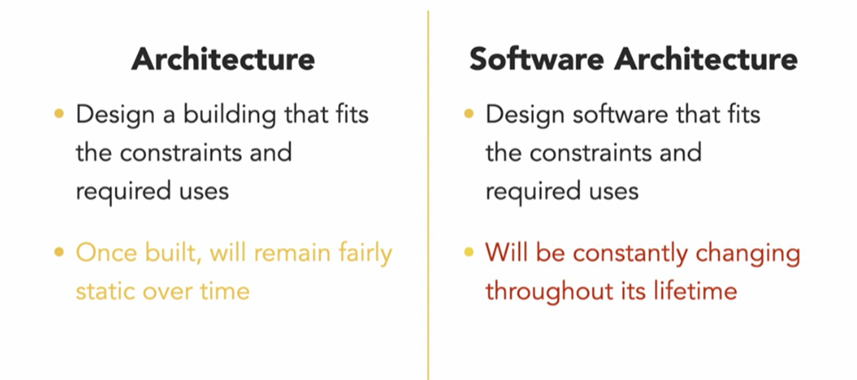
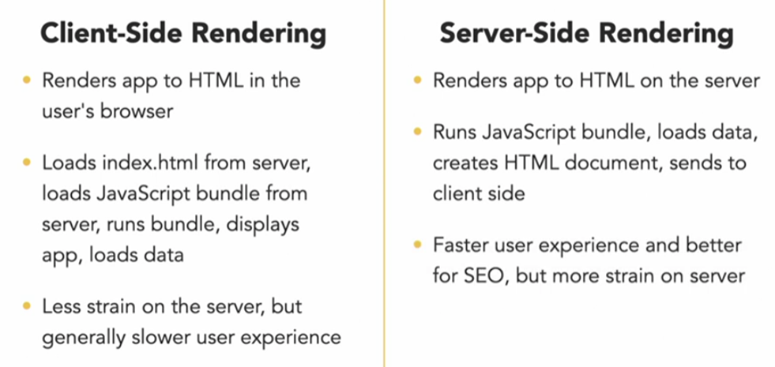

# React: Software Architecture

Es el estudio de estructura, organizacion y patrones del desarrollo de un proyecto, primeramente los que impactan la productividad de desarrollo en el tiempo



Software architecture es pensado para ser independiente de la tecnologia que estemos usando, miraremos ejemplos con React

Hay 5 temas principales:

1. Server-side rendering
2. State management: Como manejar apropiadamente la data
3. Data loading: Cual es la relacion apropiada entre front y back y como se comunican mas eficientemente, especialmente en el contexto de server-side rendering
4. Code splitting: Como entregamos eficientemente el codigo al cliente
5. Project organization: Como organizar el codigo de tal manera que sea facil para otros programadores

## Server-Side Rendering

En el flujo normal de una aplicacion de React, el cliente hace una peticion al servidor y carga el `index.html` el cual no contiene nada, ese index le dice al explorador que cargue los scripts de React, que son los que en realidad renderizan todos los elementos HTML en la pagina

Server-Side Rendering es cuando el servidor es el encargado de correr los scripts de React y renderizar los elementos



### Basic React SSR

Teniendo una aplicacion basica de react empezaremos a prepararla para que haga server side rendering

`npm install --save-dev @babel/core @babel/node @babel/preset-env @babel/preset-react nodemon`

`npm install express`

```js
//server.js
import express from 'express';
import React from 'react';
import { renderToString } from 'react-dom/server';

const app = express();

// Todas las rutas devolvera el HTML
app.get('/*', (req, res) => {
  // render es una funcion a la que le podemos pasar jsx y lo renderizara como html
  const reactApp = renderToString(<h1>Hello from the server side</h1>);

  return res.send(`
    <html>
      <body>
        <div id="root">${reactApp}</div>
      </body>
    </html>
    `);
});

app.listen(8080, () => {
  console.log('Server listening on port 8080');
});
```

```json
// .babelrc
{
  "presets": ["@babel/preset-env", "@babel/preset-react"]
}
```

Corremos la aplicacion con `npx babel-node server.js`

### Building and rendering an SSR React App

Por ahora estamos renderizando un HTML basico desde JSX en vez de renderizar nuestra React app, queremos renderizar la app y los componentes de las paginas que tenemos para eso debemos:

1. Build our react app: `npm run build`

   - Esto generara un directorio build que contiene todo el codigo minificado y transpilado

2. Desirle al servidor que sirva estaticamente los archivos dentro de la carpeta build y renderizar el componente Home. Para correr `npx nodemon --exec npx babel-node server.js`

```js
// server.js
import express from 'express';
import React from 'react';
import { renderToString } from 'react-dom/server';
import { Home } from './src/pages/Home';

const app = express();

// Por defecto si express esta sirviendo una carpeta estatica y ve que hay un index, y que el usuario esta intentando cargar data de el, inmediatamente envia el index
app.use(express.static('./build', { index: false }));

// Todas las rutas devolvera el HTML
app.get('/*', (req, res) => {
  // render es una funcion a la que le podemos pasar jsx y lo renderizara como html
  const reactApp = renderToString(<Home />);

  return res.send(`
          <html>
            <body>
              <div id="root">${reactApp}</div>
            </body>
          </html>
          `);
});

app.listen(8080, () => {
  console.log('Server listening on port 8080');
});
```

### Routing with server side rendering

Acabamos de renderizar 1 solo componente, pero lo ideal seria renderizar toda la APP, es decir, el app.js y esto no lo habiamos hecho porque tenemos que realizar el routing

1. Importaremos StaticRouter, basicamente es el equivalente a BrowserRouter que usamos en el frontend

   - Se le pasa un prop llamado location, que le permite saber que ruta esta solicitando el usuario

```js
// server.js
import express from 'express';
import React from 'react';
import { renderToString } from 'react-dom/server';
import { StaticRouter } from 'react-router-dom';
import App from './src/App';

const app = express();

// Por defecto si express esta sirviendo una carpeta estatica y ve que hay un index, y que el usuario esta intentando cargar data de el, inmediatamente envia el index
app.use(express.static('./build', { index: false }));

// Todas las rutas devolvera el HTML
app.get('/*', (req, res) => {
  // render es una funcion a la que le podemos pasar jsx y lo renderizara como html
  const reactApp = renderToString(
    <StaticRouter location={req.url}>
      <App />
    </StaticRouter>
  );

  return res.send(`
    <html>
      <body>
        <div id="root">${reactApp}</div>
      </body>
    </html>
    `);
});

app.listen(8080, () => {
  console.log('Server listening on port 8080');
});
```

2. Mover el BrowserRouter del App.js al index.js

```js
// App.js
import React from 'react';
import { Switch, Route, Link } from 'react-router-dom';
import { Home } from './pages/Home';
import { About } from './pages/About';
import { Articles } from './pages/Articles';

const App = () => {
  return (
    <>
      <h1>Server-Side Rendering Example</h1>
      <ul>
        <li>
          <Link to='/'>Home</Link>
        </li>
        <li>
          <Link to='/about'>About</Link>
        </li>
        <li>
          <Link to='/articles'>Articles</Link>
        </li>
      </ul>
      <Switch>
        <Route path='/' exact>
          <Home />
        </Route>
        <Route path='/about'>
          <About />
        </Route>
        <Route path='/articles'>
          <Articles />
        </Route>
      </Switch>
    </>
  );
};

export default App;
```

3. Las responsabilidades del index.js van a cambiar un poco, ya no sera un ReactDOM.render sino un ReactDOM.hydrate, hydrate lo que hace es que toma el HTML pre-renderizado del servidor y le agrega react para que se actualice adecuadamente cuando cambia la data en nuestra aplicacion

```js
// index.js
import React from 'react';
import ReactDOM from 'react-dom';
import './index.css';
import App from './App';
import reportWebVitals from './reportWebVitals';
import { BrowserRouter } from 'react-router-dom';

ReactDOM.hydrate(
  <React.StrictMode>
    <BrowserRouter>
      <App />
    </BrowserRouter>
  </React.StrictMode>,
  document.getElementById('root')
);

// If you want to start measuring performance in your app, pass a function
// to log results (for example: reportWebVitals(console.log))
// or send to an analytics endpoint. Learn more: https://bit.ly/CRA-vitals
reportWebVitals();
```

1. Por ultimo en nuestro server.js en vez de enviar el HTML basico, vamos a cargar el `index.html` de la carpeta build y reemplazaremos el div con id=root con nuestra reactApp

   - Esto se hace basicamente porque al hacer el build en el index se agregan los scripts al final con un hash random que apunta a los scripts compilados de react, como no podemos saber el nombre final de estos, lo mas facil es manualmente reemplazar el div=root

```js
// server.js
import express from 'express';
import path from 'path';
import fs from 'fs';
import React from 'react';
import { renderToString } from 'react-dom/server';
import { StaticRouter } from 'react-router-dom';
import App from './src/App';

const app = express();

// Por defecto si express esta sirviendo una carpeta estatica y ve que hay un index, y que el usuario esta intentando cargar data de el, inmediatamente envia el index
app.use(express.static('./build', { index: false }));

// Todas las rutas devolvera el HTML
app.get('/*', (req, res) => {
  // render es una funcion a la que le podemos pasar jsx y lo renderizara como html
  const reactApp = renderToString(
    <StaticRouter location={req.url}>
      <App />
    </StaticRouter>
  );

  // Load el index.html
  const templateFile = path.resolve('./build/index.html');
  // Load la data
  fs.readFile(templateFile, 'utf8', (err, data) => {
    if (err) {
      return res.status(500).send(err);
    }

    // Devolvemos el contenido del templateFile con el div reemplazado por nuestra app
    return res.send(
      data.replace('<div id="root"></div>', `<div id="root">${reactApp}</div>`)
    );
  });
});

app.listen(8080, () => {
  console.log('Server listening on port 8080');
});
```

### Styling with server side rendering

La manera como usualmente usamos estilos en una aplicacion de react es usando CSS modules, para que estos funcionen en el servidor deberiamos configurar el webpack lo cual es engorroso como vimos en el curso pasado

Otra alternativa a esto es usar `styled components`, tal como lo vimos previamente

- `npm i styled-components`

Basicamente, cuando style components se corre en el cliente este agrega una clase especial a cada uno de los componentes y luego genera el CSS

Cuando estamos haciendo server side rendering, hay que eliminar todos los estilos de la app e insertarlos en el index.html tal como insertamos la app en el div con id=root

1. Importamos ServerStyleSheet y con este, creamos una nueva variable que se encargara de eliminar todos los estilos de nuestra app

```js
// server.js

import { ServerStyleSheet } from 'styled-components';
  const reactApp = renderToString(
     const sheet = new ServerStyleSheet();

    sheet.collectStyles(
      <StaticRouter location={req.url}>
        <App />
      </StaticRouter>
    )
  );
```

2. Reemplazamos en nuestro index.html (el index del build) pero no tenemos un tag que reemplazar, para esto en el index.html escribimos `{{styles}}` y asi al hacer el replace, iremos a buscar este texto en el index

```js
// server.js

fs.readFile(templateFile, 'utf8', (err, data) => {
  if (err) {
    return res.status(500).send(err);
  }

  // Devolvemos el contenido del templateFile con el div reemplazado por nuestra app y tambien agregamos los estilos
  return res.send(
    data
      .replace('<div id="root"></div>', `<div id="root">${reactApp}</div>`)
      .replace('{{styles}}', sheet.getStyleTags())
  );
});
```

```js
import express from 'express';
import path from 'path';
import fs from 'fs';
import React from 'react';
import { ServerStyleSheet } from 'styled-components';
import { renderToString } from 'react-dom/server';
import { StaticRouter } from 'react-router-dom';
import App from './src/App';

const app = express();

// Por defecto si express esta sirviendo una carpeta estatica y ve que hay un index, y que el usuario esta intentando cargar data de el, inmediatamente envia el index
app.use(express.static('./build', { index: false }));

// Todas las rutas devolvera el HTML
app.get('/*', (req, res) => {
  const sheet = new ServerStyleSheet();

  const reactApp = renderToString(
    sheet.collectStyles(
      <StaticRouter location={req.url}>
        <App />
      </StaticRouter>
    )
  );

  // Load el index.html
  const templateFile = path.resolve('./build/index.html');
  // Load la data
  fs.readFile(templateFile, 'utf8', (err, data) => {
    if (err) {
      return res.status(500).send(err);
    }

    // Devolvemos el contenido del templateFile con el div reemplazado por nuestra app
    return res.send(
      data
        .replace('<div id="root"></div>', `<div id="root">${reactApp}</div>`)
        .replace('{{styles}}', sheet.getStyleTags())
    );
  });
});

app.listen(8080, () => {
  console.log('Server listening on port 8080');
});
```

## State Management

El state management es como una aplicacion maneja la data que necesitan los componentes y ademas como como dichos componentes cargan, almacenan, guardan y comparten dicha data

### State management technologies

1. useState Hook
2. Context
3. Recoil
4. Redux
5. Mobx

### Different sizes of states

La tecnologia que usemos para manejar el estado depende de:

1. El size y complejidad de nuestra app(blog vs ecommerce)
2. Cuantos componentes van a compartir la data de la app
3. Ver las fortalezas y debilidades de cada una de las tecnologias

- Small state: useState, Context
- Medium state: Recoil
- Large state: Redux, Mobx

### Recoil

`npm 1 recoil`

Funciona parecido al provider, en vez de envolver toda la app en un Provider, lo envolvemos en un `RecoilRoot`, este se encarga de vigilar el estado de toda la app y permitir a los componentes que se encuentren adentro de el acceder al estado, basicamente es un `store` de Redux

```js
// 03_05b
// App.js
import { RecoilRoot } from 'recoil';
import { CounterButton } from './CounterButton';
import './App.css';

const App = () => {
  return (
    <RecoilRoot>
      <h1>State Management Example</h1>
      <CounterButton />
    </RecoilRoot>
  );
};

export default App;
```

Recoil tiene 2 conceptos principales, atoms & selectors

1. Atoms: valores individuales que queremos almacenar en el Recoil State

   - Hace uso de una funcion `atom` de recoil que permite crear nuevas secciones del estado, se le debe pasar un objeto para configurarlo con un key y un valor

```js
// counterState.js
import { atom } from 'recoil';

export const counterState = atom({
  key: 'counterState',
  default: 0,
});

// incrementByState.js
import { atom } from 'recoil';

export const incrementByState = atom({
  key: 'incrementByState',
  default: 1,
});
```

2. Luego pasamos un hook que tiene recoil el cual permite acceder al estado definiendolo como hacemos con el `useState`

```js
import { useRecoilState } from 'recoil';
import { counterState } from './counterState';
import { incrementByState } from './incrementByState';

export const CounterButton = () => {
  const [numberOfClicks, setNumberOfClicks] = useRecoilState(counterState);
  const [incrementBy, setIncrementBy] = useRecoilState(incrementByState);

  return (
    <>
      <p>You have clicked the button {numberOfClicks} times.</p>
      <label>
        Increment By:
        <input
          value={incrementBy}
          onChange={(e) => setIncrementBy(Number(e.target.value))}
          type='number'
        />
      </label>
      <button onClick={() => setNumberOfClicks(numberOfClicks + incrementBy)}>
        Click
      </button>
    </>
  );
};
```

### Selectors

Los selectors al igual que como vimos en el curso de Building Modern Projects with react, se usan para calcular o manipular data del estado

```js
import { selector } from 'recoil';
import { counterState } from './counterState';

export const numberOfClicksSelector = selector({
  key: 'numberOfClicksSelector',
  get: ({ get }) => {
    const clicksData = get(counterState);
    const totalClicks = clicksData.reduce((sum, click) => {
      return sum + click.amount;
    }, 0);
    console.log(totalClicks);
    return totalClicks;
  },
});
```

### Mobx

Es otra manera de manejar estado en aplicaciones muy grandes pero es mas orientada a objetos hay que definir una clase, con nsu cosntructor y metodos que se encargaran de manejar el estado

## Data loading & WebSockets

Al estar usando server side y querer cargar datos a la aplicacion hay varias maneras en las que se pueden hacer las peticiones

1. Hacer el fetch desde el componente en el frontend, sin embargo, esto tiene una limitacion y es que estamos cargando el index y despues estamos anexando la peticion que hacemos con el fetch

Basicamente, estamos haciendo server side al index pero la data que hay que cargar no esta siendo renderizada en el servidor, lo ideal, es que el frontend no haga las peticiones al servidor

```js
import express from 'express';
import React from 'react';
import { ServerStyleSheet } from 'styled-components';
import { renderToString } from 'react-dom/server';
import { StaticRouter } from 'react-router-dom';
import path from 'path';
import fs from 'fs';
import App from './src/App';

const app = express();

app.use(express.static('./build', { index: false }));

const articles = [
  { title: 'Article 1', author: 'Bob' },
  { title: 'Article 2', author: 'Betty' },
  { title: 'Article 3', author: 'Frank' },
];

app.get('/api/articles', (req, res) => {
  // Esta seria la peticion a la base de datos
  const loadedArticles = articles;
  res.json(loadedArticles);
});

app.get('/*', (req, res) => {
  const sheet = new ServerStyleSheet();

  const reactApp = renderToString(
    sheet.collectStyles(
      <StaticRouter location={req.url}>
        <App />
      </StaticRouter>
    )
  );

  const templateFile = path.resolve('./build/index.html');
  fs.readFile(templateFile, 'utf8', (err, data) => {
    if (err) {
      return res.status(500).send(err);
    }

    return res.send(
      data
        .replace('<div id="root"></div>', `<div id="root">${reactApp}</div>`)
        .replace('{{ styles }}', sheet.getStyleTags())
    );
  });
});

app.listen(8080, () => {
  console.log('Server is listening on port 8080');
});
```

```js
// Articles.js
import React, { useState, useEffect } from 'react';

export const Articles = () => {
  const [articles, setArticles] = useState();

  useEffect(() => {
    fetch('/api/articles')
      .then((response) => response.json())
      .then((data) => setArticles(data));
  }, []);

  return (
    <>
      <h1>Articles</h1>
      {articles &&
        articles.map((article) => (
          <div key={article.title}>
            <h3>{article.title}</h3>
            <p>by {article.author}</p>
          </div>
        ))}
    </>
  );
};
```

### Data loading with SSR

1. Debemos cargar la data en donde hacemos la renderizacion del html
2. Una manera de hacer esto es entregar la data al documento HTML, basicamente con un script que tendra el JSON con la data

Sin embargo, el servidor sigue sin renderizar estos articulos, no es hasta que la app llega al buscador del usuario que estos cambios son re-renderizados por el frontend con react cuando hace el llamado al hydrate

```js
import express from 'express';
import React from 'react';
import { ServerStyleSheet } from 'styled-components';
import { renderToString } from 'react-dom/server';
import { StaticRouter } from 'react-router-dom';
import path from 'path';
import fs from 'fs';
import App from './src/App';

// Definimos una variable global para que no falle el cliente al intentar acceder a ella
global.window = {};

const app = express();

app.use(express.static('./build', { index: false }));

const articles = [
  { title: 'Article 1', author: 'Bob' },
  { title: 'Article 2', author: 'Betty' },
  { title: 'Article 3', author: 'Frank' },
];

app.get('/api/articles', (req, res) => {
  const loadedArticles = articles;
  res.json(loadedArticles);
});

app.get('/*', (req, res) => {
  const sheet = new ServerStyleSheet();

  const reactApp = renderToString(
    sheet.collectStyles(
      <StaticRouter location={req.url}>
        <App />
      </StaticRouter>
    )
  );

  const templateFile = path.resolve('./build/index.html');
  fs.readFile(templateFile, 'utf8', (err, data) => {
    if (err) {
      return res.status(500).send(err);
    }

    // Data cargada de la base de datos
    const loadedArticles = articles;

    return res.send(
      data
        .replace(
          '<div id="root"></div>',
          // Al objeto window le agregamos la propiedad preloadedArticles
          `<script>window.preloadedArticles = ${JSON.stringify(
            loadedArticles
          )};</script><div id="root">${reactApp}</div>`
        )
        .replace('{{ styles }}', sheet.getStyleTags())
    );
  });
});

app.listen(8080, () => {
  console.log('Server is listening on port 8080');
});
```

```js
// Articles.js
import React, { useState, useEffect } from 'react';

export const Articles = () => {
  // Cargamos los articulos del objeto window
  const [articles, setArticles] = useState(window && window.preloadedArticles);

  useEffect(() => {
    if (window && !window.preloadedArticles) {
      console.log('No preloaded articles found, loading from server');
      fetch('/api/articles')
        .then((response) => response.json())
        .then((data) => setArticles(data));
    }
  }, []);

  return (
    <>
      <h1>Articles</h1>
      {articles &&
        articles.map((article) => (
          <div key={article.title}>
            <h3>{article.title}</h3>
            <p>by {article.author}</p>
          </div>
        ))}
    </>
  );
};
```

### Rendering server-side API data

Usaremos context para comunicar front y end mientras estamos haciendo el renderizado de la app y debemos hacer esto porque:

1. useEffect no sera llamado cuando estamos renderizando los componentes en el servidor
2. Basicamente debemos buscar la manera que los componentes obtengan la data mientras estan siendo renderizados desde el servidor

3. Crearemos un nuevo context `InitialDataContext`

```js
import React from 'react';
export const InitialDataContext = React.createContext({});
```

2. Importar este context en el servidor y vamos a provide este context a la app mientras esta renderizando

```js
const reactApp = renderToString(
  <InitialDataContext.Provider>
    <StaticRouter location={req.url}>
      <App />
    </StaticRouter>
  </InitialDataContext.Provider>
);
```

3. Para que el front y el back se comuniquen usaremos un objeto `contextObj` y le daremos algunas propiedades

```js
const contextObj = { _isServerSide: true, _requests: [], _data: {} };
```

4. La estrategia es renderizar la pagina 2 veces en el servidor, la primera vez que rendericemos basicamente encontraremos que componentes necesitan cargar data en del servidor y luego vamos a cargar esa data y pasarselas a los componentes a traves del provider

   - Una vez renderizada la primera vez, vamos a tener todas las peticiones para cargar data en el array `_requests:[]` y todas estas van a ser expresadas como funciones

     ```js
     await Promise.all(contextObj._requests);
     // El servidor usara esto para saber si es renderizado en el servidor o no e ir a buscar data al window object
     contextObj._isServerSide = false;
     // Eliminamos la propiedad, para eliminar data extra porque el contextObj lo vamos a enviar al cliente parecido a como enviamos los preloaded articles
     delete contextObj._requests;
     ```

   - Renderizamos una segunda vez, de hecho en la primera vez no necesitamos hacer nada con el HTML, por eso es que le eliminamos el `const reactApp` y lo dejamos como simplemente llamando a la funcion `renderToString`

     ```js
     renderToString(
       sheet.collectStyles(
         <InitialDataContext.Provider value={contextObj}>
           <StaticRouter location={req.url}>
             <App />
           </StaticRouter>
         </InitialDataContext.Provider>
       )
     );

     await Promise.all(contextObj._requests);
     contextObj._isServerSide = false;
     delete contextObj._requests;

     const reactApp = renderToString(
       // No necesitamos ver los estilos de nuevo, por eso eliminamos el sheet.collectStyles
       <InitialDataContext.Provider value={contextObj}>
         <StaticRouter location={req.url}>
           <App />
         </StaticRouter>
       </InitialDataContext.Provider>
     );
     ```

   - Ahora en vez de enviar el `preloadedArticles` en el return hacie el cliente, enviamos `preloadedData` y en vez de enviar la variable preloadedArticles enviamos ahora el contextObj

```js
// Pasado

// Data cargada de la base de datos
const loadedArticles = articles;
return res.send(
  data
    .replace(
      '<div id="root"></div>',
      // Al objeto window le agregamos la propiedad preloadedArticles
      `<script>window.preloadedArticles = ${JSON.stringify(
        loadedArticles
      )};</script><div id="root">${reactApp}</div>`
    )
    .replace('{{ styles }}', sheet.getStyleTags())
);

// Nuevo
return res.send(
  data
    .replace(
      '<div id="root"></div>',
      `<script>window.preloadedData = ${JSON.stringify(
        contextObj
      )};</script><div id="root">${reactApp}</div>`
    )
    .replace('{{ styles }}', sheet.getStyleTags())
);
```

```js
import express from 'express';
import React from 'react';
import { ServerStyleSheet } from 'styled-components';
import { renderToString } from 'react-dom/server';
import { StaticRouter } from 'react-router-dom';
import path from 'path';
import fs from 'fs';
import App from './src/App';
import { InitialDataContext } from './InitialDataContext';

global.window = {};

const app = express();

app.use(express.static('./build', { index: false }));

const articles = [
  { title: 'Article 1', author: 'Bob' },
  { title: 'Article 2', author: 'Betty' },
  { title: 'Article 3', author: 'Frank' },
];

app.get('/api/articles', (req, res) => {
  const loadedArticles = articles;
  res.json(loadedArticles);
});

app.get('/*', async (req, res) => {
  const sheet = new ServerStyleSheet();

  const contextObj = { _isServerSide: true, _requests: [], _data: {} };

  renderToString(
    sheet.collectStyles(
      <InitialDataContext.Provider value={contextObj}>
        <StaticRouter location={req.url}>
          <App />
        </StaticRouter>
      </InitialDataContext.Provider>
    )
  );

  await Promise.all(contextObj._requests);
  contextObj._isServerSide = false;
  delete contextObj._requests;

  const reactApp = renderToString(
    <InitialDataContext.Provider value={contextObj}>
      <StaticRouter location={req.url}>
        <App />
      </StaticRouter>
    </InitialDataContext.Provider>
  );

  const templateFile = path.resolve('./build/index.html');
  fs.readFile(templateFile, 'utf8', (err, data) => {
    if (err) {
      return res.status(500).send(err);
    }

    return res.send(
      data
        .replace(
          '<div id="root"></div>',
          `<script>window.preloadedData = ${JSON.stringify(
            contextObj
          )};</script><div id="root">${reactApp}</div>`
        )
        .replace('{{ styles }}', sheet.getStyleTags())
    );
  });
});

app.listen(8080, () => {
  console.log('Server is listening on port 8080');
});
```

### Enhancing SSR with context

1. Una vez tenemos el context en el servidor, crearemos un react hook para sacar la data del context. Esto simplificara las cosas para el componente ya que no le importara si estan en el servidor o el cliente

   - Se crea un archivo `useDataSSR.js`
   - Usaremos `useState` y `InitialDataContext`
   - El hook tomara 2 argumentos, `resourceName` y `loadFunc`
   - Obtenemos el valor actual de nuestro `InitialDataContext`
   - Creamos una nueva variable de estado `data` para la data que contiene el context
     - Cuando el componente cargue data ya sea en el servidor o cliente lo haran al array `_data` y despues de eso podran acceder a la data con el hook
   - Con un if verificamos si estamos en el server side, si es asi, agregamos la loadfuncion (basicamente el fetch al servidor) a la propiedad request que se encarga de manejar la promesa

     ```js
     if (context._isServerSide) {
       context._requests.push(
         loadFunc().then((result) => (context._data[resourceName] = result))
       );
     }
     ```

   - Si la data no existe, queremos setearla

```js
import { useContext, useState } from 'react';
import { InitialDataContext } from './InitialDataContext';

export const useDataSSR = (resourceName, loadFunc) => {
  const context = useContext(InitialDataContext);
  const [data, setData] = useState(context._data[resourceName]);

  if (context._isServerSide) {
    context._requests.push(
      loadFunc().then((result) => (context._data[resourceName] = result))
    );
  } else if (!data) {
    loadFunc().then((result) => {
      setData(result);
      context._data[resourceName] = result;
    });
  }

  return data;
};
```

2. Para usar el hook que acabamos de crear en el componente

   - Para poder usar fetch en el servidor, debemos instalar `npm i isomorphic-fetch`. fetch existe por default en el browser solamente

```js
import React from 'react';
import { useDataSSR } from '../useDataSSR';

export const Articles = () => {
  const articles = useDataSSR('articles', () => {
    console.log('No preloaded articles found, loading from server');
    return fetch('http://localhost:8080/api/articles').then((response) =>
      response.json()
    );
  });

  return (
    <>
      <h1>Articles</h1>
      {articles &&
        articles.map((article) => (
          <div key={article.title}>
            <h3>{article.title}</h3>
            <p>by {article.author}</p>
          </div>
        ))}
    </>
  );
};
```

3. Agregar el context provider en el index.js
   - El value del provider lo obtendra del objeto window o si no existe sera un objeto con la propiedad `_data` vacia

```js
ReactDOM.hydrate(
  <React.StrictMode>
    <InitialDataContext.Provider
      value={(window && window.preloadedData) || { _data: {} }}
    >
      <BrowserRouter>
        <App />
      </BrowserRouter>
    </InitialDataContext.Provider>
  </React.StrictMode>,
  document.getElementById('root')
);
```

## Code Splitting

En vez de enviar todo el codigo de la aplicacion de una, se envia cada vez que lo necesita la aplicacion

Para lograr esto usamos lazy y suspense que se encargaran de cargar los componentes cuando entremos a la ruta

```js
import React, { lazy, Suspense } from 'react';
// import { One } from './One';
// import { Two } from './Two';
// import { Three } from './Three';

const One = lazy(() => import('./One'));
const Two = lazy(() => import('./Two'));
const Three = lazy(() => import('./Three'));

export const About = () => {
  return (
    <>
      <h1>About</h1>
      <Suspense fallback={<p>Loading Components...</p>}>
        <One />
        <Two />
        <Three />
      </Suspense>
    </>
  );
};
```

### Error boundaries

Son basicamente componente que bloquean secciones de la interfaz que creemos pueden tener algun tipo de error, son clases y usan un metodo especial de react llamado 'componentDidCatch'

```js
import React from 'react';

export default class ErrorBoundary extends React.Component {
  constructor(props) {
    super(props);
    this.state = {
      error: null,
    };
  }

  componentDidCatch(error, errorInfo) {
    console.log({ error, errorInfo });
  }

  static getDerivedStateFromError(error) {
    return { error };
  }

  render() {
    if (this.state.error) {
      return <p>Uh oh! Something went wrong</p>;
    }

    return this.props.children;
  }
}
```

```js
import React, { useState, lazy, Suspense } from 'react';
import ErrorBoundary from '../ErrorBoundary';
// import { One } from './One';
// import { Two } from './Two';
// import { Three } from './Three';

const One = lazy(() => import('./One'));
const Two = lazy(() => import('./Two'));
const Three = lazy(() => import('./Three'));

export const About = () => {
  const [showComponents, setShowComponents] = useState(false);

  return (
    <>
      <h1>About</h1>
      {showComponents && (
        <Suspense fallback={<p>Loading Components...</p>}>
          <ErrorBoundary>
            <One />
          </ErrorBoundary>
          <ErrorBoundary>
            <Two />
          </ErrorBoundary>
          <ErrorBoundary>
            <Three />
          </ErrorBoundary>
        </Suspense>
      )}
      <button onClick={() => setShowComponents(true)}>Show</button>
    </>
  );
};

export default About;
```

## Folder Structure and Naming conventions

Tenemos basicamente 2 tipos de organizacion

1. Function based organization, serian folders como hooks, pages, network, etc
2. Featured based organization, articles, shopping cart, login, etc
