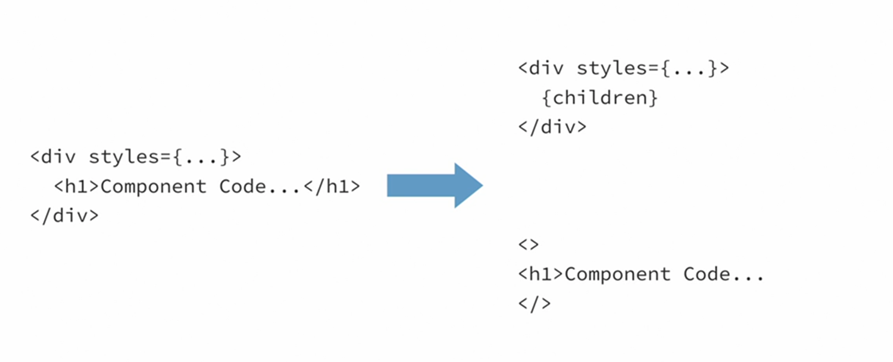
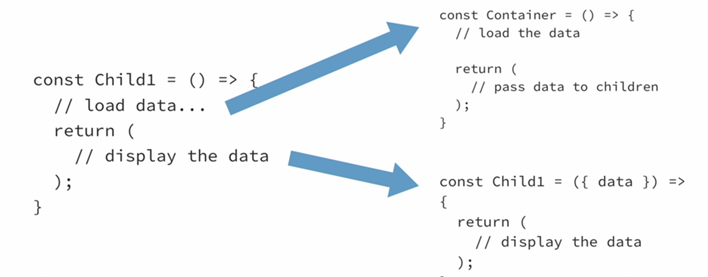
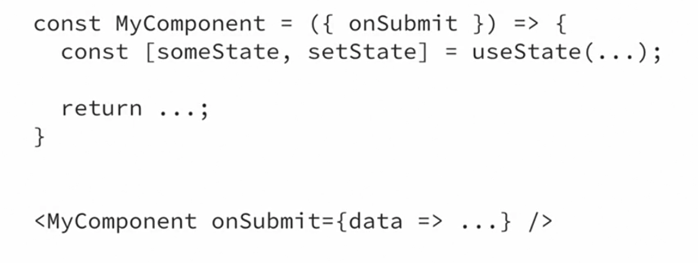
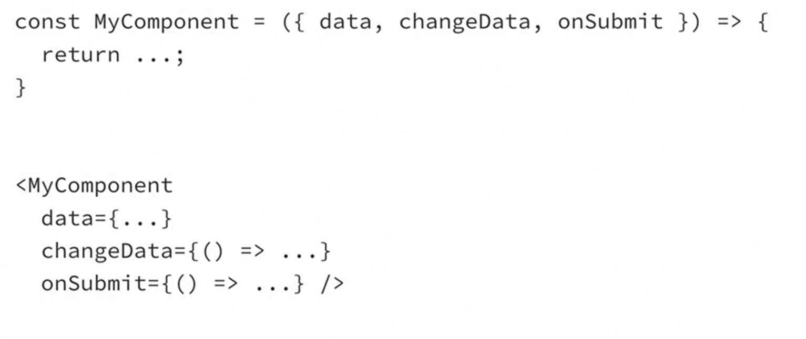

# React Design Patterns

Son soluciones efectivas a retos comunos en el desarrollo de una aplicacion, no son el gang of four OOP

Son patrones comunes para aplicaciones de react

- Creando reusable layouts
- Reutilizar logica entre componentes
- Trabajar con formularios
- Incorporar functional concepts en nuestro codigo

## Layout Components

Componentes cuyo objetivo es organizar otros componentes como split screens, list and items & modals

Pensemos en una barra de navegacion, lo que hariamos usualmente es crear la barra y en el div donde esta dicha seccion aplicar los estilos, un layout component seria extraer los estilos y agregar el contenido por aparte como hijo



## Split Screen Components

1. Split-screen components
2. List, list items and different list items
3. Modal components

```js
// splitscreen.js
import styled from 'styled-components';

const Container = styled.div`
  display: flex;
`;

const Pane = styled.div`
  flex: 1;
`;

export const SplitScreen = ({ left: Left, right: Right }) => {
  return (
    <Container>
      <Pane>
        <Left />
      </Pane>
      <Pane>
        <Right />
      </Pane>
    </Container>
  );
};
```

```js
import { SplitScreen } from './SplitScreen';

const LeftHandComponent = () => {
  return <h1 style={{ backgroundColor: 'green' }}>Left!</h1>;
};

const RightHandComponent = () => {
  return <p style={{ backgroundColor: 'red' }}>Right!</p>;
};

function App() {
  return <SplitScreen left={LeftHandComponent} right={RightHandComponent} />;
}

export default App;
```

## Container components

Componentes que se encargan de cargar y manejar la data parar su child components para asi evitar tener que hacer los request de nuevo cuando otro componente necesita la logica



Basicamente, nuestros componentes no deben saber de donde les esta llegando la data

### CurrentUserLoader component

Vamos a tener un componente que se encargara de cargar la data

1. El estado del user sera null mientras cargamos la data
2. Cargaremos la data con un `useEffect`

   1. Usamos un shortcut para crear una funcion asyn anonima

      ```js
      (async () => {})();
      ```

3. una vez con la data del user, tenemos que pasar el user state a todos los children components

```js
// Lo que va pasar es que automaticamente el CurrentUserLoader va a cargar el estado a sus hijos, es decir, al UserInfo

// App.js
<CurrentUserLoader>
  <UserInfo />
</CurrentUserLoader>
```

1. Hacemos un map atraves de los children del componente
2. Si el child es un componente valido de React `React.isValidElement(child)`, retornamos el elemento con `cloneElement` y el segundo argumento nos permite especificar extra props que queremos pasar al child

```js
// CurrentUserLoader.js
import React, { useState, useEffect } from 'react';
import axios from 'axios';

export const CurrentUserLoader = ({ children }) => {
  const [user, setUser] = useState(null);

  useEffect(() => {
    (async () => {
      const response = await axios.get('/current-user');
      setUser(response.data);
    })();
  }, []);

  return (
    <>
      {React.Children.map(children, (child) => {
        if (React.isValidElement(child)) {
          return React.cloneElement(child, { user });
        }

        return child;
      })}
    </>
  );
};
```

- El componente UserInfo, nos va tirar un error porque como nosotros inicialmente estamos `seteando` el user a null, va decir que las propiedades no existen de un null para esto tenemos 2 soluciones

1. Dar un valor por defecto a user, un objeto vacio `export const UserInfo = ({ user = {} }) `

2. Check si user existe ante de mostrar todo, si no existe muestra un mensaje de loading
3. Agregar un valor por defecto al momento de hacer el destructure

```js
export const UserInfo = ({ user }) => {
  const { name, age, hairColor, hobbies } = user || {};

  return user ? (
    <>
      <h3>{name}</h3>
      <p>Age: {age} years</p>
      <p>Hair Color: {hairColor}</p>
      <h3>Hobbies:</h3>
      <ul>
        {hobbies.map((hobby) => (
          <li key={hobby}>{hobby}</li>
        ))}
      </ul>
    </>
  ) : (
    <p>Loading...</p>
  );
};
```

### UserLoader Component

Ahora que tenemos el current user, podemos hacerlo mas general y que sea capaz de cargar cualquier user por ID

1. El cambio principal, sera al URL al que haremos el request
2. Modificamos el `useEffect` y agregamos el ID al array de dependencias

```js
import React, { useState, useEffect } from 'react';
import axios from 'axios';

export const UserLoader = ({ userId, children }) => {
  const [user, setUser] = useState(null);

  useEffect(() => {
    (async () => {
      const response = await axios.get(`/users/${userId}`);
      setUser(response.data);
    })();
  }, [userId]);

  return (
    <>
      {React.Children.map(children, (child) => {
        if (React.isValidElement(child)) {
          return React.cloneElement(child, { user });
        }

        return child;
      })}
    </>
  );
};
```

1. Al usar el componente, enviamos el userId

```js
<UserLoader userId='123'>
  <UserInfo />
</UserLoader>
```

### ResourceLoader Component

En vez de cargar un resource especifico, vamos a tener un componente que permite cargar cualquier data del servidor

1. En vez de tener un userId como un prop, vamos a tener 2 props `resourceUrl`, `resourceName` el resourceName es basicamente, el nombre de la propiedad que vamos a setear en el estado
2. Ya no tendremos un user y setUser, sino un state y setState, algo mas general

```js
import React, { useState, useEffect } from 'react';
import axios from 'axios';

export const ResourceLoader = ({ resourceUrl, resourceName, children }) => {
  const [state, setState] = useState(null);

  useEffect(() => {
    (async () => {
      const response = await axios.get(resourceUrl);
      setState(response.data);
    })();
  }, [resourceUrl]);

  return (
    <>
      {React.Children.map(children, (child) => {
        if (React.isValidElement(child)) {
          return React.cloneElement(child, { [resourceName]: state });
        }

        return child;
      })}
    </>
  );
};
```

```js
<ResourceLoader resourceUrl='/users/123' resourceName='user'>
  <UserInfo />
</ResourceLoader>
<ResourceLoader resourceUrl="/products/1234" resourceName="product">
   <ProductInfo />
</ResourceLoader>
```

### DataSource component

Hasta ahora, el ResourceLoader es un componente que sirve la mayoria de las veces, con el objetivo de ver hasta donde podemos simplificar y tener un componente que nisiquiera sepa de donde llega la data

1. Creamos el componente `DataSource`
2. Basicamente igual que el ResourceLoader
3. Tendra una funcion llamada `getDataFunc()` que sera la encargada de proporcionar la ruta para cargar los datos

```js
import React, { useState, useEffect } from 'react';

export const DataSource = ({
  getDataFunc = () => {},
  resourceName,
  children,
}) => {
  const [state, setState] = useState(null);

  useEffect(() => {
    (async () => {
      const data = await getDataFunc();
      setState(data);
    })();
  }, [getDataFunc]);

  return (
    <>
      {React.Children.map(children, (child) => {
        if (React.isValidElement(child)) {
          return React.cloneElement(child, { [resourceName]: state });
        }

        return child;
      })}
    </>
  );
};
```

1. Al usarla, simplemente debemos crear una funcion donde se definira el axios y que recurso queremos usar

```js
import axios from 'axios';
import { CurrentUserLoader } from './CurrentUserLoader';
import { UserLoader } from './UserLoader';
import { DataSource } from './DataSource';
import { ResourceLoader } from './ResourceLoader';
import { ProductInfo } from './ProductInfo';
import { UserInfo } from './UserInfo';

const getServerData = (url) => async () => {
  const response = await axios.get(url);
  return response.data;
};

function App() {
  return (
    <>
      <DataSource getDataFunc={getServerData('/users/123')} resourceName='user'>
        <UserInfo />
      </DataSource>
    </>
  );
}

export default App;
```

## Controlled and Uncontrolled Components

1. Uncontrolled Components: Son componentes que ellos mismos manejan su estado, solo dan data cuando algun evento ocurre por ejemplo cuando tiene un form



2. Controlled Components: Donde el padre es el que lleva el estado y lo pasan como props



Por lo general se prefiere usar los controlled, principalmente porque hace nuestros componentes mas reutilizables y faciles de testear

### Uncontrolled Form example

```js
import React from 'react';

export const UncontrolledForm = () => {
  const nameInput = React.createRef();
  const ageInput = React.createRef();
  const hairColorInput = React.createRef();

  const handleSubmit = (e) => {
    console.log(nameInput.current.value);
    console.log(ageInput.current.value);
    console.log(hairColorInput.current.value);
    e.preventDefault();
  };

  return (
    <form onSubmit={handleSubmit}>
      <input name='name' type='text' placeholder='Name' ref={nameInput} />
      <input name='age' type='number' placeholder='Age' ref={ageInput} />
      <input
        name='hairColor'
        type='text'
        placeholder='Hair Color'
        ref={hairColorInput}
      />
      <input type='submit' value='Submit' />
    </form>
  );
};
```

### Controlled Form example

Las diferencias con el uncontrolled son las siguientes

1. Vamos a pasar el valor de cada uno de los inputs `value={name}`
2. Vamos a usar la propiedad onChange, para mostrar como cambia el valor cuando el usuario esta copiando
3. Los controlled nos permiten hacer validaciones mientras el usuario esta copiando, un ejemplo seria usando el useEffect y verificando que el string sea mayor a 2

```js
import { useState, useEffect } from 'react';

export const ControlledForm = () => {
  const [nameInputError, setNameInputError] = useState('');
  const [name, setName] = useState('');
  const [age, setAge] = useState();
  const [hairColor, setHairColor] = useState('');

  useEffect(() => {
    if (name.length < 2) {
      setNameInputError('Name must be two or more characters');
    } else {
      setNameInputError('');
    }
  }, [name]);

  return (
    <form>
      {nameInputError && <p>{nameInputError}</p>}
      <input
        name='name'
        type='text'
        placeholder='Name'
        value={name}
        onChange={(e) => setName(e.target.value)}
      />
      <input
        name='age'
        type='number'
        placeholder='Age'
        value={age}
        onChange={(e) => setAge(Number(e.target.value))}
      />
      <input
        name='hairColor'
        type='text'
        placeholder='Hair Color'
        value={hairColor}
        onChange={(e) => setHairColor(e.target.value)}
      />
      <button>Submit</button>
    </form>
  );
};
```

### Controlled Modals
