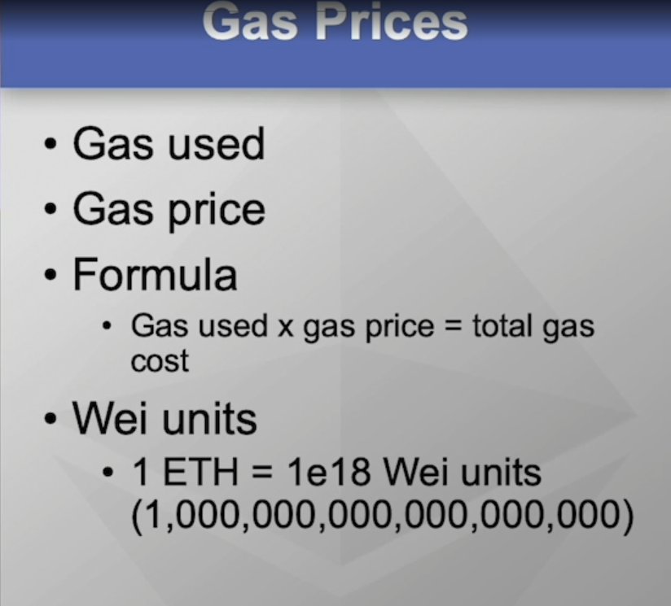
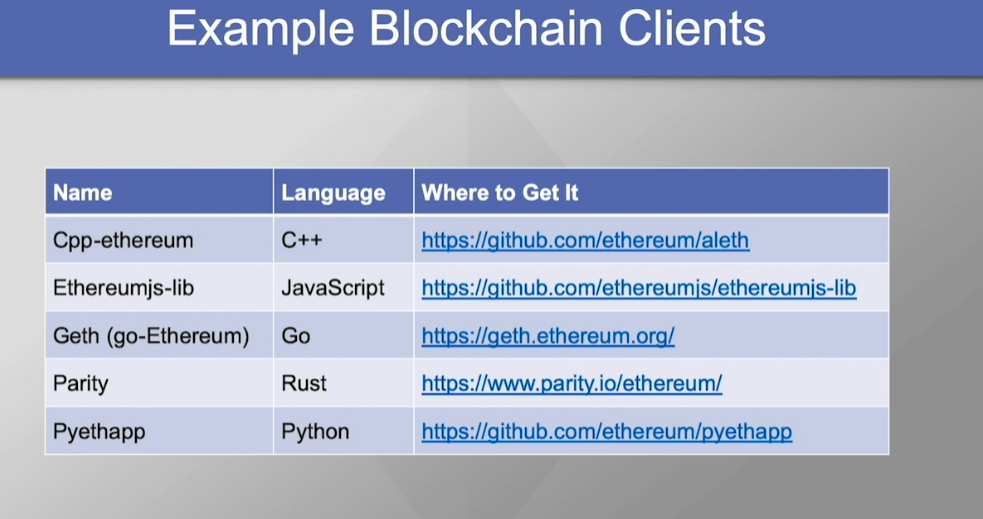
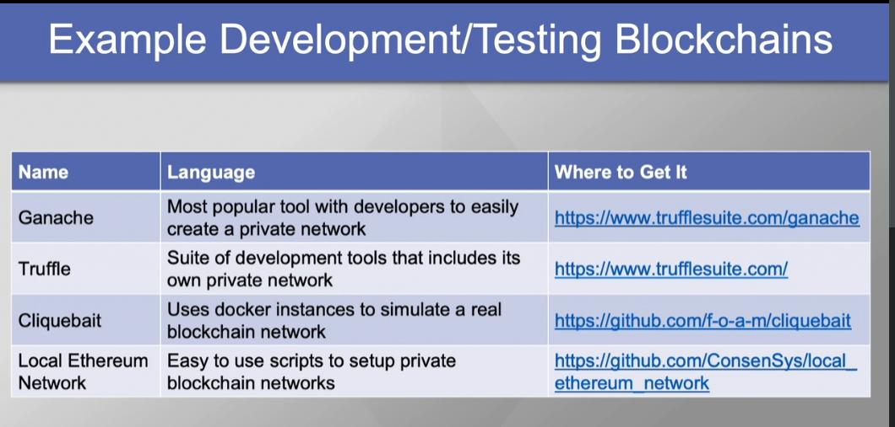
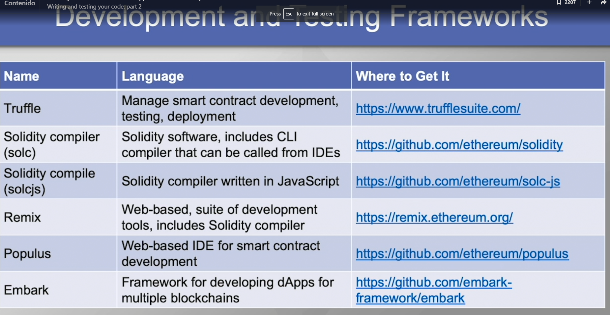
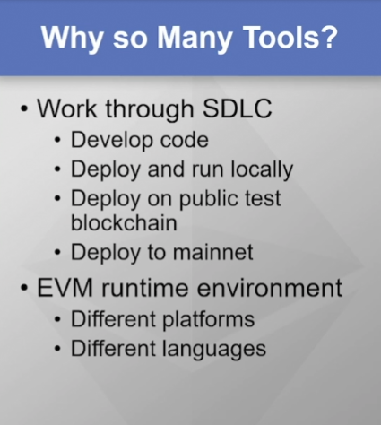

# Building an ETH blockchain app 1

## What is a blockchain

- Technology used to avoid third parties on exchanges
- Bitcoin is a implementation of blockchain, blockchain = technology, bitcoin = implementation

- Blockchain is a secure way to handle transactions in a trustless environment

### Why use a blockchain?

- Value without trust
- Eliminate middlemen and reduce costs
- Efficiency through direct interaction
- Complete transaction history, transparency
- Resilience through replication

### Blockchain data & blocks

- Cant CRUD, blockchain only allows add & read
- History and auditing capability, like one long ledger

### Blockchain immutability

- Consensus, nodes must agree how to allow new blocks to be added
- Consensus is achieved when more than half of nodes agree

### Hashes

- One way mathematical functions
- Easy to calculate, difficult to revert
- Maps an input to an output
- Any change to hashed data will change the hash result

Hashes allow the blockchain, every block store the hash of the previous block

- If data on the previous block change, his hash will also change, this makes the whole blockchain to break

### Nonce

- Nonce is used as an extra input to add complexity to the hash calculation therefore preventing fake blocks
- Nonce usually is a number, that modifies the hash. For example, bitcoin uses 19 zeros on its hash, so we have to find a number that in combination with the data creates the hash
- Finding the nonce is called MINING

### Arriving at consensus

- Proof of Work

  - Nodes compete to find the nonce
  - First get reward
  - Each node validates de nonce find

- Proof os Stake

  - Less computing power
  - Every node submits a bet
  - Size of bet used to select the winner
  - Selection is random, richest does not always win

- Delegated Proof os Stake

  - Modified PoS
  - Candidate nodes selected like PoS
  - Makes it more fair

- Delegated Byzantine Fault Tolerance (dBFT)
  - Byzantine Generals Problem
  - Group of nodes elect a delegate
  - Speaker randomly chosen from delegates, calculates hash
  - If at least 2/3 of delegates agree with the hash, block is added

## What is Ethereum

- Bitcoin

  - Implementation of blockchain
  - 1st generation blockchain
  - Primarily for cryptocurrency, little support for autonomy

- Ethereum
  - 2nd generation blockchain
  - Native cryptocurrency
  - Smart contracts, more autonomy!

### Ethereum Features

- Transparent transactions, easy auditing
- Traceable history of data, all kind of assets
- Reduce overhead, eliminate middlemen (disintermediation)
- Automate decisions with smart contracts

### Ethereum in financial services

- Pure currency exchanges, easy transfer of digital currency
- Banking, fiat currency must be backed by government
- Cryptocurrency, no government backing. Can create your own tokens (basically smart contracts)
- Blockchain works well transferring assets like real state

### Ethereum in digital identity management

- Identification is making a claim to an identity, authentication is proving that identity
- Ethereum could potentially be used to link real world identities and digital identities, making it difficult for your identity to be stolen
- The ERC-725 standard is a way to link real world identities and eth accounts

### Smart Contracts

- Rules to register a transaction in the blockchain
- Ethereum creates special runtime environment for smart contracts, EVM (Ethereum Virtual Machine) -> Virtual machine means it runs within another operating system
- Every node runs every smart contract
- Smart contracts are deterministic, the output of a smart contract is the same on all nodes
- Smart contracts create rules that must be followed by every node in order to access the blockchain

### ETH & the initial coin offering (ICO)

- ETH is ethereum cryptocurrency
- An ethereum address is a private and public key

### Decentralized Autonomous Organization (DAO)

- Operates with little to no human interaction
- DAO decisions are made by smart contracts

### Ethereum Development Tools

- Development environment
- Testing environment, ensure it works as intended
- Client interface -> Smart contracts are almost only functions, so we need an interface to test it

As Ethereum Development Tools we need:

1. Blockchain client, basically an EVM
2. An environment to develop and test the blockchain
   1. Develop apps using a local blockchain
   2. Test apps using a test blockchain (testnet) ex: Ropsten, Kovan, Rinkeby
3. Deploy to mainnet
4. Compiler
5. Testing framework: Tools to compile smart contract bytecode, push code to test network, invoke functions

- Blockchain apps are different because of their decentralized storage and processing, and append-only data
- Have built in integrity
- Bugs will be there forever because data is immutable

## Ethereum Ecosystem and Development Life Cycle

### Parts of the Ethereum blockchain

- dApps

  - Decentralized apps
  - Used to interact with the blockchain

- Blocks

  - Primary component of the blockchain
  - Stores transactions and smart contract code

- Miners

  - Nodes that create blocks and solve consensus

- Nonce (Number used once)

- Uncle (ommer block)

  - A solution to a block that comes right behind the first miner on solve the problem
  - Miner gets a discounted reward, there are like 5-6 uncle blocks but does not stay on the blockchain there are just for keep miners incentives

- Header, attributes of the entire block.

  - parentHash: Previous hash
  - nonce: Number miners find
  - timestamp: Time
  - ommersHash: uncle blocks
  - logsBloom: Bloom filters (search about)
  - difficulty: difficulty at the time the block was created
  - gasLimit & gasUse: what we pay
  - Roots, 3 pointers, point to the rest of the block
    

- Block transactions (body), this have their own structure
  - signature: Digital signature, associate with the owner the from account
  - nonce: for each transaction
    

### Virtual Machines

- Use computers to do more with less hardware
- Easy switch between operating systems or configurations
- Easy to rollback to undo changes with snapshots

- Ethereum uses its runtime as the EVM
  - This means that when you implement a node, you download and install the EVM
  - It is a software application that creates a closed environment and the smart contracts work and they run inside that environment
  - The EVM is present in all nodes
  - All EVM play by the same rules
    - Any node that breaks the rules creates a rogue blockchain -> (smart contracts are deterministic, meaning, they also produce the same result)
    - Any EVM deviation in immediately evident
    - The blockchain of a bad EVM is deemed invalid

### Gas

- Cryptocurrency cost of accessing the blockchain
- Incentivize storing local blockchain copies and mining
- Transaction fee
- Avoid infinite loops because the gas is limited
- Set max amount of gas
  - Incentives developers to create efficient smart contracts
  - They want to reduce the times they interact with the blockchain
  - Reduces malicious code and DoS attacks (Denial of Services)

#### Gas Prices

1. Gas used -> Amount used
2. Gas price
3. Total cost -> Gas used x gas price = total gas
4. The unit used is WEI -> 1 ETH = 1e18 WEI (1 quintillion - 1 with 18 zeros after)
   1. 

### Ethereum SDLC (Software Development Life Cycle)

1. Planning
2. Coding - Development
3. Testing
4. Deploy to mainnet

The tools we will use for the SDLC

1. Ethereum blockchain client
2. Development/testing blockchain
3. Compiler/testing framework
4. Source code editor - IDE (Integrated Development Environment)

### Blockchain client

- Software app that makes a device a node on the Ethereum blockchain
- Supports Ethereum standards
- Runs the EVM on a node



### Writing and testing your code

- By default the client connect to the mainnet
- We have to attached to a local simulated blockchain for our development and testing



- Frameworks help by simplifying deployment and testing tasks



## ETH development toolbox

- Your ETH development toolbox consists of your blockchain client (EVM), IDEs for code development, local and public test blockchains, and the live environment (mainnet)
- ETH has a vast amount of open-source tools on the main page



## Ethereum Wallet

- Only way to access crypto assets is with private key
- Eth wallet securely stores private key

### Types of wallets

- Hot wallet, stores the keys online. Easy access from anywhere
- Cold wallet, store keys offline. More secure. Less convenient
- Wallet client software
  - Web wallet, run on web browser
  - Desktop wallet, runs on desktop
  - Mobile wallet
- Hardware wallet. Device that stores your private key, keys stores on physical chip
- Paper wallet, keys printed on paper

### Web & Desktop wallets

- My ether wallet
  - Open source
  - Most popular
  - Has been hacked

- Coinbase
  - Cryptocurrency exchange & wallet
  - Limited token & coin types

- Guarda
  - Cold wallet, supports multiple cryptos

- Desktop wallets
  - Exodus -> Multiple cryptos
  - Mist -> Official Ethereum cold wallet, blockchain browser
  - Metamask -> Partially funded by the eth foundation, only a web browser extension

### Mobile, Hardware & Paper wallets

- Mobile wallets -> Jaxx, Coinomi, & Bread are cold wallets
- Hardware wallets -> Ledger Nano, Trezor, KeepKey
- Paper wallets -> ETHAddress & My Ether Wallet

## First app - Hello World

For make any eth app we need:

1. Geth lab (blockchain client)
2. Ganache (for testing)
3. Truffle (Framework)
4. VSC

Once we are on the directory we want to start our project we make it with truffle

`truffle init`

After, we can create our first smart contract

```js
// SPDX-License-Identifier: MIT
pragma solidity ^0.8.0;

contract HelloWorld {
  string private helloMessage = "Hello world";

  function getHelloMessage() public view returns (string memory) {
    return helloMessage;
  }
}
```

1. We have to create our dummy blockchain with ganache is just 1 click
   1. We have to ve sure that our Ganache server hostname is the same we configure on our `truffle-config.js` on our working directory
      

2. When the contract is ready we have to deploy with `truffle deploy --reset`
   1. Careful, looks like we have to also create a file on the migrations directory to migrate our contract
   2. This is very important to call the smart contract later from the truffle console

   ```js
   const HelloWorld = artifacts.require('HelloWorld');

   module.exports = function (deployer) {
     deployer.deploy(HelloWorld);
   };
   ```

3. Once the contract is deployed, we can go inside the console with `truffle console`
   1. `HelloWorld.deployed().then(function(instance) {return instance})` If theres a contract deployed will run an instance
   2. Once we have a contract instance we can call his methods, in this case, getHelloMessage() `HelloWorld.deployed().then(function(instance) {return instance.getHelloMessage() })`

## Smart Contracts In Deep

### Ethereum Tokens - ERC-20 Token Standard

- Token standard is a smart contract that manage cryptocurrency
- The ERC-20 standard
  - Smart contract
  - Contains variables to store the value and owner of the token
  - Minimum of 6 functions that a token must support
- ETH wallets are compatible with specific tokens types
  - An ERC-20 compatible token can only be stored in an ERC-20 compatible wallet

### Supply Chain Project

- Implement a real supply chain solution
- 2 smart contracts
  - Define token for payments
  - Asset tracking and management

- Paying for services
  - Each supply chain link provides a service
    - Shipping, storing in warehouses, shelving at retailers
  - Supply chain participants want to make money -> Payment expected every time a product moves
  - Ethereum for payments -> Define a token

- Managing Assets
  - Ethereum cant manage physical assets, only digital
    - Associating physical assets with digital mirror
      - Engrave an ID
      - Attach printed label
      - Attach printed label to box of products
      - Manufacturer-generated ID
      - Attach RFID (Radio Frequency Identification) tag

- Your smart contract functions
  - Creating a new supply chain participant
  - Adding a new product to the supply chain
  - Transferring ownership of a product to another participant
  - Tracking a product

### What is Solidity

- Programming language for writing Ethereum smart contracts
- Most popular
- Like Javascript
- Solidity Smart Contracts
  - Solidity code is deterministic
  - Runs the same way everywhere, every time
  - Govern how you access the blockchain
  - Code is stored on the blockchain -> just like data
  - Source code must be compiled into bytecode for the EVM to run it

- Syntax Rules
  - Define how you write valid smart contracts -> Every language has different syntax rules
  - Bad syntax wont compile
  - Syntax defines what word and symbols are valid

- Basic solidity smart contract components
  - Valid compiler version(s)
    - Solidity is still young, constantly new versions
    - Some smart contracts may depend on specific compiler versions
    - pragma -> directive that defines which Solidity compiler version(s) will compile this smart contract
  - Comments
  - Importing external files
    - Most smart contracts include code in other files
      - Shared functions or definitions may live in other files
      - Easier to share than to re write the same
  - Define the actual contracts(s)
    - contract -> defines new smart contract and fives it a name

### Defining types of data

- Handling blockchain data is different from traditional databases
  - No delete or direct update
  - Only add or read

Theres is 2 types of variables, local & state

- Local variables -> Not stored between smart contract executions
- State variables -> Stored in blockchain data, have to pay for that persistence

Where the data physically resides, theres different locations

- Stack -> Simple variable (like an integer). Lives in local memory in the EVM
- Memory -> More complex. Loves in local memory in EVM
- Storage -> Blockchain data, must pay to store

### Data Types

- uint
  - Stores non-negative integers
  - Good for counting
  - uint by itself is a 256-bit integer
  - If this is a state variable, you have tom pay for all that space on the blockchain
- uint8
  - uint that stores up to 8bits
- int
  - Integer, can store negatives
- bool -> yes/no, true/false
- address
  - Ethereum account address
  - msg.sender is the owner of the smart contract
- bytes32 -> Allows us to store arrays of any type data
- strings -> Array of characters

### Visibility of variables and functions

There are 4 main visibility modifiers

1. public
   - Public function -> anyone can call
   - Public variable -> any app can read from or write to
2. external
   - Only external entities can invoke a function or access a variable
3. internal
   - Only functions in current smart contracts and any contract derived (inheritance) from it can invoke an internal function
4. private
   - Only functions within current contract can invoke a private function
   - Private variables can only be accessed by functions within current smart

5. view
   - Keyword, another modifier that tells the compiler that the body of the function will only reference local variables
   - In other words, not touching the blockchain

   ```js
     function getStateVariables() public view returns (uint, int, uint, bool, address, bytes32, string memory) {
        return (x, i, j, isEthereumCool, owner, bMsg, sMsg);
     }
   ```

### Revisiting gas

1. Gas price
   - Highest price per unit transaction creator is willing to pay -> Price per gallon
   - Miners usually choose most lucrative transactions
   - Higher gas prices usually mean more complex transactions

2. Gas limit
   - Total number of gas units a transactions creator is willing to pay -> gallon qty

3. Gas cost
   - Every operation in Solidity has a cost. EX: add operation costs 3 gas units
   - Multiply operation cost 5 units

4. Transaction fee
   - Total cost for computations in a transaction
   - Transaction fee = total gas cost x gas price

The unused gas on a transaction goes back to the transaction originator -> Unused gas = gas budget - gas used

### Controlling flow

- if-else
- while
- do-while
- for

### Handling errors

1. Error handling functions
   - revert()
     - Undoes all state changes
     - Can send return value to caller -> Informs caller of the function why it failed
     - Refunds remaining gas to the caller
     - Indicates a transaction should be terminated before it is completed
   - assert()
     - It s a command that you should never encounter
     - Something bad has happened
     - Undoes all state changes
     - Uses all remaining gas
   - require()
     - Checks for requirements before invoking function
     - Undoes state changes
     - Sends return value
     - Refunds all remaining gas

## Supply Chain Example

### Supply chain design process needs

1. Assets
   - The product to be bough by the consumer
2. Participants
   - All supply chain participants like manufacturers, suppliers, shippers, consumers
3. Ownership structure
   - Which participant currently owns the product
   - Tracks the product
4. Payment token
   - Participants pays each other with tokens as ownership changes

### Supply chain design capabilities

1. Initialize tokens
   - Establish initial pool of payment tokens
2. Transfer tokens -> Move tokens between accounts as payment
3. Authorize token payments -> Allow token transfers on behalf on another
4. Add an update participants
5. Move products along the supply chain -> Transfer product ownership
6. Add and update products
7. Tracks an asset
   - Where a product is today
   - Find product provenance (ownership)

### Developing dApps

- Our code has to be deterministic
- Ensure we are not using any data thats localized to a particular node that could change the deterministic nature -> basically don't read anything from local
- Advantages of dApps
  - Automatic history tracking
  - Built-in fault tolerance -> Any node can fail, but the others have his back
  - Trusted data
- Before developing
  - Know what your dApp does
  - Know your goals and how you plan to achieve them
  - Understand why the ETH blockchain is best
- dApps allow users to access data stored on the blockchain
  - The only proper way to access to write to the blockchain is through dApps through the invocation of functions in smart contracts
- Understand cost of interacting with the blockchain
- Smart contracts provide the interface between users and the blockchain

### Token smart contract details

An ERC-20 token has minimum 6 data items

1. totSupply -> Total numbers of tokens in circulations
2. name
3. decimals -> precision that's used when displaying token amounts
4. symbol -> Short identifier
5. balances -> Current balance of each participating account, mapped to the account address
6. allowed -> Number of tokens authorized to transfer between accounts mapped to the senders address

In the body of the contract we are going to define six functions, the functions are mandatory for an ERC-20 token, if you look at any other ERC-20 token they have these six basic functions with the same name

1. totalSupply() -> current total number of tokens
2. balanceOf() -> balance of a specific account
3. allowance() -> returns remaining number of tokens allowed to be transferred from one account to another account
4. transfer() -> transfers tokens from the owner to specified target account
5. transferFrom() -> transfer tokens from one specific account to another specific account
6. approve() -> Maximum allowed tokens that can be transferred from one specific account to another specific account

### Supply chain smart contract details

- It contains basically the data and the functionality to manage all products, participants, ownerships transfers
  - A supply chain is basically a collection of products that are owned by a specific participant at a certain point in time

- Product structure
  - Model number, part number, cost, etc
  - Data that defines a unique product
- Participant structure
  - Data that defines a unique participant -> username, password, eth address
- Ownership structure
  - Data that records product ownership transfer information -> product ID, owner ID, transaction time

In order to our structures work we need 3 global scaler variables or simple variables

1. product ID
2. participant ID
3. owner ID

This variables will be part of the structures also

For functionality we are going to need

1. addParticipant() & getParticipant()
2. addProduct() & getProduct()
3. newOwner()
4. getProvenance() -> Record of ownership in order
5. getOwnership() -> Owner of a product in a specific point in time
6. authenticateParticipant() -> Confirms participant is allowed to access certain data

### Smart Contract Road Map


### Token smart contract data

- ERC-20 (Ethereum Request for Comments) the real name is EIP (Ethereum Improvement Proposal) EIP-20

```js
// ----------------------------------------------------------------------------
// ERC Token Standard #20 Interface
// https://github.com/ethereum/EIPs/blob/master/EIPS/eip-20.md
// ----------------------------------------------------------------------------
pragma solidity >=0.4.21 <0.6.0;

contract ERC20Interface {
    uint256 public totSupply;

    function totalSupply() public view returns (uint);
    function balanceOf(address tokenOwner) public view returns (uint balance);
    function allowance(address tokenOwner, address spender) public view returns (uint remaining);
    function transfer(address to, uint tokens) public returns (bool success);
    function approve(address spender, uint tokens) public returns (bool success);
    function transferFrom(address from, address to, uint tokens) public returns (bool success);

    event Transfer(address indexed from, address indexed to, uint tokens);
    event Approval(address indexed tokenOwner, address indexed spender, uint tokens);
}
```

- An interface is simply a definition of the minimum data and functions that you have to implement in order to make it a standard

1. erc20Token.sol
   1. mappings -> solidity structure that creates a list. Maps elements from a key to a value
      - `mapping (address => uint256) public balances;`
        - Mapping between an address and a uint256
        - Its going to be public so everybody can see it
        - Its going to be called balances
        - Basically mapping address (owners of token) to the number of tokens they own
      - `mapping (address => mapping (address => uint256)) public allowed;`
        - Two layer mapping
        - A list of tokens that are allowed to be transfer from, pme address to a list of other addresses and for each address thats valid or allowed we are going to have a uint256 which is a number of tokens that the SECOND address is allowed to transfer from the first address
          - The second mapping is saying for Michael (FIRST ADDRESS) is allowed to transfer 50 tokens to Stacy, 100 to Noah and so on

   2. constructor
      - Whenever we create a new object or a new data item, the constructor is a special function that fires and automatically runs and it is the initialization code!
      - When we create a token we give it a
        - initial amount
        - name
        - number of decimals
        - symbol
      - This are assigned and stored on the blockchain

   3. The rest of the functionality is carry out but the functions
      - It's common to use parameters name with underscore `_to` and variables with the normal convention
      - `require(balances[msg.sender] >= _value`
        - Start off with the require function
        - Require the balances of message sender and check if it is greater than the value we want to send
      - If theres is enough balance, we deduce and add on the corresponding accounts
      - We communicate out to the client, we emit (or trigger and event)

      ```js
      // Transfer tokens from msg.sender to a specified address
       function transfer(address _to, uint256 _value) public returns (bool success) {
           require(balances[msg.sender] >= _value,"Insufficient funds for transfer source.");
           balances[msg.sender] -= _value;
           balances[_to] += _value;
           emit Transfer(msg.sender, _to, _value); //solhint-disable-line indent, no-unused-vars
           return true;
       }
      ```

   ```js
   // ----------------------------------------------------------------------------
   ///Implements EIP20 token standard: https://github.com/ethereum/EIPs/blob/master/EIPS/eip-20.md
   // ----------------------------------------------------------------------------

   pragma solidity >=0.4.21 <0.6.0;

   import "./erc20Interface.sol";

   contract ERC20Token is ERC20Interface {

       uint256 constant private MAX_UINT256 = 2**256 - 1;
       mapping (address => uint256) public balances;
       mapping (address => mapping (address => uint256)) public allowed;

       uint256 public totSupply;           // Total number of tokens
       string public name;                   // Descriptive name (i.e. For Dummies Sample Token)
       uint8 public decimals;                // How many decimals to use when displaying amounts
       string public symbol;                 // Short identifier for token (i.e. FDT)

       // Create the new token and assign initial values, including initial amount
       constructor(
           uint256 _initialAmount,
           string memory _tokenName,
           uint8 _decimalUnits,
           string memory _tokenSymbol
       ) public {
           balances[msg.sender] = _initialAmount;               // The creator owns all initial tokens
           totSupply = _initialAmount;                        // Update total token supply
           name = _tokenName;                                   // Store the token name (used for display only)
           decimals = _decimalUnits;                            // Store the number of decimals (used for display only)
           symbol = _tokenSymbol;                               // Store the token symbol (used for display only)
       }

       // Transfer tokens from msg.sender to a specified address
       function transfer(address _to, uint256 _value) public returns (bool success) {
           require(balances[msg.sender] >= _value,"Insufficient funds for transfer source.");
           balances[msg.sender] -= _value;
           balances[_to] += _value;
           emit Transfer(msg.sender, _to, _value); //solhint-disable-line indent, no-unused-vars
           return true;
       }

       // Transfer tokens from one specified address to another specified address
       function transferFrom(address _from, address _to, uint256 _value) public returns (bool success) {
           uint256 allowance = allowed[_from][msg.sender];
           require(balances[_from] >= _value && allowance >= _value,"Insufficient allowed funds for transfer source.");
           balances[_to] += _value;
           balances[_from] -= _value;
           if (allowance < MAX_UINT256) {
               allowed[_from][msg.sender] -= _value;
           }
           emit Transfer(_from, _to, _value); //solhint-disable-line indent, no-unused-vars
           return true;
       }

       // Return the current balance (in tokens) of a specified address
       function balanceOf(address _owner) public view returns (uint256 balance) {
           return balances[_owner];
       }

       // Set
       function approve(address _spender, uint256 _value) public returns (bool success) {
           allowed[msg.sender][_spender] = _value;
           emit Approval(msg.sender, _spender, _value); //solhint-disable-line indent, no-unused-vars
           return true;
       }

       // Return the
       function allowance(address _owner, address _spender) public view returns (uint256 remaining) {
           return allowed[_owner][_spender];
       }

       // Return the total number of tokens in circulation
       function totalSupply() public view returns (uint256 totSupp) {
           return totSupply;
       }
   }
   ```

### Supply chain smart contract data

- Define contract from scratch
- Define 3 variables, that represent the ids of product, participant & owner
- Structure is defined by the key word struct
  - Is basically an object, a collection of variables
- We will map a uint32 value to a product structure
  - We are creating an indexed list of product structures indexed by the product ID and it will be called products

```js
  contract supplyChain {
    uint32 public product_id = 0;   // Product ID
    uint32 public participant_id = 0;   // Participant ID
    uint32 public owner_id = 0;   // Ownership ID

    struct product {
        string modelNumber;
        string partNumber;
        string serialNumber;
        address productOwner;
        uint32 cost;
        uint32 mfgTimeStamp;
    }

    mapping(uint32 => product) public products;

    struct participant {
        string userName;
        string password;
        string participantType;
        address participantAddress;
    }gi
  }
```

- We have 2 mappings defined because if we look at ownerships, we might want to see all the ownerships by an owner or the ownership by a product

```js
  mapping(uint32 => ownership) public ownerships; // ownerships by ownership ID (owner_id)
  mapping(uint32 => uint32[]) public productTrack;  // ownerships by Product ID (product_id) / Movement track for a product
```

### Token smart contract functions
