# Node JS Essential Training

- [Node JS Essential Training](#node-js-essential-training)
  - [Node Globals](#node-globals)
    - [The global object](#the-global-object)
    - [The require function](#the-require-function)
    - [The process object](#the-process-object)
    - [Standard output & input](#standard-output--input)
  - [Node Modules](#node-modules)
    - [Readline](#readline)
      - [Creando una aplicación para hacer preguntar con la terminal & readline](#creando-una-aplicación-para-hacer-preguntar-con-la-terminal--readline)
    - [Export custom modules](#export-custom-modules)
      - [Exportando la funcion collectAnswers](#exportando-la-funcion-collectanswers)
  - [EventEmitter](#eventemitter)
    - [EventEmitter en nuestra app](#eventemitter-en-nuestra-app)
  - [File System Basics](#file-system-basics)
    - [Leyendo los archivos de un directorio](#leyendo-los-archivos-de-un-directorio)
    - [Leyendo un archivos](#leyendo-un-archivos)
      - [Sincrono](#sincrono)
      - [Asincrono](#asincrono)
    - [WRITE AND APPEND FILES](#write-and-append-files)
    - [DIRECTORY CREATION](#directory-creation)
    - [APPEND FILES](#append-files)
    - [RENAME AND REMOVE FILES](#rename-and-remove-files)
    - [RENAME AND REMOVE DIRECTORIES](#rename-and-remove-directories)
  - [FILES AND STREAMS](#files-and-streams)
    - [READABLE FILE STREAMS](#readable-file-streams)
    - [WRITABLE FILE STREAMS](#writable-file-streams)
      - [Ejemplo: Enviando la data de la terminal a un archito](#ejemplo-enviando-la-data-de-la-terminal-a-un-archito)
      - [Ejemplo: Usando write and read stream](#ejemplo-usando-write-and-read-stream)
    - [pipe()](#pipe)
    - [CHILD PROCESS WITH EXEC](#child-process-with-exec)
    - [CHILD PROCESS WITH SPAWN](#child-process-with-spawn)
  - [CONCLUSION & NEXT COURSES](#conclusion--next-courses)

## Node Globals

### The global object

- En exploradores, el global scope es el window object, en nodeJS el global scope de un modulo es el mismo modulo, cuando definimos una variable en el global scope de nuestro modulo de nodeJS, será local al módulo
- Todo en el global object, está disponible para nosotros globalmente por ejemplo el console.log
- El global object contiene todos los objetos, valores y metodos que podemos usar en nodeJS sin tener que importar ninguna funcionalidad.
- Para ver una lista de los global objects de node podemos ir a [esta ruta](https://nodejs.org/dist/latest-v14.x/docs/api/globals.html)
- 

### The require function

La funcion `require()`, nos permite cargar modulos que vienen con node u otros que hemos instalado con npm, por ejemplo si quisieramos usar el modulo path que viene instalado con node para saber el nombre del archivo con el que estamos trabajando usariamos lo siguiente

```javascript
const path = require('path');
console.log(`The file name is ${path.basename(__filename)}`);
// filename es una variable global disponible que nos da todo el path completo el archivo en el que nos encontramos
```

### The process object

Otro objeto importante disponible globalmente es el `process`, este objeto contiene informacion sobre el proceso actual y herramientas para interactuar con el

1. Podemos usarlo para saber el process ID
2. Podemos saber la version actual de node que se está usando para correr el proceso

```javascript
console.log(process.pid); // 1
console.log(process.versions.node); // 2
```

Otra herramienta util que tiene el objeto `process` es que nos permite recolectar información de la terminal cuando cargamos la aplicacion

La variable `process.argv`, nos permite ver los argumentos que son enviados al proceso cuando lo corremos y nos los entrega en un array

```javascript
console.log(process.argv);
```

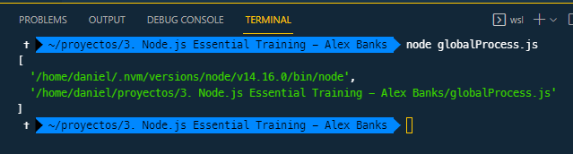

Por ejemplo, podríamos usar array destructuring y enviar al correr el proceso nuestro nombre y apellido `npm globalProcess Daniel Ramirez`

```javascript
const [, , firstName, lastName] = process.argv;

console.log(`Your name is ${firstName} ${lastName}`); // Your name is Daniel Ramirez
```

Lo anterior es un ejemplo básico, pero lo que queremos hacer de verdad es entregar flags y que tengamos una función que sepa identificar el flag y el siguiente elemento del flag en el array (es decir, encontrar la posicion del flag y obtener el flag+1 en posicion) para usar ese argumento en nuestro proceso

```javascript
const grab = (flag) => {
  let indexAfterFlag = process.argv.indexOf(flag) + 1; // Encontramos el index donde está el flag que enviamos por la terminal
  return process.argv[indexAfterFlag];
};

const gretting = grab('--gretting'); //flag que queremos identificar
const user = grab('--user');

console.log(`${gretting} ${user}`);
```

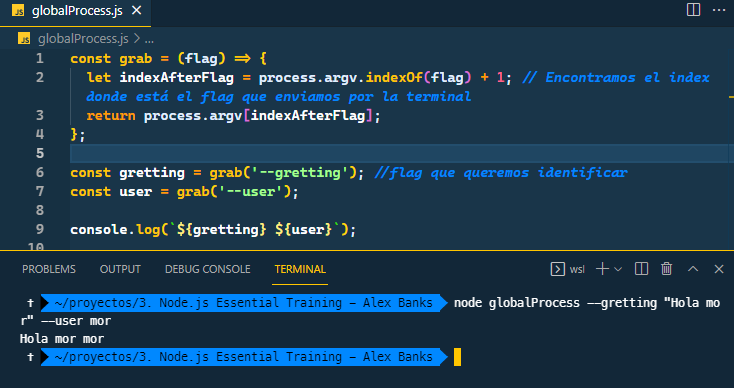

### Standard output & input

Otra herramienta del objeto process es el standard input y output que nos permiten comunicarnos con el proceso mientras está corriendo, por ahora, los utilizaremos para leer y escribir a la terminal

`process.stdout` es un writable string e implementa un metodo `write()` que podemos usar para enviar data fuera del programa a la terminal


Supongamos que creamos una aplicacion que le preguntará al usuario algo usando una funcion que lee el index del array con preguntas

```javascript
const questions = [
  'Whats your name?',
  'What would you rather be doing',
  'What is your preferred programming language?',
];

const ask = (i = 0) => {
  process.stdout.write(`\n\n\n ${questions[i]}`);
  process.stdout.write(`> `);
};

ask();
```

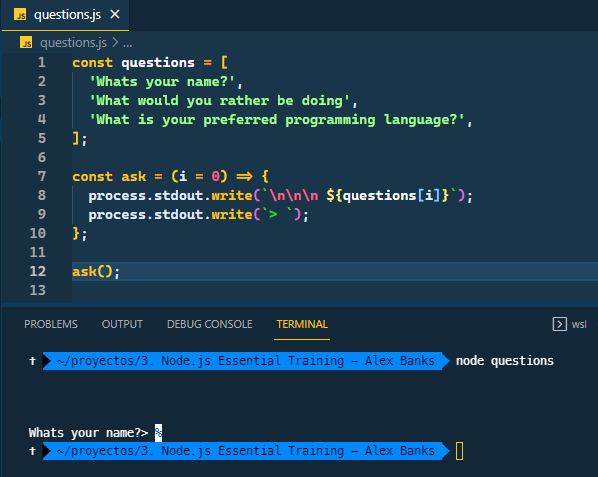

Cuando corramos esto, no podremos entrar data porque:

1. El programa ejecuta la función ask y sale inmediatamente
2. Este módulo que creamos es **corre sincrono**, es decir, declaramos todas nuestras variables, declaramos la funcion, y hacemos la pregunta cuando la termina de hacer node ve que no hay nada más que hacer y deja de correr el programa
3. Finalizaremos esto usando **process standard input** y crearemos un modulo **asincrono**

---

1. Usaremos el `process.stdin`
2. Crearemos un listener usando la funcion on
3. El nombre del evento que estamos escuchando es `"data"`, esto significa, que has copiado algo con el teclado y has presionado enter
4. El segundo elemento de on es el handler, por ahora simplemente devolveremos lo que el usuario copie en la terminal
5. La data viene en modo binario, por eso debemos usar toString()
6. La aplicación esta escuchando por input, esto la hace asincrona

```javascript
const questions = [
  'Whats your name?',
  'What would you rather be doing',
  'What is your preferred programming language?',
];

const ask = (i = 0) => {
  process.stdout.write(`\n\n\n ${questions[i]}`);
  process.stdout.write(`> `);
};

ask();

process.stdin.on('data', (data) => {
  process.stdout.write(`\n\n ${data.toString().trim()} \n\n`);
});
```

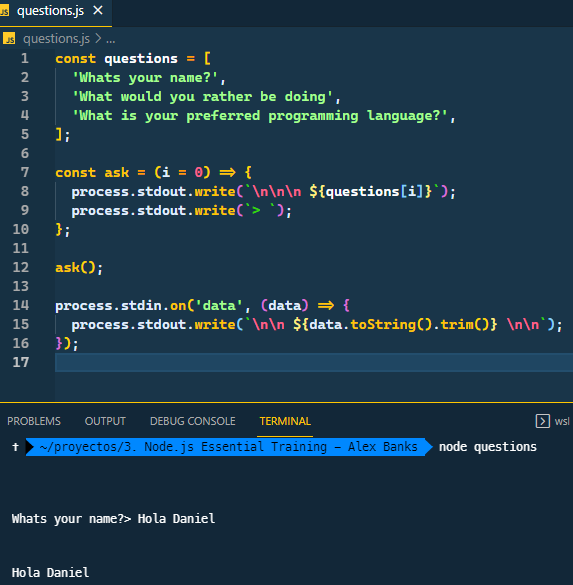

Terminando la app

```javascript
const questions = [
  'Whats your name?',
  'What would you rather be doing',
  'What is your preferred programming language?',
];

const ask = (i = 0) => {
  process.stdout.write(`\n\n\n ${questions[i]}`);
  process.stdout.write(`> `);
};

ask();

const answers = [];

process.stdin.on('data', (data) => {
  answers.push(data.toString().trim());

  if (answers.length < questions.length) {
    ask(answers.length);
  } else {
    process.exit();
  }
});

process.on('exit', () => {
  const [name, activity, lang] = answers;
  console.log(`

  Thank you for your answers.

  Go ${activity} ${name} you can write ${lang} code later

  `);
});
```

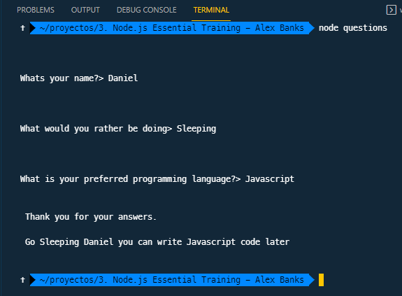

## Node Modules

- Muchos de los `modules` que cargamos y con los que trabajamos son hosteados por `npm` y son hechos por la comunidad de nodeJS
- Los `modules` que vienen por defecto con `nodeJS` y se les conoce como los `core modules` algunos de estos modulos son
  1. path
  2. util
  3. v8
  4. readline

### Readline

Readline es un modulo que nos puede ayudar a construir una aplicación para perguntarle al usuario desde la terminal al igual que hicimos anteriormente.

1. Como readline es un `core module` lo único que necesitamos para usarlo es usar `require`
2. Para usar readline, necesitamos crear una interfaz
   1. A la interfaz le tenemos que pasar un `objeto` que le dice que usar para el input y para el output
3. Para hacer una pregunta, podemos usar el método `question` de `readline`
   1. Este método recibe la pregunta y un callback o handler

```javascript
const readline = require('readline');

const rl = readline.createInterface({
  input: process.stdin,
  output: process.stdout,
});

rl.question('How are you?', (answer) => {
  console.log(`Your answer ${answer}`);
});
```

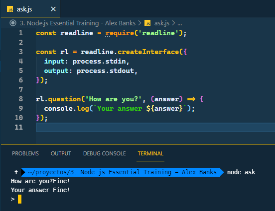

#### Creando una aplicación para hacer preguntar con la terminal & readline

```javascript
const readline = require('readline');

const rl = readline.createInterface({
  input: process.stdin,
  output: process.stdout,
});

const questions = [
  'Whats your name? ',
  'What would you rather be doing? ',
  'What is your preferred programming language? ',
];

const collectAnswers = (questions, done) => {
  const answers = [];
  const [firstQuestion] = questions;

  const questionAnswered = (answer) => {
    answers.push(answer);
    if (answers.length < questions.length) {
      rl.question(questions[answers.length], questionAnswered);
    } else {
      done(answers);
    }
  };

  rl.question(firstQuestion, questionAnswered);
};

collectAnswers(questions, (answers) => {
  console.log('Thank you for your answers ');
  console.log(answers);
  process.exit();
});
```


### Export custom modules

1. En nodeJS cada javscript file es su propio modulo
2. La funcion `require`hace parte del `common JS module pattern`, pero esta solo representa el 50%, el otro 50% es la funcion `module.export`
3. El module.export nos sirve para exportar data y funcionalidad de un modulo


1. Cuando queremos usar otro archivo JS debemos especificar la ruta a dicho archivo
2. Cuando usamos `core nodeJS modules` o modulos instalados con `npm` no tenemos que especificar la ruta

```js
// myModule.js
const { inc, req, getCount } = require('./myModule.js');

inc();
inc();
inc();
dec();

console.log(getCount());
```

```js
// app.js
const counter = require('./myModule.js');
counter.inc();
counter.inc();
counter.inc();
console.log(counter.getCount());
```


1. En todos los archivos JS, todas las variables pertenecen a cada modulo por lo que los archivos que usen dicho modulo NO TENDRAN ACCESO a las variables
2. Lo que hacemos es crear una función que retorne el valor de count
3. `module.exports`permite exportar cualquier tipo de Javascript, en este caso un objeto y ahí enviaremos las funciones
4. En el modulo donde estamos consumiendo ya podemos hacer uso de estas funciones exportadas previamente
5. También podríamos hacer una destructuración de las funciones que enviamos al momento de usar el `require` en el modulo que va consumir dichas funciones

```js
const { inc, req, getCount } = require('./myModule.js');

inc();
inc();
inc();
dec();

console.log(getCount());
```

#### Exportando la funcion collectAnswers

Vamos a mover la funcion `collectAnswers` de nuestra app de la terminal a su propio modulo para reutilizarla, la guardaremos en una carpeta llamada lib y la exportaremos a nuestro archivo `question2.js`

```js
// lib/collectAnswers.js
const readline = require('readline');
const rl = readline.createInterface({
  input: process.stdin,
  output: process.stdout,
});

module.exports = (questions, done) => {
  const answers = [];
  const [firstQuestion] = questions;

  const questionAnswered = (answer) => {
    answers.push(answer);
    if (answers.length < questions.length) {
      rl.question(questions[answers.length], questionAnswered);
    } else {
      done(answers);
    }
  };

  rl.question(firstQuestion, questionAnswered);
};

// questions2.js
const collectAnswers = require('./lib/collectAnswers.js');

const questions = [
  'Whats your name? ',
  'What would you rather be doing? ',
  'What is your preferred programming language? ',
];

collectAnswers(questions, (answers) => {
  console.log('Thank you for your answers ');
  console.log(answers);
  process.exit();
});
```

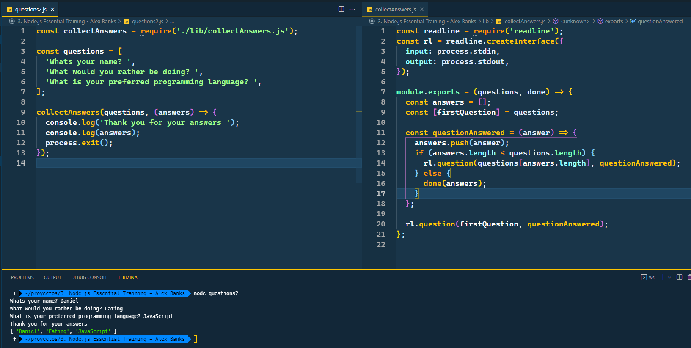

Podríamos no enviar un callback al momento de llamar a la funcion `collectAnswers` lo que nos enviaría un error, como se muestra acá


Este error se da porque nuestro callback no es una funcion, no enviamos una funcion que manejara las respuestas, esto lo podemos solucionar haciendo el callback algo opcional

```js
// lib/collectAnswers.js
const readline = require('readline');
const rl = readline.createInterface({
  input: process.stdin,
  output: process.stdout,
});

module.exports = (questions, done = (f) => f) => {
  const answers = [];
  const [firstQuestion] = questions;

  const questionAnswered = (answer) => {
    answers.push(answer);
    if (answers.length < questions.length) {
      rl.question(questions[answers.length], questionAnswered);
    } else {
      done(answers);
    }
  };

  rl.question(firstQuestion, questionAnswered);
};
```

Estamos creando una funcion dummy que no hace nada, así el código no se romperá al no enviar el callback al momento de consumir la función en `questions2.js`


## EventEmitter

El `EventEmitter` es la implementacion de node del patron `publisher-subscriber`

> The Publish/Subscribe pattern, also known as pub/sub, is an architectural design pattern that provides a framework for exchanging messages between publishers and subscribers. This pattern involves the publisher and the subscriber relying on a message broker that relays messages from the publisher to the subscribers. The host (publisher) publishes messages (events) to a channel that subscribers can then sign up to.
> In software architecture, publish–subscribe is a messaging pattern where senders of messages, called publishers, do not program the messages to be sent directly to specific receivers, called subscribers, but instead categorize published messages into classes without knowledge of which subscribers, if any, there may be. Similarly, subscribers express interest in one or more classes and only receive messages that are of interest, without knowledge of which publishers, if any, there are.

Este modulo de nodeJS nos da un mecanismo para emitir custom events, y subscribir listeners & handlers para esos eventos, para usar el `EventEmitter` debemos:

1. Requerir el módulo `require("events")`
2. Crear una instancia del `EventEmitter`, este es un constructor que nos permite crear nuevos `custom events`
3. Para crear un `custom event` usamos la funcion `emit()`

   1. Esta funcion recibe como primer parametro el nombre del evento
   2. Los datos que se van a pasar al handler

   ```js
   emitter.emit('customEvent', 'Hello World', 'Computer');
   ```

4. Luego de tener los eventos, creamos los handlers, se crean con la funcion `on()`.

   1. El primer argumento es el evento que queremos manejar, en este caso `customEvent` y el segundo es la función que manejara la data

   ```js
   emitter.on('customEvent', (message, user) => {
     console.log(`${user} says: ${message}`);
   });

   emitter.emit('customEvent', 'Hello World', 'Computer');
   ```

```js
// events.js
const events = require('events');

const emitter = new events.EventEmitter();

emitter.on('customEvent', (message, user) => {
  console.log(`${user} says: ${message}`);
});

emitter.emit('customEvent', 'Hello World', 'Computer');
emitter.emit('customEvent', 'Cool', 'Daniel');
```

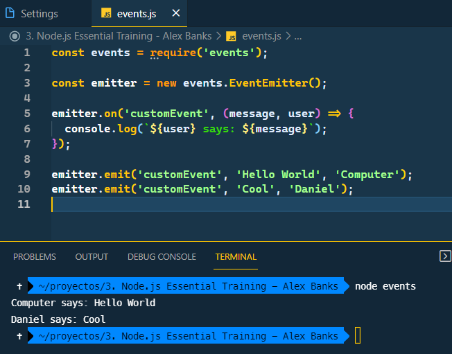

Otro feature importante del `EventEmitter` es que es asincrono, estos eventos son emitidos cuando suceden, por ejemplo si modificaramos el código y escucharamos por el input del usuario en la terminal

```js
// events.js
const events = require('events');

const emitter = new events.EventEmitter();

emitter.on('customEvent', (message, user) => {
  console.log(`${user} says: ${message}`);
});

process.stdin.on('data', (data) => {
  const input = data.toString().trim();
  if (input === 'exit') {
    emitter.emit('customEvent', 'Goodbye!', 'process');
    process.exit();
  }
  emitter.emit('customEvent', input, 'terminal');
});
```

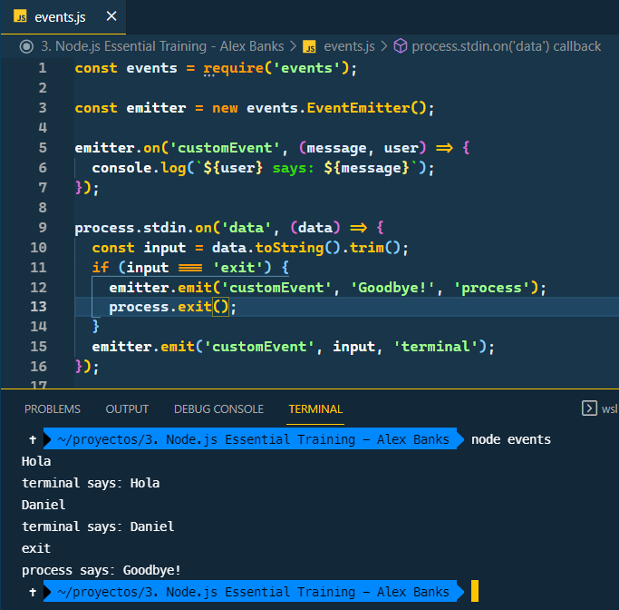

### EventEmitter en nuestra app

Podemos usar el `EventEmitter` para mejorar nuestra app de la terminal

1. Lo primero es retornar el emitter al final de la función una vez se ha creado una nueva instancia del `EventEmitter`
2. Supongamos que queremos enviar un evento cada vez que se responde una pregunta
   1. Cada vez que un usuario responde una pregunta la funcion `questionAnswered` es llamada, entonces, antes de hacer el push de la respuesta podemos crear el evento
3. Tambien creamos un evento `complete` al cual le enviamos todas las respuestas

```js
const readline = require('readline');
const { EventEmitter } = require('events');

const rl = readline.createInterface({
  input: process.stdin,
  output: process.stdout,
});

module.exports = (questions, done = (f) => f) => {
  const answers = [];
  const [firstQuestion] = questions;
  const emitter = new EventEmitter();

  const questionAnswered = (answer) => {
    emitter.emit('answer', answer);
    answers.push(answer);
    if (answers.length < questions.length) {
      rl.question(questions[answers.length], questionAnswered);
    } else {
      emitter.emit('complete', answers);
      done(answers);
    }
  };

  rl.question(firstQuestion, questionAnswered);

  return emitter;
};
```

1. Con el cambio anterior, agregamos unas opciones a nuestra función, una de estas es `wire up listeners` a los eventos, es decir, podemos crear el handler cada vez que se dispare el evento que definimos anteriormente
2. Es decir, basicamente nos suscribimos al evento "answer" y cada vez que este sucede podemos manejarlo como queramos en el módulo donde estamos consumiendo dicho evento

```js
// questions2.js

const collectAnswers = require('./lib/collectAnswers.js');

const questions = [
  'Whats your name? ',
  'What would you rather be doing? ',
  'What is your preferred programming language? ',
];

const answerEvents = collectAnswers(questions);

answerEvents.on('answer', (answer) =>
  console.log(`Your answer was: ${answer}`)
);

answerEvents.on('complete', (answers) => {
  console.log('Thank you for your answers ');
  console.log(answers);
});

answerEvents.on('complete', () => process.exit());
```

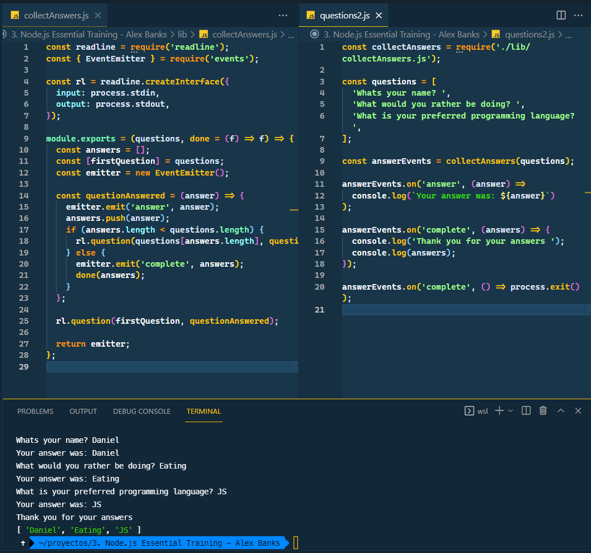

## File System Basics

nodeJS tambien viene con un modulo que nos permite interactuar con los archivos del sistema, `fs` puede ser usados para:

1. Crear nuevos archivos en directorios
2. Vigilar achivos
3. Modificar permisos
4. Entre otros

### Leyendo los archivos de un directorio

```js
const fs = require('fs');
const files = fs.readdirSync('./assets');
console.log(files);
```

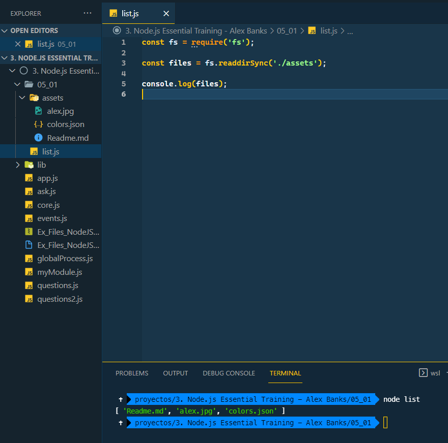

1. `readdirSync()` es sincrona, esto significa, que JS va a detener todo hasta que termine de leer todos los archivos en ese directorio
2. Podemos leer asincrono con la funcion `readdir()`, esta recibe un callback donde manipularemos los archivos que nos llegan luego de leer
   1. El primer argumento que le enviamos es un error y el segundo son los archivos
   2. Como es asincrona, el callback function será llamado una vez node termine de leer los archivos

```js
const fs = require('fs');

fs.readdir('./assets', (err, files) => {
  if (err) {
    throw err;
  }

  console.log(files);
});

console.log(files);
```

### Leyendo un archivos

#### Sincrono

```js
const fs = require('fs');

const text = fs.readFileSync('./assets/Readme.md', 'UTF-8');

console.log(text);
```

#### Asincrono

```js
const fs = require('fs');

fs.readFile('./assets/Readme.md', 'UTF-8', (err, text) => {
  console.log('File contents read');
  console.log(text);
});
```

### WRITE AND APPEND FILES

Creamos archivos con la función `writeFile()`

1. Primer argumento es la ruta donde queremos guardar
2. El texto que queremos escribir al archivos
3. Un callback function que usamos para mostrar errores, solo recibe un argumento, el error

```js
const fs = require('fs');

const md = `

# This is a new file

We can write text to a file with fs.writeFile

`;

fs.writeFile('./assets/notes.md', md.trim(), (err) => {
  if (err) {
    throw err;
  }
  console.log('file saved');
});
```

- Una buena práctica es antes de crear un archivo verificar si dicho archivo existe

```js
if (fs.existsSync('./assets/notes.md')) {
  console.log('File already exists');
} else {
  fs.writeFile('./assets/notes.md', md.trim(), (err) => {
    if (err) {
      throw err;
    }
    console.log('file saved');
  });
}
```

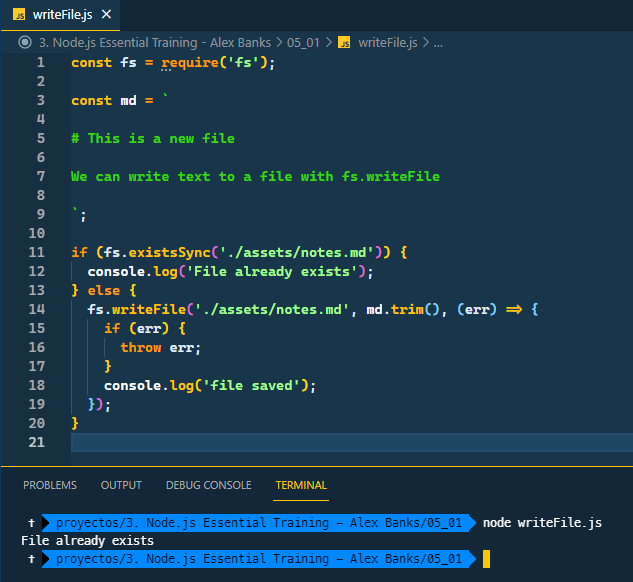

### DIRECTORY CREATION

Creamos directorios con la funcion `mkdir()`, funciona igual al writeFile

```js
const fs = require('fs');

if (fs.existsSync('storage-files')) {
  console.log('Directory already exists');
} else {
  fs.mkdir('storage-files', (err) => {
    if (err) {
      throw err;
    }

    console.log('directory created');
  });
}
```

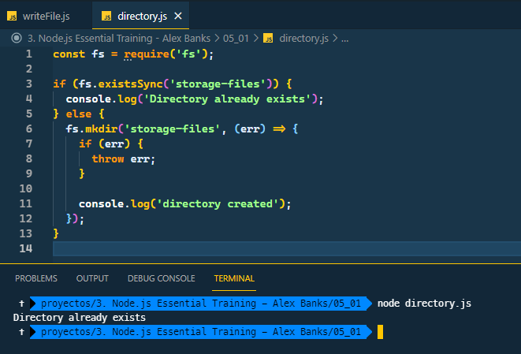

### APPEND FILES

La función `appendFile()` creara el archivo si no existe y si existe agregará lo que enviemos o queramos anexar

- Funciona igual que las `writeFile()`, ruta, data a anexar y callback
- Cada vez que corremos el modulo, se anexaran nuevas lineas al documento

```js
const fs = require('fs');
const colorData = require('./assets/colors.json');

colorData.colorList.forEach((c) => {
  fs.appendFile(
    './storage-files/colors.md',
    `${c.color}: ${c.hex} \n`,
    (err) => {
      if (err) {
        throw err;
      }
    }
  );
});
```

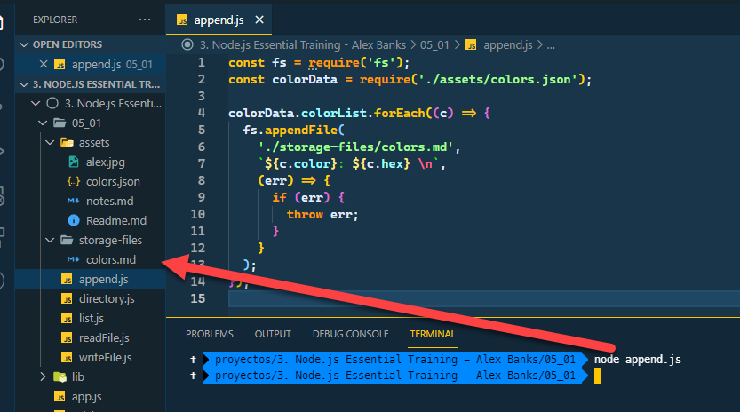

### RENAME AND REMOVE FILES

Podemos renombrar con la funcion `renameSync()` o `rename()` también podemos cambiar de posición el archivo si cambiamos toda la ruta pero no el nombre del archivo

```js
const fs = require('fs');

fs.renameSync('./assets/colors.json', './assets/colorData.json');

fs.rename('./assets/notes.md', './storage-files/notes.md', (err) => {
  if (err) {
    throw err;
  }
});

setTimeout(() => {
  fs.unlinkSync('./assets/alex.jpg');
}, 4000);
```

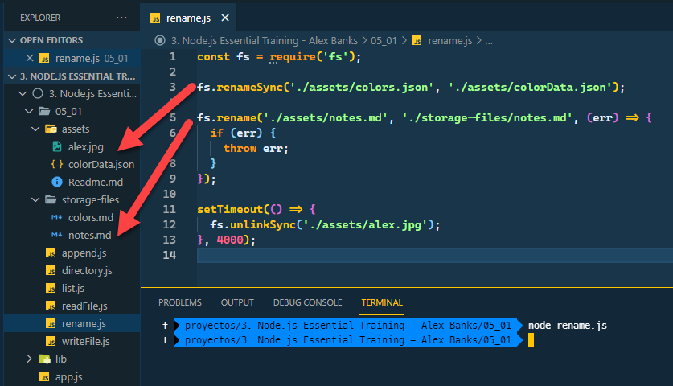

### RENAME AND REMOVE DIRECTORIES

Para remover directorios usamos `rmdir()` la unica diferencia, es que un directorio no se puede eliminar sin antes haber eliminado todos los archivos que contiene

- Cambiemos de nombre el directorio storage-files por storage
- Eliminemos los archivos adentro de storage y posteriormente eliminemos storage

```js
const fs = require('fs');

fs.renameSync('./storage-files', './storage');

fs.readdirSync('./storage').forEach((fileName) => {
  fs.unlinkSync(`./storage/${fileName}`);
});

fs.rmdir('./storage', (err) => {
  if (err) {
    throw err;
  }
});
```

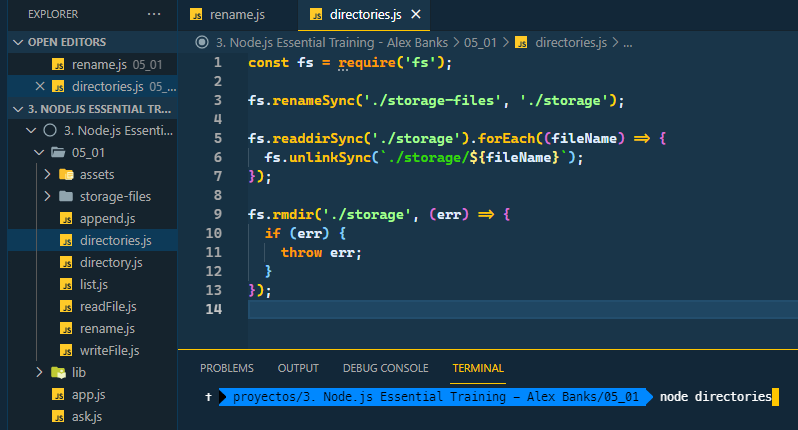
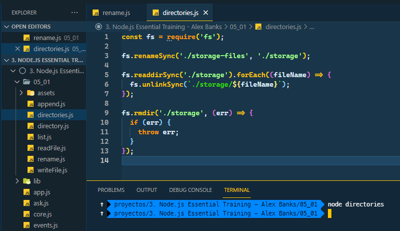

## FILES AND STREAMS

Streams son uno de los conceptos fundamentales que Node.js, son una manera de manejar eficientemente:

- Reading/writing files
- Network communications
- Cualquier end-to-end information exchange

En la manera tradicional, cuando un programa lee un archivo, el archivo es leido en la memoria de inicio a fin y luego se procesa

Usando stream, se lee pedazo a pedazo del archivo, procesando su contenido sin almacenarlo todo en memoria

El modulo de stream provee las bases para todas las APIs que usan streaming, todos los streams son instancias de `EventEmitter`

### READABLE FILE STREAMS

> a stream you can pipe from, but not pipe into (you can receive data, but not send data to it). When you push data into a readable stream, it is buffered, until a consumer starts to read the data.

Basicamente son archivos de los que se puede recibir data, pero no enviar data

- `process.stdin` es un `readable stream`, leemos la data escuchando data events
- `file system, fs` tambien viene con una manera de crear readable streams
- Al crear un readable stream con fs, el primer argumento es el path al archivo que será leido. El segundo argumento es si queremos crear un binary read stream o text read stream, de acuerdo a esto pasamos el encoding
  - Como queremos text read stream, pasamos UTF-8

```js
const fs = require('fs');

const readStream = fs.createReadStream('./assets/lorum-ipsum.md', 'UTF-8');

console.log('type something...');
readStream.on('data', (data) => {
  console.log(`I read ${data.length - 1} characters of text`);
});
```

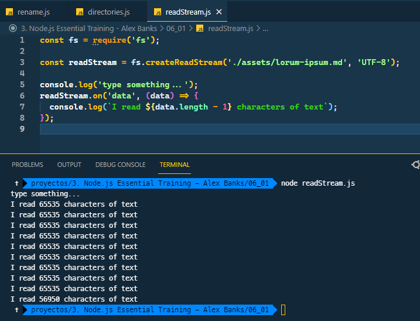

Estos streams crean eventos por lo que podemos usarlos para manipular la data

```js
readStream.once('data', (data) => {
  console.log(data);
});

readStream.on('end', (data) => {
  console.log('finished reading file');
});
```

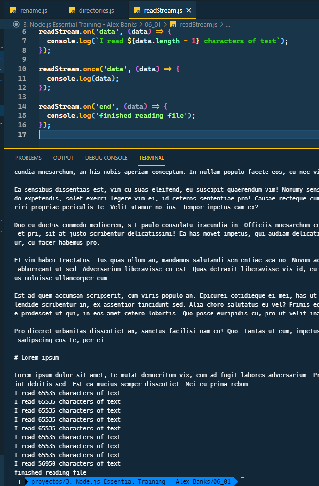

### WRITABLE FILE STREAMS

> a stream you can pipe into, but not pipe from (you can send data, but not receive from it)

Archivos en los que podemos enviar data pero no recibir, `process.stdout` es un writable stream

```js
const fs = require('fs');

const writeStream = fs.createWriteStream('./assets/myFile.txt', 'UTF-8');

writeStream.write('Hello');
writeStream.write(' world \n');
```

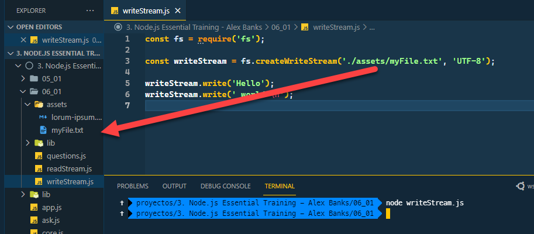

#### Ejemplo: Enviando la data de la terminal a un archito

```js
const fs = require('fs');

const writeStream = fs.createWriteStream('./assets/myFile.txt', 'UTF-8');

process.stdout.on('data', (data) => {
  writeStream.write(data);
});
```

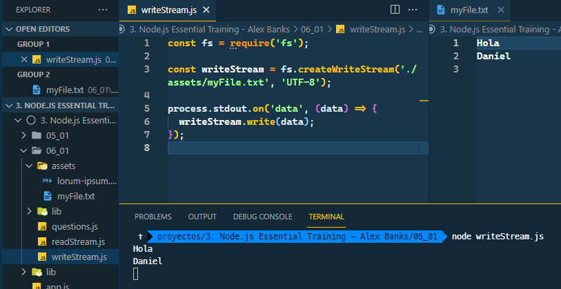

#### Ejemplo: Usando write and read stream

```js
// Basicamente estamos haciendo una copia del archivo
const fs = require('fs');

const writeStream = fs.createWriteStream('./assets/myFile.txt', 'UTF-8');
const readStream = fs.createReadStream('./assets/lorum-ipsum.md', 'UTF-8');

readStream.on('data', (data) => {
  writeStream.write(data);
});
```

### pipe()

El metodo pipe lo que hace es que toma la fuente y lo lleva al destinatario

Se llama en el source stream, y se envia al destinatario

```js
const fs = require('fs');

const writeStream = fs.createWriteStream('./assets/myFile.txt', 'UTF-8');
const readStream = fs.createReadStream('./assets/lorum-ipsum.md', 'UTF-8');

process.stdin.pipe(writeStream);
// Todo lo que llegue por la terminal como data lo va enviar al writable stream
```

```js
const fs = require('fs');

const writeStream = fs.createWriteStream('./assets/myFile.txt', 'UTF-8');
const readStream = fs.createReadStream('./assets/lorum-ipsum.md', 'UTF-8');

readStren.pipe(writeStream);
// Basicamente, copiar el archivo de nuevo
```

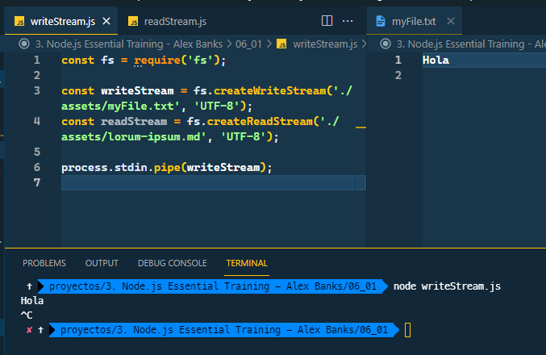

### CHILD PROCESS WITH EXEC

El modulo child_process nos permite ejecutar procesos externos del sistema, es decir, comunicarse con otras aplicaciones del sistema

1. La funcion execute es para operaciones sincronas
2. El primer argumento es el comando que queremos ejecutar y en caso que devuelvan datos, el segundo es la funcion handler con la que manejaremos dichos datos

```js
const cp = require('child_process');

cp.exec('open http://www.google.com');
```

```js
const cp = require('child_process');

cp.exec('ls', (err, data) => {
  if (err) {
    throw err;
  }

  console.log(data);
});
```

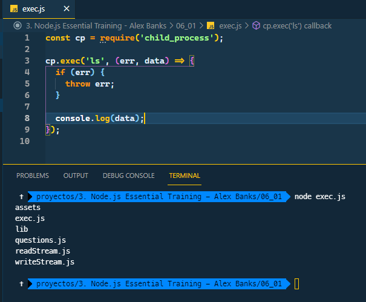

### CHILD PROCESS WITH SPAWN

spawn lo usamos para manejar procesos asincronos

1. Basicamente vamos a tener corriendo la aplicación como una variable
2. Al usar spawn, el primer argumento es el comando que queremos enviar
   1. Los otros argumentos extras se envian en un array
3. Una vez creada la aplicacion, nos podemos comunicar con ella atraves de `stdin` y `stdout`
   1. Podemos por ejemplo, cada vez que la aplicacion envie información (data) usar un console log diciendo que la aplicacion esta enviando data

```js
const cp = require('child_process');

const questionApp = cp.spawn('node', ['questions.js']);

questionApp.stdout.on('data', (data) => {
  console.log(`from the question app: ${data}`);
});

questionApp.on('close', () => {
  console.log('questionApp process exited');
});
```

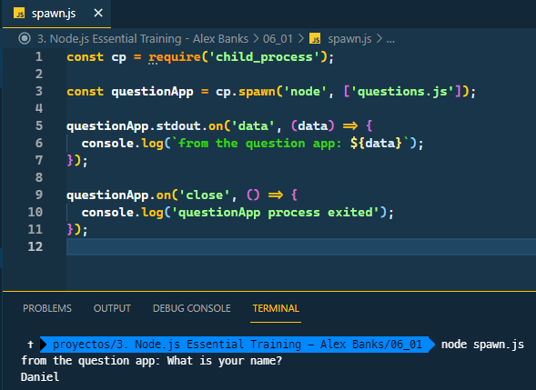

Podemos enviar data a la aplicacion con stdin

```js
const cp = require('child_process');

const questionApp = cp.spawn('node', ['questions.js']);

questionApp.stdin.write('Daniel \n');
questionApp.stdin.write('Medellin \n');
questionApp.stdin.write('Learn \n');

questionApp.stdout.on('data', (data) => {
  console.log(`from the question app: ${data}`);
});

questionApp.on('close', () => {
  console.log('questionApp process exited');
});
```

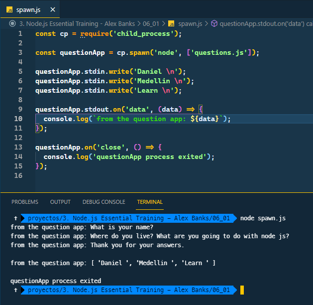

## CONCLUSION & NEXT COURSES

1. Advanced Node.js
   1. Se centra en programacion asincrona & data streaming
2. Advanced Node.js scaling applications
   1. Explora temas como clonar, escalar databases y descomponer apps en micro services
3. Node.js design patterns
   1. Patrones de diseño para escribir mejor codigo de JS
