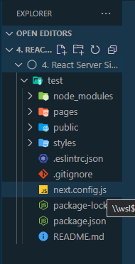
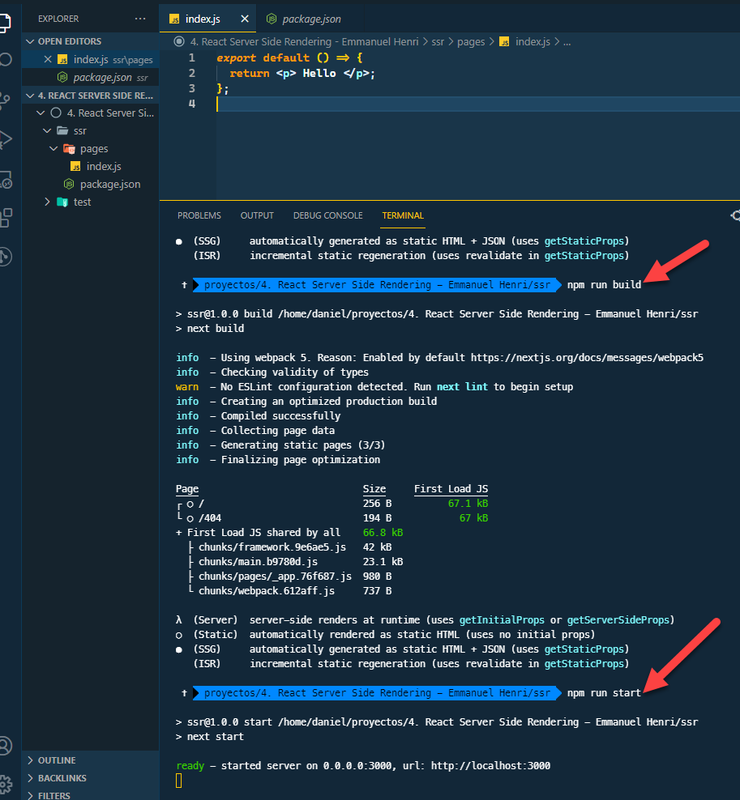
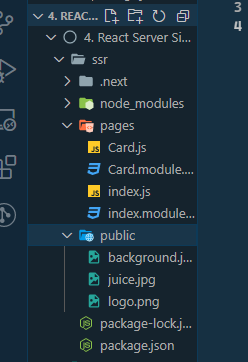
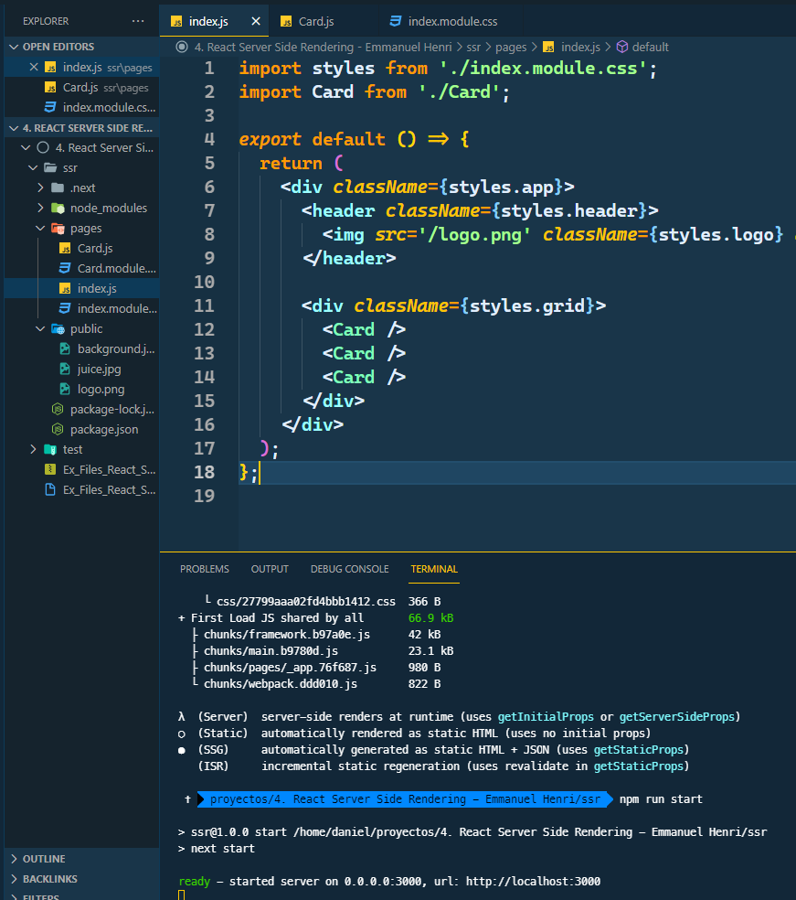
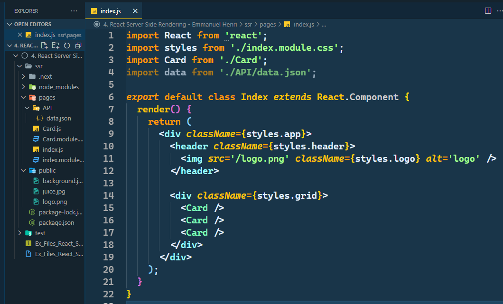
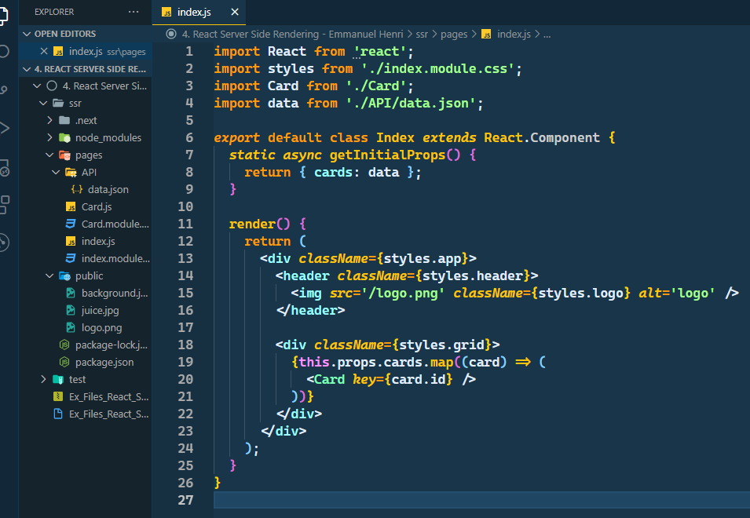
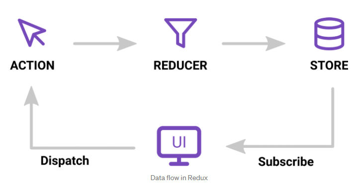
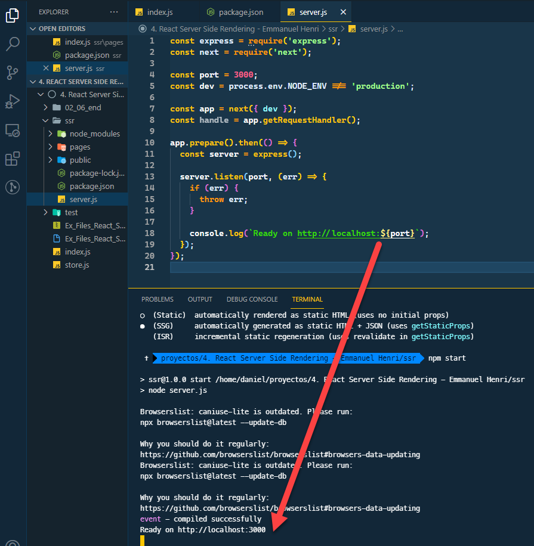
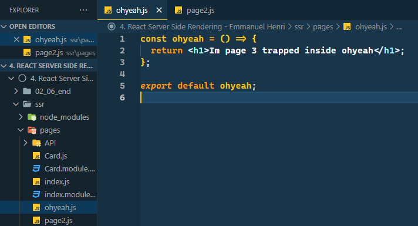

# REACT SERVER-SIDE RENDERING

## SERVER-SIDE RENDERING (SSR) INTRODUCTION

Isomorphic, Universal & SSR, son terminos que indican lo mismo, es decir, que la apicación en renderizada en el servidor y no en el cliente


- CLIENT RENDERING

  - El backend entrega APIs o data al front-end
  - React, con la data en la mano renderiza el HTML en el explorador

- SERVER SIDE RENDERING
  - El servidor crea el HTML y lo entrega al cliente eliminando esta responsabilidad del explorador
  - Dependiendo del tamaño de la aplicación, provee tiempos más rapidos de carga
  - Mejora la busqueda con el search engine

## NEXT.JS TO BUILD SSR

NextJS es una libreria que nos permite crear rapidamente una aplicacion con SSR

NextJS usa webpack (module bundler), hay 2 maneras de crear una aplicación con NEXTJS

1. `npx create-next-app [nombre-app]`



2. Crearla manualmente como veremos a continuacion

### CREANDO UNA APP MANUALMENTE CON NEXTJS

1. Iniciar npm con `npm init` y llenar la informacion necesaria
2. Instalar react, react-dom & nextjs

   > `npm install react react-dom next`

   ```json
   "dependencies": {
       "next": "11.1.0",
       "react": "17.0.2",
       "react-dom": "17.0.2"
     },
   ```

3. Usar los scripts adecuados para next

   ```json
   "scripts": {
       "dev": "next dev",
       "build": "next build",
       "start": "next start",
       "lint": "next lint"
     }
   ```

4. Crear el folder pages, donde van las páginas que se renderizarán en el servidor y creamos el **index.js**

   - Exportaremos una frase simplemente
   - Posteriormente correremos next, antes de correr cualquier app de next primero hay que correr el build

   > `npm run build`
   >
   > `npm run start`

   

### ADD INITIAL COMPONENTS FROM TEMPLATE

Usaremos unos archivos base para construir nuestra aplicacion, para esto debemos crear un public folder donde guardaremos imagenes que usaremos y pegaremos un template de una aplicacion que entregan en el curso



- NextJS nos da la posibilidad de importar CSS, extiende la funcionalidad de `import`
- Next soporta los CSS Modules, usando el `[name].module.css`, basicamente, los modulos de CSS buscaran el componente que tenga el mismo nombre, esto permite que la misma clase exista en diferentes componentes!

```js
// index.js
import styles from './index.module.css';
import Card from './Card';

export default () => {
  return (
    <div className={styles.app}>
      <header className={styles.header}>
        
      </header>

      <div className={styles.grid}>
        <Card />
        <Card />
        <Card />
      </div>
    </div>
  );
};
```



### ADD DATA FOR PROPS

Hasta ahora hemos usado componentes sin estado, cuando necesitamos pasar data tenemos que usar el estado y luego pasar ese estado como `props` a nuestros componentes

Nextjs usa un approach un poco diferente pero conceptualmente es igual, veamos el ejemplo

1. Importaremos la data que se encuentra en el directorio API
2. Importaremos react, porque convertiremos la funcion en una clase de react

   ```js
   import React from 'react';
   import styles from './index.module.css';
   import Card from './Card';
   import data from './API/data.json';

   export default class Index extends React.Component {
     render() {
       return (
         <div className={styles.app}>
           <header className={styles.header}>
             
           </header>

           <div className={styles.grid}>
             <Card />
             <Card />
             <Card />
           </div>
         </div>
       );
     }
   }
   ```

   

3. Creamos el estado con la funcion `getInitialProps()` y pasamos la data al objeto cards

   ```js
   static async getInitialProps() {
       return { cards: data };
     }
   ```

4. Una vez hecho esto, podemos usar esta data en un map para mostrar toda la informacion de las cards que tenemos en la data que importamos

   ```js
   import React from 'react';
   import styles from './index.module.css';
   import Card from './Card';
   import data from './API/data.json';

   export default class Index extends React.Component {
     static async getInitialProps() {
       return { cards: data };
     }

     render() {
       return (
         <div className={styles.app}>
           <header className={styles.header}>
             
           </header>

           <div className={styles.grid}>
             {this.props.cards.map((card) => (
               <Card key={card.id} />
             ))}
           </div>
         </div>
       );
     }
   }
   ```

   

### ADD REDUX STORE AND SETUP

1. Instalar las dependencias necesarias

   > `npm i next-redux-wrapper react-redux redux`

2. Crear el `store.js` en la carpeta root

   - Creamos el store con `createStore` de redux, el store es el que contiene todo el estado de la app y solo debe haber uno por aplicación
   - Creamos `initStore` que es basicamente un wrapper para simplificar el codigo de redux

   ```js
   import { createWrapper } from 'next-redux-wrapper';
   import { createStore } from 'redux';
   import data from './pages/API/data.json';

   // create store
   // el initialState por default = startState
   const store = (initialState = startState) => {
     return createStore(reducer, initialState);
   };

   export const initStore = createWrapper(store);
   ```

3. Actualizamos nuestro `index.js`

   - Actualizamos el `getinitialProps` pasando el store
   - Retornamos el store y hacemos un dispatch para llamar los cards iniciales
   - Hacemos `export` al `initStore` creado anteriormente en el store y le pasamos el componente index
     - Basicamente, estamos haciendo un WRAP al componente con ayuda del `initStore`

   ```js
   import React from 'react';
   import styles from './index.module.css';
   import Card from './Card';
   import { initStore } from '../store';

   class Index extends React.Component {
     static async getInitialProps({ store }) {
       return store.dispatch(initialCards());
     }

     render() {
       return (
         <div className={styles.app}>
           <header className={styles.header}>
             
           </header>

           <div className={styles.grid}>
             {this.props.cards.map((card) => (
               <Card key={card.id} />
             ))}
           </div>
         </div>
       );
     }
   }

   export default initStore.withRedux(Index);
   ```

### ADD REDUX ACTIONS

Al implementar redux necesitamos las acciones, basicamente, son funciones que serán despachadas (**dispatch**) o llamadas por el componnt y luego ejecutaran el `reducer` para actualizar el estado



1. Crear el estado inicial en el store

   - Será un ojbeto con los `cards` los cuales serán un array

   ```js
   // initial state
   const startState = {
     cards: [],
   };
   ```

2. Crear las actions

   - Las acciones tienen un `type` y un `payload`, de acuerdo al type que tengan es la función que se ejecutará (reducer)

   ```js
   // Actions
   export const initialCards = () => {
     return {
       type: 'INITIAL_CARDS',
       payload: data,
     };
   };
   ```

3. Importamos las actions en el index.js

   ```js
   import { initStore, initialCards } from '../store';
   ```

### ADD REDUCERS

Los reducers tomaran la `action` que envió el `dispatch` y actualizarán el estado con base al type que envie la `action`

```js
// Reducers
export const reducer = (state = initialState, action) => {
  switch (action.type) {
    case 'INITIAL_CARDS':
      return {
        cards: action.payload,
      };
    default:
      return state;
  }
};
```

- Para evitar hacer `npm run build` & `npm run start`, podemos usar `npm run dev`

## SERVER-SIDE RENDERING WITH NODE

### CREATE INITIAL EXPRESS OR NEXTJS SERVER

1. Vamos a volver al proyecto cuando no estabamos usando redux
2. Instalamos express para correr nuestro servidor

   > `npm i express`

3. Modificamos el script start

   ```json
   "start": "node server.js"
   ```

4. Creamos el archivo `server.js` en el root

   1. Requerimos express y next, definimos el puerto, la variable dev para saber que estamos en desarrollo o produccion
   2. Creamos la app, en vez de usar `express` usamos `next`
   3. Creamos el `getRequestHandler()`
   4. Usamos `prepare`, basicamente es para que una vez esté corrido el build cree el servidor con express

   ```js
   // server.js
   const express = require('express');
   const next = require('next');

   const port = 3000;
   const dev = process.env.NODE_ENV !== 'production';

   const app = next({ dev });
   const handle = app.getRequestHandler();

   app.prepare().then(() => {
     const server = express();

     server.listen(port, (err) => {
       if (err) {
         throw err;
       }

       console.log(`Ready on http://localhost:${port}`);
     });
   });
   ```

   

### ADD EXPRESS ROUTES

1. Agregamos las rutas al servidor de express

   1. Creamos la ruta a `/page2`, y retornamos el metodo render y le pasamos el page2, pero este page2 debe existir en nuestra carpeta pages
   2. Creamos el default route

   ```js
   server.get('/page2', (req, res) => {
     return app.render(req, res, '/page2');
   });

   server.get('/page3', (req, res) => {
     return app.render(req, res, '/ohyeah');
   });

   server.get('*', (req, res) => {
     return handle(req, res);
   });
   ```

### ADD LINKS AND PAGES WITH EXPRESS OR NEXTJS

1. Debemos crear las paginas adentro del folder pages y el router de express en conjunto con el render de next se encargará de enrutar

   

2. Cremos un link a alguna ruta en nuestro index.js

   ```js
   // index.js
   import Link from 'next/link';

   <Link href='/page2'>
     
   </Link>;
   ```

## CODE SPLITTING

Code splitting es la habilidad de separar el codigo en bundles más pequeños para que carge más rapido

Next viene con code splitting por defecto y es intuitivo, por ejemplo si tenemos un componente llamado A y este tiene un css, y hace importa a algunas dependencias, next hará un bundle con todas sus dependencias y su css automaticamente

- Algunos features avanzados son Dynamic imports y Dynamic React Components que basicamente nos permiten hacer un delay o cargar features especificos de acuerdo a la demanda

## Extra info

- Next js examples github [link](https://github.com/vercel/next.js/tree/canary/examples)
  - Using nextjs with redux-wrapper
  - Using bindActionCreators to use on the component [link](https://redux.js.org/api/bindactioncreators)
