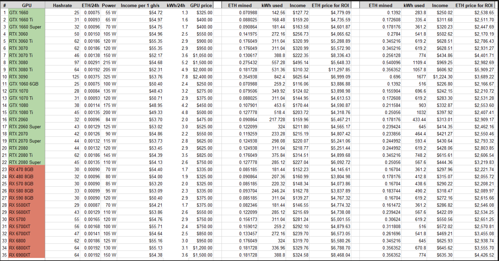

# Minar bitcoin

## GPU

- Debe ser una GPU que pueda

- whattomine para ver las ganancias
- ethermine.org

1. GPU
2. Fuente de poder
3. Placa madre [https://www.amazon.com/gp/product/B073BX57M1/ref=ppx_yo_dt_b_asin_title_o00_s00?ie=UTF8&psc=1]
4. Base para poner las GPUs ![https://www.amazon.com/gp/product/B073Q2CN14/ref=ppx_yo_dt_b_asin_title_o00_s01?ie=UTF8&psc=1]
5. (Procesador) [https://www.asrock.com/MB/Intel/H110%20Pro%20BTC+/#CPU]
6. Ventilador
7. Cable de alimentacion de la tarjeta a la fuente [link](https://www.amazon.com/Endlesss-PCIe-alimentaci%C3%B3n-extensi%C3%B3n-pulgadas/dp/B08NT899YS/ref=sr_1_1_sspa?__mk_es_US=%C3%85M%C3%85%C5%BD%C3%95%C3%91&dchild=1&keywords=PICE+CABLE&qid=1630173709&sr=8-1-spons&psc=1&smid=A2K1N4NSXHNIZJ&spLa=ZW5jcnlwdGVkUXVhbGlmaWVyPUExVU4yVjkyWU1HMFBXJmVuY3J5cHRlZElkPUEwNjI4NzEzMUExMjdYOTJTWDE4ViZlbmNyeXB0ZWRBZElkPUEwNjgxMTM1MkZUTEpZUFNCWDJZQSZ3aWRnZXROYW1lPXNwX2F0ZiZhY3Rpb249Y2xpY2tSZWRpcmVjdCZkb05vdExvZ0NsaWNrPXRydWU=)

- Video sobre como montar el coso de mineria [link](https://www.youtube.com/watch?v=5les7XJhmaA&t=1247s)

- Cable adaptador de 2 fuentes [link](https://articulo.mercadolibre.com.pe/MPE-432577048-adaptador-cable-atx-24pines-a-2-atx-24pines-_JM?searchVariation=54929297407#searchVariation=54929297407&position=7&search_layout=stack&type=item&tracking_id=7deca33d-a509-4795-85ab-454dd9e92f28)

- Raiser para bitcoin [link](https://www.amazon.com/Ubit-PCI-Alimentado-alimentaci%C3%B3n-procesamiento/dp/B072XGDWB3/ref=sr_1_1_sspa?__mk_es_US=%C3%85M%C3%85%C5%BD%C3%95%C3%91&dchild=1&keywords=RISER+MINING&qid=1630173194&sr=8-1-spons&psc=1&spLa=ZW5jcnlwdGVkUXVhbGlmaWVyPUExMVBCVEtSSldTUkFTJmVuY3J5cHRlZElkPUEwMDAwMjEwWlgyV1FXWFRTQk5QJmVuY3J5cHRlZEFkSWQ9QTA0MjkwNjcxVjBRWVI0S0I3UFQ2JndpZGdldE5hbWU9c3BfYXRmJmFjdGlvbj1jbGlja1JlZGlyZWN0JmRvTm90TG9nQ2xpY2s9dHJ1ZQ==)

- Ventiladores [link] (https://www.amazon.com/gp/product/B07NF8BWC5/ref=ppx_yo_dt_b_asin_title_o00_s02?ie=UTF8&psc=1)
