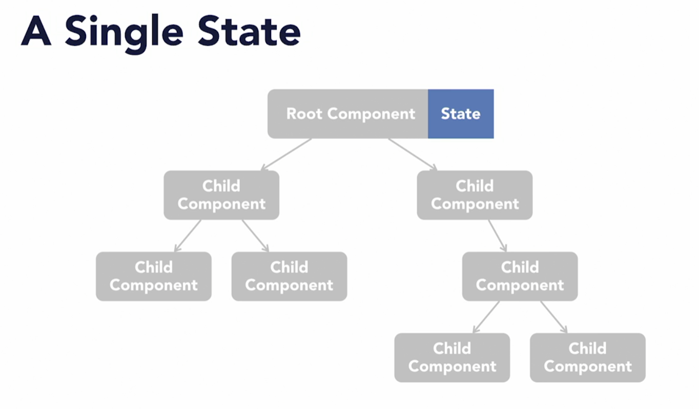

# Building modern projects with react

- [Building modern projects with react](#building-modern-projects-with-react)
  - [The React ecosystem tools](#the-react-ecosystem-tools)
  - [Creating your basic project](#creating-your-basic-project)
    - [Building a React project from scratch](#building-a-react-project-from-scratch)
    - [The React entry point](#the-react-entry-point)
    - [Supporting ES6](#supporting-es6)
    - [The index.js file and app component](#the-indexjs-file-and-app-component)
    - [Building and serving with webpack](#building-and-serving-with-webpack)
  - [Adding Redux](#adding-redux)
    - [How does Redux work ?](#how-does-redux-work-)

## The React ecosystem tools

1. Redux: Ayuda a manejar el estado de la aplicacion, usa la arquitectura **FLUX**
2. Thunk: Separa los side effects de nuestra app, siendo side effects cambios permanentes como modificar la data de un usuario o subir un articulo

   - No ayuda a poner dicha lógica para manejar estos eventos fuera del componente
   - Los componentes deben solamente de mostrar data, nada más

3. Selectors: Redux se encarga de manejar y modificar el estado el proposito de los selectors es abstraer los detalles de como la data es almacenada en el estado
4. Styled components: Una mejor manera de manejar la apariencia de los componentes a parte del CSS, particularmente cuando su apariencia depende del estado en alguna manera

## Creating your basic project

### Building a React project from scratch

Lo que necesitamos para crear una aplicación desde 0 con react es:

1. index.html, esto es lo que se enviará al cliente y lo que react renderizará
2. Support for ES6
3. Webpack, esto hará el build de nuestra app y tambien nos permitirá usar cosas como el CSS modules para plicar estilos a nuestra app y tambien hara el serve during development
4. root component, esta es la base de nuestro `component tree`, es como el container de todos los componentes de nuestra app
5. react-hot-loader, nos permite ver los cambios que le hacemos a la app inmediatamente en desarrollo sin tener que refrescar

### The React entry point

1. `npm init -y` para iniciar un nuevo package.json
2. `git init`
3. Crear 2 directorios, public & src

   1. Public:
      - Este folder va a tener todos los recursos publicos accesibles para nuestra aplicacion como en una pagina estatica
   2. src:
      - Acá irá todo el codigo de react

4. Crear el index.html en el directorio public

   - Este será el HTML que se envíe al cliente cuando envien una peticion a nuestro sitio
   - Será un html básico, con unos tags simples
   - Importante poner el script al final del html

   ```html
   <!DOCTYPE html>
   <html>
     <head>
       <meta charset="UTF-8" />
       <meta
         name="viewport"
         content="width=device-width, initial-scale=1, shrink-to-fit=no"
       />
       <title>React Ecosystems</title>
     </head>
     <body>
       <!-- Muy importante este div con id=rooot, es donde react va a renderizar nuestra aplicacion -->
       <div id="root"></div>
       <noscript> Please enable JavaScript to view this site </noscript>
       <!-- Script to load our react code -->
       <script src="../dist/bundle.js"></script>
     </body>
   </html>
   ```

### Supporting ES6

Escribiremos nuestro codigo de react usando ES6 syntax y necesitaremos soporte para JSX, Reacts special HTML-Like syntax para los layouts de las paginas. Para lograr esto empezamos con:

`npm install --save-dev @babel/core @babel/cli @babel/preset-env @babel/preset-react`

1. Crear el archivo `.babelrc`, este archivo le dirá al transpiler de Babel que presets y plugins usar para transpilar nuestro codigo
2. `@babel/preset-env` => Maneja la transformacion de ES6 a JS comun
3. `@babel/preset-react` => Maneja el JSX

```json
{
  "presets": ["@babel/preset-env", "@babel/preset-react"]
}
```

### The index.js file and app component

1. En la carpeta de src vamos a crear 3 archivos, index.js, App.js & App.css
   1. index.js
      - Acá estará el código que insertará la aplicación en el index.html

```js
//App.js
import React from 'react';
import './App.css';

const App = () => (
  <div className='App'>
    <h1>Hello world</h1>
  </div>
);

export default App;
```

```css
/* App.css */
.App {
  margin: 1rem;
  font-family: Arial, Helvetica, sans-serif;
  color: #222222;
}
```

1. Creemos ahora el codigo que va renderizar nuestro componente App, para esto usamos el ReactDom y el metodo render, que recibe el componente que queremos renderizar y donde lo queremos renderizar, en este caso, en el div con id root
2. Instalar react y react-dom `npm install react react-dom`

### Building and serving with webpack

Debemos configurar webpack para que haga el build de nuestra app, algunas de las funciones que hara webpack son:

- Tomar el codigo del folder src y hacer algunas operaciones como convertir el ES6 & JSX a common JS
- Hostear el folder public para que podamos ver nuestra app en el browser

1. Instalar todos los packages que necesitaremos

   > `npm install --save-dev webpack webpack-cli webpack-dev-server style-loader css-loader babel-loader`

2. Crear nuestro webpack config file

   - Normalmente se escribe en common JS, es el archivo que se encargará de convertir JSX a JS
   - Definimos un export el cual será un objeto de JS con configuracion
     - Debemos definir nuestro entry point para el webpack el cual será el index.**js**

   ```js
   const path = require('path');
   const HtmlWebpackPlugin = require('html-webpack-plugin');

   module.exports = {
     // Where files should be sent once they are bundled
     output: {
       path: path.join(__dirname, '/dist'),
       filename: 'index.bundle.js',
     },
     // webpack 5 comes with devServer which loads in development mode
     devServer: {
       port: 3000,
       watchContentBase: true,
     },
     // Rules of how webpack will take our files, complie & bundle them for the browser
     module: {
       rules: [
         {
           test: /\.(js|jsx)$/,
           exclude: /nodeModules/,
           use: {
             loader: 'babel-loader',
           },
         },
         {
           test: /\.css$/,
           use: ['style-loader', 'css-loader'],
         },
       ],
     },
     plugins: [new HtmlWebpackPlugin({ template: './src/index.html' })],
   };
   ```

   - In `output` we mention where the files should be sent once they are bundled.

     - `path` mentions the name of the directory to be created where all the bundled files will be stored. We have named our folder dist, which is a common practice.
     - And `filename` is the name we set for the new bundled file that will be created after webpack runs it's magic(basically bundles all the js code into one file).

   - `devServer` is used to quickly develop an application, which is contrary to the production mode, which takes slighlty more time to build the application since it minifies the file, which doesn't happen in development mode.

     - With `port` we can set a port number of our choice. I have set it to 3000.
     - `hot` triggers a full page reload when any changes are made in any file. It is disabled by default.

   - `module` is where you pass the rules for bundling files.

     - `test` is where we mention the extension of file which needs to be targetted by the specific loader. All .js or .jsx files need to be bundled by the babel loader.
     - `exclude` is where we mention files that are needed to be ignored by the bundler.
     - Same goes for the `css` files. It is important to take in note that the array of `use :['style-loader', 'css-loader']` needs to be written in that exact order.
     - When webpack bundles the css files,this is the order it follows :
       - It first runs the css-loader which turns css files to common js.
       - Then it runs style-loader which extracts css into files as string.
     - Lastly we add a plugin called `HtmlWebpackPlugin` which ensures that the webpack knows which html file template to follow for running the app.

3. Una vez lista la configuracion podemos crear 2 scripts para servir y build nuestra aplicacion

```json
"scripts": {
    "serve": "webpack serve --mode development",
    "build": "webpack --mode production"
  }
```

## Adding Redux

Redux busca responde la pregunta de: "Cual es la mejor manera de manejar el estado en nuestra aplicacion? "

1. A single state:

   - Una posicion extrema sería tener un estado centrar en el componente root e irlo pasando hacia abajo a los componentes hijos
   - Tendríamos problemas al crecer la aplicacion porque habrían que pasar props a traves de un componente que no los usa, simplemente los pasa hacia los hijos. A esto se le llama props drilling
   - Dificil de encontrar el error cuando suceden en toda la cadena que se pasa el estado

   
   

2. Components Managing Their Own State:

   - Si nos vamos al otro extremo donde cada componente maneja su estado surge el problema de que pasa cuando un componente necesita compartir data con otro?
   - La unica opción es hacer un hoist del estado hacia donde lo necesita el otro componente y esto haría que nunca sepamos exactamente en que parte del arbol del estado está el estado de un componente especifico

   

3. Global State Management:

   - Una solucion sería tener un estado global centralizado al que todos los componentes tienen acceso
   - Esto suena bien, pero en la realidad es malo porque no hay reglas sobre como interactuarán entre ellos o como accederan al estado
   - La solucion es usar el Global State Management con unas reglas, esto es lo que hace REDUX

   

### How does Redux work ?

1. Uno de los principales conceptos de Redux es que tenemos un `estado global central` llamado el `store` al que todos los componentes pueden acceder

   - Este `store` es esencialmente un JSON object que sirve como la unica fuente de informacion veridica para todos los componentes

2. Como controlar el estado global ?

   - El problema no es que el estado sea global, sino que no hay una manera de controlar los cambios excesivos que pueden suceder en el estado porque cualquier componente puede modificarlo
   - Toca "confiar" en que el estado sea manejado adecuadamente en cada uno de los componentes

3. Redux Actions & Reducers:

   - Redux Actions son JSON OBJECTS que tienen un TYPE y un PAYLOAD (data adicional):
     - El proposito de las actions es definir explicitamente los diferentes eventos que pueden ocurrir en la aplicacion
     - Por ejemplo, podriamos tener un action con el type: ITEM_ADDED_TO_CART con un payload que contiene el ID de un item que se agregó al carro de compra

- Reducers son los que dicen que debe de pasar en el store cuando una accion especifica ocurra
  - Por ejemplo, cuando un item es agregado al carrito agregamos el item que está en el payload al array de items del carrito que se encuentran en el store

Los componentes solo pueden interactuar con el estado accionando las actions y los unicos cambios permitidos en la aplicacion son los especificados en los reducers!

Esto genera algo llamado unidirectional data flow, en otras palabras terminamos con un ciclo asi:

1. La interfaz del usuario activa la action
2. De acuerdo a la action, esta es reducida para obtener el nuevo estado
3. Los componentes ven el estado actualizado


