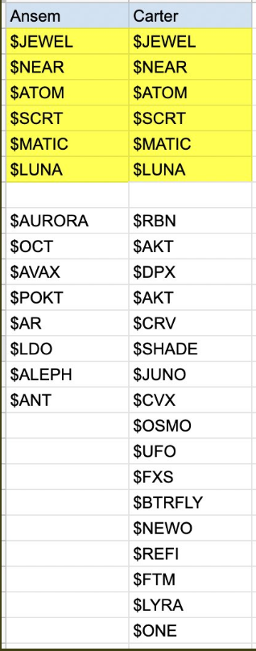

# Notas crypto

### 06-NOV-21

1. Cardano

   - Ha estado corrigiendo
   - Hay un soporte de 3100 SAT, abajo de ese hay uno de 2900
   - Hay una resistencia entre 3600 y 3900 SATS, si pasa esta resistencia probablemente podría llegar a la superior sino, el ciclo podría estar terminandose
   - En USD, hay una resistencia de 2.1$
   - El soporte está alrededor de los 1.7$, si se pierde este soporte el próximo es 1.5 - 1.4

2. Bitcoin

   - Está corrigiendo
   - Si testea 61k otra vez, puede agrrar momento hacia abajo
   - Reject en 62.5k

## Yield Farming

### Inversiones

1. ChronoSwap => 1200 usd en CNO-BUSD, 973 LP - (466% de APR)

   1. Las ganancias se reinvierten en DAI-USDC (54%), empezamos con 100usd

2. ApeSwap => 1000usd en USDC-ABR, 0.0002463873 LP - (165% de APR)

3. Beefy => 45$ - 0.00001455 LP - (50%)

Inversion total mas o menos 2350$

## Mirror Delta Neutral Strategy

Vamos a usar Long(apostamos que el valor va a subir) y Short(apostamos que el valor va bajar)

### 1. Short Farm + Long Hold (0% exposed to Impermanent Loss)

Para colateral en mirror podemos usar aUST que nos dan en Anchor

Suponiendo que tenemos 3K, 2/3 se usaran en Anchor y el otro 1/3 se usar para comprar el mAsset en mirror

1. Depositamos 2K en Anchor protrocol, esto nos da aUST
2. Con el aUST vamos a Mirror
3. Elegimos una asset y apostamos en corto

   - Ir en corto es "apostar" a que la accion va a bajar de precio
   - Por ejemplo si vamos en short a una accion que vale 100 lo que pasa es lo siguiente
     - Pedimos prestada la accion al valor actual 100
     - La accion se desvaloriza a 70 dolares
     - Ahora si pagamos la accion que prestamos
     - Ganamos 30 dolares

   Ahora que pasa si la accion sube? si la accion sube por ejemplo a 150 dolares, al pagarla tenemos que poner 50 extra, es decir, perdimos 50% de la inversion que teniamos presupuestada

   Por eso se dice que en short las perdidas son infinitas porque el precio puede subir infinitamente

4. Compramos la cantidad del mAsset contra la que apostamos y la holdeamos

   - Por ejemplo, con el aUST que tenemos compramos 1 stock de AMAZON
   - Compramos y holdeamos 1 stock de AMAZON
   - Asi, si el precio sube o baja no nos AFECTARA porque la "deuda" ya la tenemos
   - Estaremos ganando con los APY y con el ANCHOR que tenemos

### 2. Short Farm + Long LP (50% exposed to IL)

La estrategia numero 2, usara la anterior pero necesitara 1K extra

- Continuamos en el paso anterior, en vez de simplemente holdear las acciones las emparejamos con UST y las depositamos en un pool pero estaremos expuestos al impermanent loss

### 3. Long Borrow LP (67% exposed to IL)

## Terra Degen Stablefarm strategy

## Layer-1 blockchain staking: the base layer of a new global financial paradigm

No invertion is risk free, but in praactice, people take the debt issued by the US government as a benchmark, risk-free asset, because governments collect taxes

Cuando compran US Treasuries, estas directamente comprando una parte de GDP de US

Todas las blockchains cobran un fee, entre mas complicada la accion en la blockchain mas caro sera el fee, transferir fondos vale 21000 gas, hacer un swap en algun dex usa smart contracts y muchos pasos extra en el background por eso cuesta x10 mas

## Q1 2022 thesis

6 tokens that are mentioned in both accounts @blknoiz06 & @monetwithcarter

### @blknoiz06
