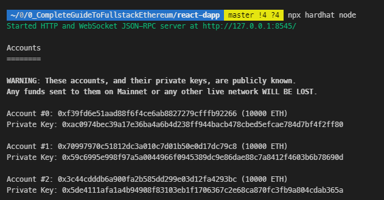
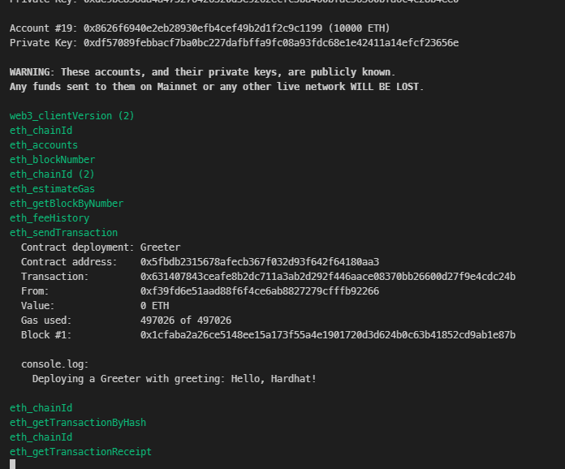
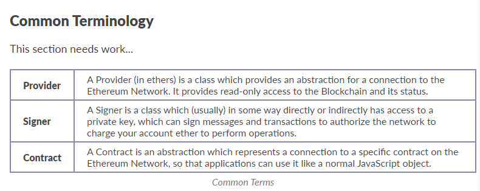
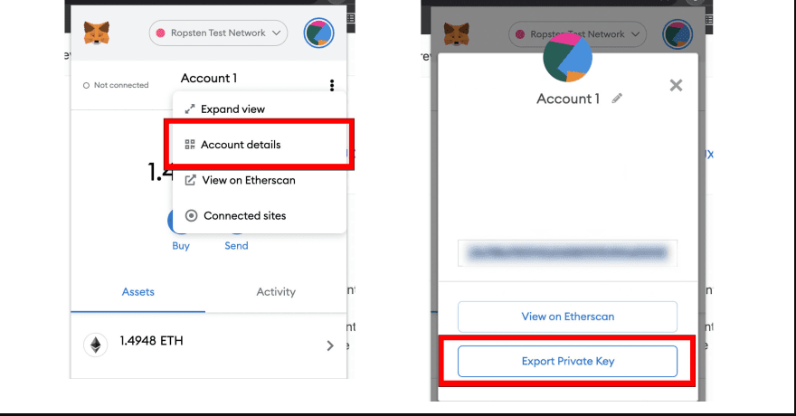
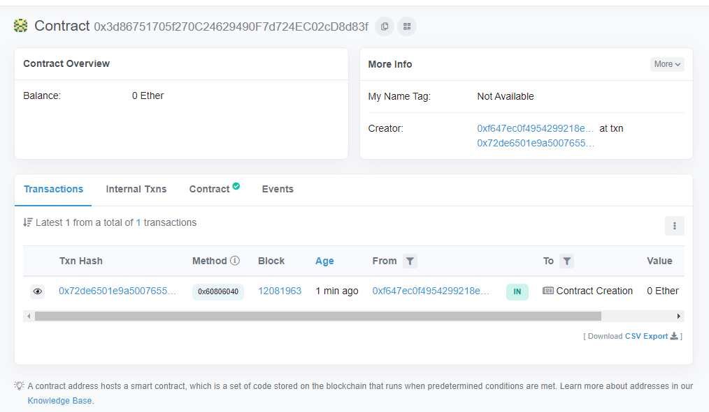

# The Complete Guide to Full Stack Ethereum Development

- [The Complete Guide to Full Stack Ethereum Development](#the-complete-guide-to-full-stack-ethereum-development)
  - [Ethereum development environment](#ethereum-development-environment)
  - [Ethereum web client library](#ethereum-web-client-library)
  - [Metamask](#metamask)
  - [React](#react)
  - [The Graph](#the-graph)
  - [What we will be building](#what-we-will-be-building)
  - [Getting started](#getting-started)
  - [Installing and configuring an Ethereum development environment](#installing-and-configuring-an-ethereum-development-environment)
    - [hardhat.config.js](#hardhatconfigjs)
  - [Smart contract](#smart-contract)
    - [Reading and writing to the Ethereum blockchain](#reading-and-writing-to-the-ethereum-blockchain)
    - [Compiling the ABI](#compiling-the-abi)
    - [Deploying and using a local network/blockchain](#deploying-and-using-a-local-networkblockchain)
  - [Connecting React](#connecting-react)
  - [Deploying and using a live test network](#deploying-and-using-a-live-test-network)
  - [Minting tokens](#minting-tokens)
  - [ERC-20 Token](#erc-20-token)

This is [an end to end guide](https://youtu.be/a0osIaAOFSE) to show how to build full stack ethereum apps using the most up to date resources, libraries and tooling

1. Client framework -> React
2. Ethereum development environment -> Hardhat
3. Ethereum web client library -> Ethers.js
4. API layer -> The graph protocol

## Ethereum development environment

1. For deploy contracts, run tests and debug solidity without live environments
2. For compile Solidity code into code that can be run in a client-side app (in this case a react app)

Hardhat is an Ethereum development environment and framework designed for full stack development, other tools like it are Ganache, Truffle & Foundry

## Ethereum web client library

This is the way to interact with the smart contracts deployed

Ethers.js aims to be a complete and compact library for interacting with the Ethereum blockchain and its ecosystem from client-side JavaScript applications like React, another option is web3.js

## Metamask

Help to handle account management and connecting the current user to the blockchain.

1. Once a user has connected their Metamask, you as a developer can interact with the globally available Ethereum API (window.ethereum) that identifies the users of web3-compatible browsers
2. Whenever you request a transaction signature, Metamask will prompt the user in as comprehensible a way as possible

## React

React and its large ecosystem of meta frameworks like `Next.js`, `Gatsby`, `Redwood`, `Blitz.js` and others enable all types of deployment targets including traditional SPAs, static site generators, server-side rendering and a combination of all three.

## The Graph

For most apps built on blockchains like Ethereum, it's hard and time-intensive to read data directly from the chain.

The Graph is an indexing protocol for querying blockchain data that enables the creation of fully decentralized applications and solves this problem, exposing a rich GraphQL query later that apps can consume

[To learn how to build blockchain APIs using The Graph](https://dev.to/edge-and-node/building-graphql-apis-on-ethereum-4poa)

## What we will be building

1. A contract for creating and updating a message on the Ethereum blockchain
2. A contract for minting tokens
   1. Allow the owner of the contract to send tokens to others
   2. Read the token balances

3. React front end that will allow
   1. Read the greeting from the contract deployed
   2. Update the greeting
   3. Send the newly minted tokens from their address to another address
   4. Read the token balance from the contract deployed to the blockchain

## Getting started

1. Create a new react app with `npx create-react-app react-dapp`
2. CD into new app directory and install `ethers.js` and `hardhat` with `npm install ethers hardhat @nomiclabs/hardhat-waffle ethereum-waffle chai @nomiclabs/hardhat-ethers`
   1. `ethers & hardhat` self explanatory
   2. `hardhat-waffle ethereum-waffle` Waffle is a tool for test smart contracts
   3. `chai` also for testing

## Installing and configuring an Ethereum development environment

1. Initialize a new Ethereum development environment with Hardhat `npx hardhat`
   1. This will ask for what you want to do -> Create a basic simple project
   2. Leave default project root
   3. Add a `.gitignore`
      1. Delete README.md from create-react-app

When running `npx hardhat` you would have to choose, create a sample project, choose the root project directory and add a gitignore, after running this hardhat created

1. `hardhat.config.js` for configuring
2. `sample-scripts.js` located on the folder script, this script deploy the smart contract when is executed
3. A folder named test with an example testing script, `sample-test.js`
4. A folder named contracts with an example contract `Greeter.sol`

### hardhat.config.js

1. We will set the paths for our artifacts
   1. Since we are working on react, we will be working with the `src` folder
      1. Hardhat will compile the contracts as abi (some machine readable code), we want this artifacts to go on the `src` folder to be able to use them on the front end

         ```js
         module.exports = {
           solidity: '0.8.4',
           paths: {
             artifacts: '.src/artifacts',
           },
         };
         ```

2. Set the networks config, first will be the hardhat local network.
   1. ChainID has to be 1337 for a error with metamask, no big deal

      ```js
      module.exports = {
        solidity: '0.8.4',
        paths: {
          artifacts: '.src/artifacts',
        },
        networks:{
          hardhat:{
            chainId: 1337
          }
        }
      };
      ```

## Smart contract

1. Basic smart contract
2. When deployed, it sets a `_gretting` this is thanks to the constructor
   1. Always a contract is deployed it needs the constructor to give it the initial values
3. The contract has a `function greet()` that show the value of the variable `_greeting` stored on the blockchain
4. There is a `function setGreeting()` to change the value of the variable `_greeting`

```js
//SPDX-License-Identifier: Unlicense
pragma solidity ^0.8.0;

import "hardhat/console.sol";

contract Greeter {
 string private greeting;

 constructor(string memory _greeting) {
  console.log("Deploying a Greeter with greeting:", _greeting);
  greeting = _greeting;
 }

 function greet() public view returns (string memory) {
  return greeting;
 }

 function setGreeting(string memory _greeting) public {
  console.log("Changing greeting from '%s' to '%s'", greeting, _greeting);
  greeting = _greeting;
 }
}
```

### Reading and writing to the Ethereum blockchain

1. There are 2 types of ways to interact with a smart contract, reading or writing/transactions
   1. `function greet()` is reading -> Gas free
   2. `function setGreeting()` is writing/transactional -> This cost gas

2. From our React app, we will use `ethers.js`, the contract address and the ABI created with hardhat to interact with the smart contract
   1. ABI (application binary interface) is the interface between front and the blockchain

### Compiling the ABI

1. Compile the ABI with `npx hardhat compile`
   1. This create a folder on the `src` folder named `artifacts`
   2. The `artifacts/contracts/Greeter.json` has the ABI on its properties

   ``` json
   {
     "_format": "hh-sol-artifact-1",
     "contractName": "Greeter",
     "sourceName": "contracts/Greeter.sol",
     "abi": [
       {
         "inputs": [
           {
             "internalType": "string",
             "name": "_greeting",
             "type": "string"
           }
         ],
         "stateMutability": "nonpayable",
         "type": "constructor"
       }],
   }
   ```

2. When we need to use the ABI we can import it from our JS file

   ``` js
   import Greeter from './artifacts/contracts/Greeter.sol/Greeter.json'
   ```

### Deploying and using a local network/blockchain

1. To deploy to the local network
   1. Start the local test node with `npx hardhat node`
      1. This creates 20 accounts to work with

      

2. Deploy the contract to the test network
   1. Remember, hardhat uses scripts to deploy and when we run `npx hardhat` this created a default script `scripts/sample-script.js`
   2. Rename that script as  `deploy.js`
   3. Run the deploy script with a flag on the CLI(Command Line Interface) indicating that we want to deploy on the local network `npx hardhat run scripts/deploy.js --network localhost`

   ```js
   // We require the Hardhat Runtime Environment explicitly here. This is optional
   // but useful for running the script in a standalone fashion through `node <script>`.
   //
   // When running the script with `npx hardhat run <script>` you'll find the Hardhat
   // Runtime Environment's members available in the global scope.
   const hre = require("hardhat");

   async function main() {
     // Hardhat always runs the compile task when running scripts with its command
     // line interface.
     //
     // If this script is run directly using `node` you may want to call compile
     // manually to make sure everything is compiled
     // await hre.run('compile');

     // We get the contract to deploy
     const Greeter = await hre.ethers.getContractFactory("Greeter");
     const greeter = await Greeter.deploy("Hello, Hardhat!");

     await greeter.deployed();

     console.log("Greeter deployed to:", greeter.address);
   }

   // We recommend this pattern to be able to use async/await everywhere
   // and properly handle errors.
   main()
     .then(() => process.exit(0))
     .catch((error) => {
       console.error(error);
       process.exit(1);
     });
   ```

3. The contract used the first account that was created when we created the local network using `npx hardhat node`

4. As we can see on the code, there is a `console.log` that says the `address` of the contract deployed
   1. `Greeter deployed to: 0x5FbDB2315678afecb367f032d93F642f64180aa3`
   2. This address is what we will use on the client app to talk to the contract
   3. Output on the local network after deploying the smart contract
      

5. To send transactions to the smart contract we will need to connect our Metamask to one of the accounts created on the local network
   1. Import the first account to metamask
      1. Click on metamask plugin icon -> Account profile picture -> Settings -> Advanced -> Show test networks

## Connecting React

The objectives for our React app will be:

1. Fetch the current value of `greeting`
2. Allow the user to update the value of `greeting` -> using `function setGreeting()`

To make this possible:

1. Create an input field and some local state to manage the value of the input (to update the `_greeting`)
2. Allow the application to connect to the users Metamask account to sign transactions
3. Create functions for reading and writing to the smart contract

About the code

1. Remember, when a user is connected to Metamask, the window object is injected with the ethereum API so we use this as a condition to interact with the contract
   1. `typeof window.ethereum !== "undefined"`, If window.ethereum **IS NOT** undefined

2. Provider explanation on ethers.js

   

   1. The quickest and easiest way to experiment and begin developing on the Ethereum is to use MetaMask, this extension provides:
      1. A connection to the Ethereum network (a Provider)
      2. Holds your private key and can sign things (a Signer)

   2. Connecting to MetaMask
      1. MetaMask injects a provider as `window.ethereum`
      2. Web3Provider wraps the provider MetaMask gives

      ```js
      // A Web3Provider wraps a standard Web3 provider, which is
      // what MetaMask injects as window.ethereum into each page
      const provider = new ethers.providers.Web3Provider(window.ethereum)

      // MetaMask requires requesting permission to connect users accounts
      await provider.send("eth_requestAccounts", []);

      // The MetaMask plugin also allows signing transactions to
      // send ether and pay to change state within the blockchain.
      // For this, you need the account signer...
      const signer = provider.getSigner()
      ```

3. Contracts on ethers.js
   1. A contract is an abstraction of program code which lives on the eth blockchain

   2. The contract object makes it easier to use an on-chain contract as a normal JS object with the methods mapped to encoding and decoding data

   3. Similar to an Object Relational Mapper (ORM)

   4. In order to communicate with the Contract on-chain
      1. Needs to know what methods are available and how to encode and decode the data, which is what the Application Binary Interface (ABI) provides

   5. This class is a meta-class
      1. Its methods are constructed at runtime
      2. When you pass in the ABI to the constructor it uses it to determine which methods to add

   6. An ABI oftem comes from the Solidity or Vyper compiler, but you can use the Human-Readable in code, which the following examples use

      ```js
      // You can also use an ENS name for the contract address
      const daiAddress = "dai.tokens.ethers.eth";

      // The ERC-20 Contract ABI, which is a common contract interface
      // for tokens (this is the Human-Readable ABI format)
      const daiAbi = [
        // Some details about the token
        "function name() view returns (string)",
        "function symbol() view returns (string)",

        // Get the account balance
        "function balanceOf(address) view returns (uint)",

        // Send some of your tokens to someone else
        "function transfer(address to, uint amount)",

        // An event triggered whenever anyone transfers to someone else
        "event Transfer(address indexed from, address indexed to, uint amount)"
      ];

      // The Contract object
      const daiContract = new ethers.Contract(daiAddress, daiAbi, provider);
      ```

```js
// src/App.js

import './App.css';
import { useState } from 'react';
import { ethers } from 'ethers'
import Greeter from './artifacts/contracts/Greeter.sol/Greeter.json'

// Update with the contract address logged out to the CLI when it was deployed
const greeterAddress = "0x5FbDB2315678afecb367f032d93F642f64180aa3"

function App() {
  // store greeting in local state
  const [greeting, setGreetingValue] = useState()

  // request access to the user's MetaMask account
  async function requestAccount() {
    await window.ethereum.request({ method: 'eth_requestAccounts' });
  }

  // call the smart contract, read the current greeting value
  async function fetchGreeting() {
    if (typeof window.ethereum !== 'undefined') {
      const provider = new ethers.providers.Web3Provider(window.ethereum)
      const contract = new ethers.Contract(greeterAddress, Greeter.abi, provider)
      try {
        const data = await contract.greet()
        console.log('data: ', data)
      } catch (err) {
        console.log("Error: ", err)
      }
    }
  }

  // call the smart contract, send an update
  async function setGreeting() {
    if (!greeting) return
    if (typeof window.ethereum !== 'undefined') {
      await requestAccount()
      const provider = new ethers.providers.Web3Provider(window.ethereum);
      const signer = provider.getSigner()
      const contract = new ethers.Contract(greeterAddress, Greeter.abi, signer)
      const transaction = await contract.setGreeting(greeting)
      await transaction.wait()
      fetchGreeting()
    }
  }

  return (
    <div className="App">
      <header className="App-header">
        <button onClick={fetchGreeting}>Fetch Greeting</button>
        <button onClick={setGreeting}>Set Greeting</button>
        <input onChange={e => setGreetingValue(e.target.value)} placeholder="Set greeting" />
      </header>
    </div>
  );
}

export default App;
```

## Deploying and using a live test network

There are several eth test networks like

1. Ropsten
2. Rinkeby
3. Kovan

We will deploy to Ropsten

1. Connect to Ropsten Test Network on MetaMask

2. Send some test Ether to use during the test with a [faucet](https://faucet.dimensions.network/)

3. Create a project on Infura, this allows to use their nodes instead of run a node locally
   1. When we create a project, we will get an endpoint like: `https://ropsten.infura.io/v3/6001baf54c5e4fcca21ae98829134e24`

   2. Set the Allowlist Ethereum Addresses in Infura to include the wallet address of the account we will be deploying from

   3. Add a `networks` property to the `hardhat.config.js`.
      1. Remember install `npm i dotenv` and create a `.env` file where you would store the ACCOUNT_PRIVATE_KEY variable

      

      ```js
      const dotenv = require('dotenv')
      dotenv.config()

      module.exports = {
        solidity: '0.8.4',
        paths: {
          artifacts: './src/artifacts',
        },
        networks: {
          hardhat: {
            chainId: 1337,
          },
          ropsten: {
            url: "https://ropsten.infura.io/v3/6001baf54c5e4fcca21ae98829134e24",
            accounts: [`0x${process.env.ACCOUNT_PRIVATE_KEY}`]
          }
        },
      };
      ```

   4. Once we have our test network ready, we can deploy our contract `npx hardhat run scripts/deploy.js --network ropsten`
      1. This will deploy our contract to ropsten test blockchain
      2. `Greeter deployed to: 0x3d86751705f270C24629490F7d724EC02cD8d83f`
      3. Now we can go and search the contract on the testnet

      

## Minting tokens

1. One of the most common use cases of smart contracts is creating tokens
2. This contract will create a new token called 'Nader Dabit Token' and set its max supply

   ```js
   //SPDX-License-Identifier: MIT
   pragma solidity ^0.8.0;

   import "hardhat/console.sol";

   contract Token {
    string public name = "Nader Dabit Token";
    string public symbol = "NDT";
    uint256 public totalSupply = 1000000;
    mapping(address => uint256) balances;

    constructor() {
     balances[msg.sender] = totalSupply;
    }

    function transfer(address to, uint256 amount) external {
     require(balances[msg.sender] >= amount, "Not enough tokens");
     balances[msg.sender] -= amount;
     balances[to] += amount;
    }

    function balanceOf(address account) external view returns (uint256) {
     return balances[account];
    }
   }
   ```

3. Compile the new contract `npx hardhat compile`

4. Update the `deploy.js` to deploy the token

   ```js
     const Token = await hre.ethers.getContractFactory("Token");
     const token = await Token.deploy();

     await token.deployed();
     console.log("Token deployed to:", token.address);
   ```

5. Deploy the contract to the local network `npx hardhat run scripts/deploy.js --network localhost`

6. Update the client code in order to send the tokens to other addresses

   ```js
   import './App.css';
   import { useState } from 'react';
   import { ethers } from 'ethers'
   import Greeter from './artifacts/contracts/Greeter.sol/Greeter.json'
   import Token from './artifacts/contracts/Token.sol/Token.json'

   const greeterAddress = "your-contract-address"
   const tokenAddress = "your-contract-address"

   function App() {
     const [greeting, setGreetingValue] = useState()
     const [userAccount, setUserAccount] = useState()
     const [amount, setAmount] = useState()

     async function requestAccount() {
       await window.ethereum.request({ method: 'eth_requestAccounts' });
     }

     async function fetchGreeting() {
       if (typeof window.ethereum !== 'undefined') {
         const provider = new ethers.providers.Web3Provider(window.ethereum)
         console.log({ provider })
         const contract = new ethers.Contract(greeterAddress, Greeter.abi, provider)
         try {
           const data = await contract.greet()
           console.log('data: ', data)
         } catch (err) {
           console.log("Error: ", err)
         }
       }
     }

     async function getBalance() {
       if (typeof window.ethereum !== 'undefined') {
         const [account] = await window.ethereum.request({ method: 'eth_requestAccounts' })
         const provider = new ethers.providers.Web3Provider(window.ethereum);
         const contract = new ethers.Contract(tokenAddress, Token.abi, provider)
         const balance = await contract.balanceOf(account);
         console.log("Balance: ", balance.toString());
       }
     }

     async function setGreeting() {
       if (!greeting) return
       if (typeof window.ethereum !== 'undefined') {
         await requestAccount()
         const provider = new ethers.providers.Web3Provider(window.ethereum);
         console.log({ provider })
         const signer = provider.getSigner()
         const contract = new ethers.Contract(greeterAddress, Greeter.abi, signer)
         const transaction = await contract.setGreeting(greeting)
         await transaction.wait()
         fetchGreeting()
       }
     }

     async function sendCoins() {
       if (typeof window.ethereum !== 'undefined') {
         await requestAccount()
         const provider = new ethers.providers.Web3Provider(window.ethereum);
         const signer = provider.getSigner();
         const contract = new ethers.Contract(tokenAddress, Token.abi, signer);
         const transation = await contract.transfer(userAccount, amount);
         await transation.wait();
         console.log(`${amount} Coins successfully sent to ${userAccount}`);
       }
     }

     return (
       <div className="App">
         <header className="App-header">
           <button onClick={fetchGreeting}>Fetch Greeting</button>
           <button onClick={setGreeting}>Set Greeting</button>
           <input onChange={e => setGreetingValue(e.target.value)} placeholder="Set greeting" />

           <br />
           <button onClick={getBalance}>Get Balance</button>
           <button onClick={sendCoins}>Send Coins</button>
           <input onChange={e => setUserAccount(e.target.value)} placeholder="Account ID" />
           <input onChange={e => setAmount(e.target.value)} placeholder="Amount" />
         </header>
       </div>
     );
   }

   export default App;
   ```

7. We can now check our localhost network, import the token and see that we have the amount we just minted

## ERC-20 Token
