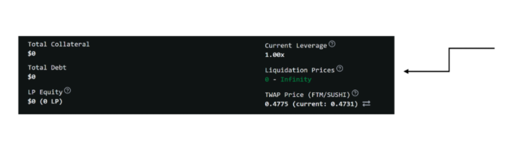

# Tarot Overview - Byte Masons

Founded by Tigris of Gaul, introduced DeFi primitive of leveraged yield farming, users can receive yield on their assets in a number of ways:

1. Lending
2. Borrowing
3. Leveraging their LP tokens
4. Staking the  governance token for xTarot

Tarot's Vault system is also unique on Fantom

- Bounties are given out to compound the rewards for each vault

## Leveraged Yield Farming

1. Allows users who seek leverage on their assets to also benefit from the reward structure of transaction fees paid out to liquidity pools

2. Users deposit LP tokens from SpookySwap or SpiritSwap as collateral and can lever at least 5x

3. This leverage allows tailored exposures to an individual users needs and is facilitated by LENDING POOLS

4. When levering up or down, liquidation prices are not fixed and may change as your borrowing costs increase
   1. Prices are calculated using the `time-weighted average price (TWAP)` for the token pair from the `Tarot Price Oracle`
   2. Liquidation occur when TWAP price for the pair crosses the boundary of liquidations
   3. The higher the leverage, the smaller the liquidation zone

   

## Price Oracle

1. Tarot uses their very own Price Oracle
   1. A price oracle is any contract that provides on-chain access to price information for a token
   2. Usually denominated in terms of another token or an off-chain unit of account such as USD
   3. DeFi products such as synthetic assets, decentralized options, collateralized loans and algorithmic stablecoins all depend on price oracles to function correctly

   

## Isolated Lending Pools

1. Lenders deposit their tokens and receive `bTarot` single-sided yield

2. Borrowers deposit LP tokens and get `cTarot`, they can:
   1. Take out a loan against their collateral in the underlaying token

   2. Leverage their LP token positions with greater yield
      1. The shown Leveraged LP APR is the result of multiplying your leverage multiplier to the original APR with no leverage

      2. Example: You deposit 100$ of LP, this has a 2.21% APR

## Bounties and Rewards

1. The ongoing fees generated by borrowing activity and Supply Vaults accrue to the protocols reserves and pay out the xTAROT rewards

2. The processing of fees and distribution of TAROT to xTAROT holders is permissionless and can be invoked by anyone on a per-token basis
   1. In return for invocation, the caller receives a reward bounty in TAROT

3. The Tarot Vault contracts are based on Impermax's StakedLPToken functionality
   1. Originally designed to work with QuickSwap on Polygon and appears to have been inspired by Alpha Homoras vault functionality

   2. QuickSwap uses a different farming framework thats not based on MasterChef
      1. To support Spooky and Spirit, these contracts were adapted

## Supply Vaults

1. Supply Vaults enable users automatically earn yield trough multiple lending pools, with just one deposit

2. Tarot Supply Vault tokens (tTokens) represent a share of the total underlying value of a Tarot Supply Vault and they continuously earn yield over time.
   1. This tokens can be transferred, used as collateral or even composed into others protocols

## xTAROT

Staked TAROT (xTAROT) is the gateway for on-chain governance of the Tarot Protocol, benefits:

1. Earn TAROT rewards from protocol revenue
2. Enhanced yield by supplying staked TAROT in lending pools
3. Increased liquidity across multiple lending pools
4. Collateralization via the composable xTAROT token
5. Participation in DAO governance
6. Stake xTAROT in partner-incentivized pools for additional rewards

## Fee Distribution

With the launch of xTAROT, ongoing fees accrued will be used to buy back and distribute TAROT rewards to xTAROT holders as follow:

1. 50% -> Remain in protocol reserves (as bTAROT and tTokens)
2. 50% -> Buy back and distribute TAROT to xTAROT holders

## Interest Rate Model

1. Tarot uses an adaptive interest rate model, this determines Borrow and Supply APRs for each lending pool, which are isolated.

2. Utilization rate is the % of tokens supplied by lenders to a lending pool that are currently utilized by borrowers in outstanding loans

## Token Distribution

TAROT is a fixed-supply token with a total supply of 100m allocated as follow:

1. Farming Rewards: 59m over 4 years
2. Protocol Growth: 19m over 4 years
3. Core Team: 13,3m over 4 years
4. LGE Participants: 3,2m over 1 year
5. Early Tarot Users: 3m over 1 year
6. Initial Liquidity: 2,5m

## Farming Rewards Program

1. Program that will distribute 59% of the total supply of TAROT to borrowers and leveraged yield farmers, rewards will decrease by 2.4% every two weeks

2. Half of all farming rewards will be distributed to farmers in the first year of the Tarot Farming Rewards

### Missing to learn

1. Whats Impermax StakedLPToken functionality
2. Whats Alpha Homoras vault functionality
3. MasterChef
