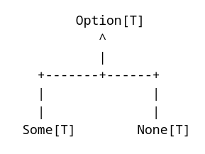
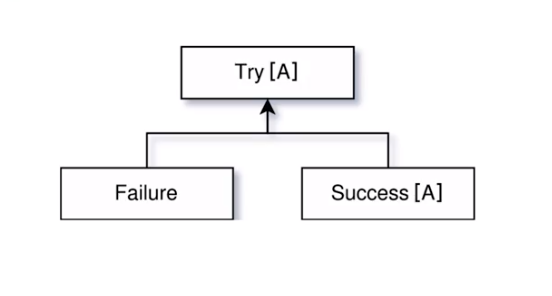

# Programación funcional con scala

Los tipos de datos de scala son parecidos a los que tienen todos los lenguajes de programación, lo diferente es como se relacionan estos tipos entre ellos

Scala mezcla conceptos de programación orientada a objetos con programación funcional, el polimorfismo generado opr la herencia de estos tipos de datos puede ser importante en algunas ocasiones

Existe un tipo de dato llamado `Any`, debajo de este tendremos otros dos, `AnyVal` y `AnyRef`


Los tipos que se relacionan con `AnyVal` son los tipos básicos que se pueden agrupar en 5 grupos

1. Boolean
2. Double, Float, Long, Int, Short -> tipos numéricos
3. Byte -> datos binarios
4. Char -> strings
5. Unit -> Expresa la unidad o el vacío

Finalmente tendremos un tipo de dato llamado `Nothing`, expresa la nada

- Todos los datos provienen de `Any`, todos los tipos tienen en común `Any`
  - Any es el top type

- Ningún tipo de dato puede provenir de `Nothing`
  - Nothing es un bottom type, el dato mas bajo

## Inmutabilidad

1. Scala es capas de inferir el tipo de dato
2. Cuando se define una variable con `var` permite mutación, es decir, se puede cambiar el valor
3. Cuando se define una variable con `val` no permite cambiar su valor

    ```js
    var x = 1
    x = 2
    // mutated x

    val y = 1
    y = 2
    // error: reassignment to val
    ```

4. En programación funcional, evitaremos siempre los datos mutables de ser posible
   1. La razón principal es que la mutabilidad va a dificultar razonar sobre el código

5. La mutabilidad debería usarse cuando la eficiencia que ganamos agregándola es mayor que la complejidad cognitiva que genera el código

## Expresiones

1. Scala es un lenguaje orientado a expresiones, todo lo que escribamos va ser intrínsecamente una expresión

2. Bloques de código, que siempre retornaran un valor por esto no se usara la palabra clave `return`
   1. El ultimo valor del bloque es el valor de retorno
   2. Para devolver nada (void) devolvemos `Unit`
   3. El ultimo valor que este entre `()`, `{}` es lo que retornara el `return` implícito de escala
      1. Entre `()`  solo puede haber 1 expresión entre `{}`  varias

    ```js
      def x = (3)
      x: Int
      def x = 3
      x: Int
      def x = {3}
      x: Int

      def z = {1; 1+2}
      z
      // res0: Int = 3
    ```

## Funciones

1. Dominio: Datos de entrada
   1. Todo lo que puede entrar
2. Rango: Datos de salida
   1. Todo lo que puede salir

Las funciones transforman los datos  `f: D -> R`

1. Funciones de Orden superior
   1. Cuando tratamos una función como un valor mas, es decir, lo vamos a poder pasar como variable
   2. También podremos retornar una función desde otra función!

2. Funciones anónimas o funciona lambdas
3. Funciones como objetos
4. Funciones como métodos

En escala las funciones básicamente se tratan igual que una definición

```ts
def f(x: Int) = x * x
// f: (x:Int)Int
// f va recibir un x de tipo entero y va retornar un entero
f(4)
// res1: Int = 16
```

Una función anónima y su asignación a una variable

```ts
(x: Int) => x * x
// res2: Int => Int = $$Lambda

val a = (x: Int) => x * x
```

En scala las funciones son tratadas como objetos

1. Para saber esto usamos `apply`
   1. Las funciones anónimas son tratadas como objetos

```ts
a.apply(2)
// res: Int=4

f.apply(2)
// Error
```

### Funciones de orden superior

1. Pasamos h(x) como parámetro a g(x) -> g(h(x)) = h(3)
2. g(x) evalúa el valor que nos devuelve evaluar la función cuando vale 3 h(3)
   1. Que pasaría si evaluamos g(x) cuando h es la función `f(x:Int) = x*x`
   2. h(3) = 9 -> Entonces g = 9

```js
def g(h: Int => Int) = h(3)
// g: (h: Int => Int) Int

g(f)
// res: Int = 9
```

1. Podemos encadenar entrada con currying

```js
def k(h: Int=>Int)(x: Int) = h(x)

k(f)(3)
// res: Int=9

k(f)(4)
// res: Int=16

// En versiones viejas se puede hacer
k f 4
```

## Secuencias, Conjuntos y Mapas -> Collections

1. Listas: Es el dato mas básico en lenguajes funcionales, son inmutables y algunos ejemplos son:
   1. List
   2. Seq
   3. Array

2. Conjuntos: Similar a una lista pero permite hacer las operaciones lógicas de los conjuntos
   1. Set

3. Mapas: También conocidos como diccionarios, información semiestructural
   1. Map


1. En programación funcional no usaremos loops como `for` o `while`. Se usan funciones que recorren los elementos por nosotros como:
   1. `map()`
   2. `filter()`
   3. `forEach()`
   4. `find()`

    ```js
    val a1 = Seq(1,2,3)
    // a1: Seq[Int] = List(1,2,3)
    ```

2. Recordemos que estos elementos son inmutables, para agregar un elemento a la lista y poder usar ese nuevo array hay que crear otro elemento

    ```js
    a1.appended(4)
    // res: Seq[Int] = List(1,2,3,4)

    val a2 = a1.appended(4)
    // a2: Seq[Int] = List(1,2,3,4)
    ```

    - El appended se puede escribir de otra manera, `:+`
    - También podemos cambiar el llamado de la función, usando `.` y `()`

    ```js
    a1 :+ 4
    // res: Seq[Int] = List(1,2,3,4)

    a1.:(4)
    // res: Seq[Int] = List(1,2,3,4)

    a1 appended 4
    // res: Seq[Int] = List(1,2,3,4)
    ```

3. Para entrar a los elementos de un list usamos el index -> `a2(0)`

4. Los conjuntos se definen con `Set` y para agregar elementos usamos `incl`

    ```js
    val c1 = Set(1,2,3)
    // c1: scala.collection.immutable.Sent[Int] = Set(1,2,3)

    c1.incl(4)
    // res: scala.collection.immutable.Sent[Int] = Set(1,2,3,4)

    val c2 = c1.incl(4)
    // c2: scala.collection.immutable.Sent[Int] = Set(1,2,3,4)

    val c2 = c1 + 4
    // c2: scala.collection.immutable.Sent[Int] = Set(1,2,3,4)
    ```

5. Los Maps se crean de a parejas, se pueden agregar elemento usando `+` de 2 maneras

    ```js
    val m1 = Map((1, "hola"))
    // m1: scala.collection.immutable.Map[Int,String] = Map(1 -> hola)

    val m1 = Map (1 -> "hola")
    // m1: scala.collection.immutable.Map[Int,String] = Map(1 -> hola)

    val m2 = m1 + ((2, "hello"))
    // m2: scala.collection.immutable.Map[Int,String] = Map(1 -> hola, 2 -> hello)

    val m2 = m1 + (2, -> "hello")
    // m2: scala.collection.immutable.Map[Int,String] = Map(1 -> hola, 2 -> hello)
    ```

6. Podemos recorrer toda la lista con `map()` pasándola una función anónima que modificara cada elemento

```js
c2.map(x => x+1)
// res: scala.collection.immutable.Set[Int] = Set(2,3,4,5)
```

## Tuplas y Objetos

1. Tuplas: Para agrupar distintos tipos de datos en una sola estructura
2. Objetos: Sirven como las tuplas pero nos permiten nombrarlos para programar de manera mas organizada

3. Las clases en Programación Orientada a Objetos tendrá atributos y métodos
4. En Programación Funcional se separan clases que contienen atributos y clases que contienen métodos (operaciones)

    ```js
    val tupla = (1, "daniel", false)
    // tupla: (Int, String, Boolean) = (1,daniel,false)

    // Para definir objetos, primero se define un case class
    case class Persona(id:Int, nombre:String, activo:Boolean)
    // defined class Persona

    val p = Persona(1, "daniel", true)
    // p: Persona = Persona(1,daniel,true)
    ```

5. Para seleccionar en una tupla usamos `._x` donde x es la posición empezando en 1.
   1. Para seleccionar en un objeto usamos `.propiedad`
   2. Podemos generar un objeto a partir de una tupla usando la propiedad `tupled()` de las clases
      1. También se puede generar una tupla a partir de un objeto con `unapply`

    ```js
    tupla._1
    // res: Int=1

    p.id
    // res: Int=1

    Persona.tupled(tuple)
    // res: Person = Persona(1,daniel,false)

    Persona.unapply(p)
    // res: Option[(Int, String, Boolean)] = Some((1,daniel,true))
    ```

## Pattern Matching

En programación funcional la herencia no suele ser tan importante como en programación orientada a objetos pero la forma de los datos suelen importar mucho mas

Pattern matching nos permite definir casos de emparejamiento para hacer algo con los datos que cumplen dicho emparejamiento

- Básicamente pensar en switch
- Un `match` tiene un valor, la palabra clave `match` y al menos un `case`

1. "hola" se convierte en el operando izquierdo del `match`, en el lado derecho tenemos una expresión con 3 casos
   1. El ultimo caso `_` es un `catch all` para cualquier otro valor que no cumpla con los 2 casos

    ```js
    "hola" match {
    case "mundo" => "oo"
    case "hola" => "aa"
    case _ => "holi"
    }
    ```

    ```js
    def matchTest(x: Int): String = x match {
      case 1 => "one"
      case 2 => "two"
      case _ => "other"
    }
    matchTest(3)  // returns other
    matchTest(1)  // returns one
    ```

    ```js
    def g(x: Seq[Int]) = x match {
      case List(a,b,c) => a+b+c
      case List(a,b,c,d) => a+b+c+d
      case _ => 0
    }

    g(Seq(1,1,1)) // res: Int = 3
    g(Seq(1,1)) // res: Int = 0
    ```

2. Otro caso de uso es usar matching on case class
   1. Vamos a definir un class de tipo Persona
   2. Tendrá 2 datos un nombre y edad
   3. Definimos 2 objetos de este tipo de dato
   4. Definimos una función `h(x)`
   5. Recibirá un `x` de tipo `Persona`
   6. Emparejara con un `match` un caso donde:
      1. `y.edad` es mayor que 18

      2.

```js
case class Person(nombre: String, edad:Int)

val p1 = Persona("Maria",20)
val p2 = Persona("Freddy",15)

def h(x: Persona) = x match {
  case y if y.edad >= 18 => "Mayor de edad"
  case _ => "No es mayor de edad"
}

h(p1) // "Mayor de edad"
h(p2) // "No es mayor de edad"
```

## Tail recursion

La recursion es una manera de abordar los problemas donde una función se llama a si misma, es la manera clásica de programar en lenguajes funcionales

Tail recursion es una modificación sobre la función con el objetivo de optimizar su ejecución, se busca:

   1. No llenar el stack con llamadas
   2. Realizar la operación que queremos y pasar su acumulación al siguiente paso

```js
def factorial(n: Long): Long =
  if (n == 0) {
    1
  } else {
    n * factorial(n-1)
  }

factorial(3)

if (3==0) 1 else 3 * factorial(3-1)

3 * factorial(3)
3 * ( 2 * factorial (1))
3 * (2 * (1 * factorial (0)))
3 * (2 * (1 * 1))
24
```

## Agregación

Cuando trabajamos con listas es usual usar acumuladores para entregar un resultado final, scala tiene algunas funciones que nos ayudan a realizar estos procesos

1. `foldLeft & foldRight` permiten acumular sin necesidad de tener variables externas
   1. Generamos una lista con base en los números que queremos `(1 to 3)`
   2. Al ser lista tenemos disponibles las funciones de listas
   3. `foldLeft()` recibe un valor inicial y la función que se encargara de correr sobre cada uno de los elementos
      1. Esta función recibe 2 parámetros, el acumulado que se devolverá luego de cada iteración
      2. El elemento actual en el que se encuentra la iteración

```js
val factorial = (1 to 3).foldLeft(1L)(
  (acum, n) => acum * n
)
```

## Funciones totales y parciales

Una función total es aquella que puede dar respuesta a todos los elementos de su dominio, las parciales no pueden dar respuesta a todos algunos ejemplos son:

1. get()
2. head()
3. tail()
4. last()

```js
val a = List(1,2,3)
a.head // 1 -> Devuelve el primer elemento
a.tail // List[Int] = List(2,3) -> Devuelve la lista sin el primer elemento

// Si creamos una lista vaciá
val b = Nil // b: scala.collection.immutable.Nil.type = List()
b.head // error
b.tail // error

// Take es una función total
b.take(1) // List[Nothing] = List()
```

## Razonamiento inductivo

Es una manera de razonar donde el primer paso es encontrar lo que se conoce como caso base, un hecho concreto que usaremos para iniciar el modelo que queremos modelar

Posteriormente se modela la continuación del proceso (paso inductivo) usando el caso base anterior

El resultado de este proceso se convierte el nuevo caso base y se continua iterando

## Razonamientos con tipos

1. Los tipos de datos son importantes al momento de crear sistemas que escalen
2. Los tipos mantienen la consistencia de un sistema y se vuelven una manera de probarlo
3. Los tipos son una parte critica para hacer abstracciones
4. Los tipos son proposiciones y nuestros programas son pruebas
   1. El compilador se convierte en un razones que prueba el software con base a las proposiciones o tipos que le damos

## Traits

Son tipos de datos abstractos que contienen ciertos campos y métodos, en la herencia de scala una `class` solo puede extender otra `class` pero puede extender multiples `traits`

```js
trait Greeter {
  def greet(name: String): Unit
}

// También pueden tener valores por defecto
trait Greeter {
  def greet(name: String): Unit =
    println("Hello, " + name + "!")
}
```

Podemos extender traits con la palabra `extends` y también poder sobre escribir una implementación con `override`

```js
class DefaultGreeter extends Greeter

class CustomizableGreeter(prefix: String, postfix: String) extends Greeter {
  override def greet(name: String): Unit = {
    println(prefix + name + postfix)
  }
}

val greeter = new DefaultGreeter()
greeter.greet("Scala developer") // Hello, Scala developer!

val customGreeter = new CustomizableGreeter("How are you, ", "?")
customGreeter.greet("Scala developer") // How are you, Scala developer?
```

## Tipos genéricos

Son datos que el compilador determina al ejecutarse y depende del valor que le llega, básicamente son comodines

1. Para definir un tipo genérico usamos `[]`

```js

val list: List[Any] = List(
  "a string",
  732,  // an integer
  'c',  // a character
  true, // a boolean value
  () => "an anonymous function returning a string"
)

list.foreach(element => println(element))

// a string
// 732
// c
// true
// <function>
```

## Lazy

`lazy` variables defers the initialization of a variable, this lazy initialization pattern is common in Java programs

1. A `val` is executed when it is defined
2. A `lazy val` is executed when it is accessed the first time
   1. The initialization of a `val` is delayed until it is accessed for the first time, after that point, it acts just like a regular `val`

3. On the example:
   1. When the `lazy val` is declared, all that is saved to the `foo` value is a lazy function that hasn't been evaluated yet
   2. When the regular `val` is set, we see the `println` call execute and the value assigned to `bar`
   3. When we evaluate `foo` the first time we see `println` execute but not when is evaluated the second time
   4. Similarly, when `bar` is evaluated we don't see `println` execute, only when it is declared

    ```js
    `scala>` lazy val foo = {
        |   println("Initializing")
        |   `my foo value`
        | }
    // foo: String = <lazy>

    `scala>` val bar = {
        |   println("Initializing bar")
        |   "my bar value"
        | }
    // Initializing bar
    // bar: String = my bar value

    `scala>` foo
    // Initializing
    // res3: String = my foo value

    `scala>` bar
    // res4: String = my bar value

    `scala>` foo
    // res5: String = my foo value
    ```

4. In contrast to a method (defined with `def`) a `lazy val` is executed once and then never again, this can be useful when an operation takes long time to complete
   1. When the values `x` and `y` are never used, only `x` in unnecessarily wasting resources
   2. If `y` has no side effects and we don't know how often  it is accessed it is useless to declare it as `def` since we don't want to execute it several times

    ```js
    `scala>` class X { val x = { Thread.sleep(2000); 15 } }
    // defined class X

    `scala>` class Y { lazy val y = { Thread.sleep(2000); 13 } }
    // defined class Y

    `scala>` new X
    // res5: X = X@262505b7 // we have to wait two seconds to the result

    `scala>` new Y
    // res6: Y = Y@1555bd22 // this appears immediately
    ```

## Option/Some/None

Scala `Option[T]` is a container for zero or one element of a given type

An `Option[T]` can be either `Some[T]` or `None` object.

For instance, the `get` method of Scalas Map produces Some(value) if a value corresponding to a given key has been found or None if the given key is not defined in the Map



The base class `scala.Option` is abstract and extends `scala.collection.IterableOnce` this makes `Option` behaves like a container

1. Both `o1` and `o2` are instances of `Option[Int]`

    ```js
    val o1: Option[Int] = None
    val o2 = Some(10)
    ```

2. We can retrieve the `Option` value via `get`, however if we used on an instance of `None` then we will get an error, so its better to use `gerOrElse` to give it a default value

    ```js
    val v1 = o1.getOrElse(0)
    ```

3. We can treat Option as a collection of 1 element, therefor we can use map on it

```js
val lista = List(1,2,3)

lista.find(x=>x==3)
// Option[Int] = Some(3)

lista.find(x => x==3).map(y => y+1)
// Option[Int] = Some(4)

lista.find(x => x==3).map(y => y+1).get
// Int = 4
```

## Try/Success/Failure

This is a clean way to handle exceptions, if the code succeeds, we return a `Success` object with the result, we pass the error in a `Failure` object

1. `Try` makes it very simple to catch exceptions
2. `Failure` contains the exception



```js
def toInt(s: String): Try[Int] = Try {
  Integer.parseInt(s.trim)
}

`scala>` val a = toInt("1")
// a: scala.util.Try[Int] = Success(1)

`scala>` val b = toInt("boo")
// b: scala.util.Try[Int] = Failure(java.lang.NumberFormatException: For input string: "boo")
```

## Either/Left/Right

Another exception less alternative is either

Either represents two mutually exclusive possible values represented by Left and Right

1. When handling errors, the convention is to use `Left` for the error and `Right` for the result

## Modelo por actores

La base del modelo son los actores, cada actor tiene una bandeja de entrada donde recibe mensajes para actuar con base a ellos

1. Permite coordinar distintas funcionalidades entre los diferentes tipos de actor
   1. Pueden haber multiples actores del mismo tipo
   2. Existe un coordinador de actores principal que distribuye trabajo según el tipo de actor

2. Si un actor falla, su coordinador se dará cuenta y puede redirigir el trabajo

3. Si un actor tiene muchos mensajes y no puede, avisara al coordinador para crear un nuevo actor del mismo tipo que le ayude

4. Si el coordinador detecta que no necesita mas algún actor lo eliminara para optimizar recursos

El framework play, internamente usa los actores

1. Cuando a play le llega una petición HTTP un coordinador de actores crea un actor basado en la lógica que escribimos
   1. Si llegan muchas peticiones el sistema de actores crece o decrece según la necesidad

## Futures and Promises

## Recover - Futures

## Serialization

continuación
