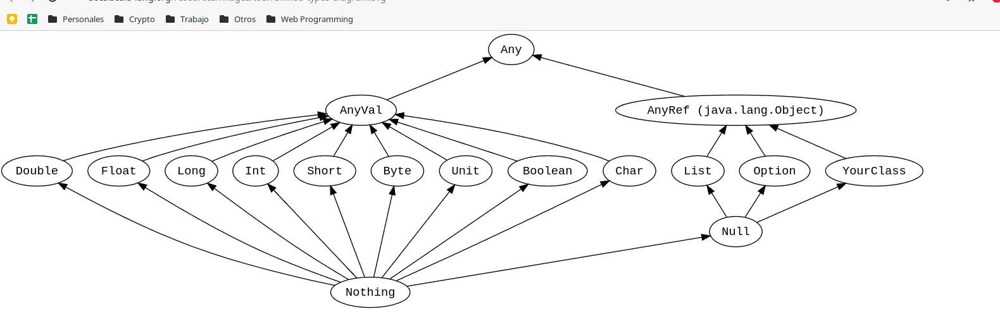
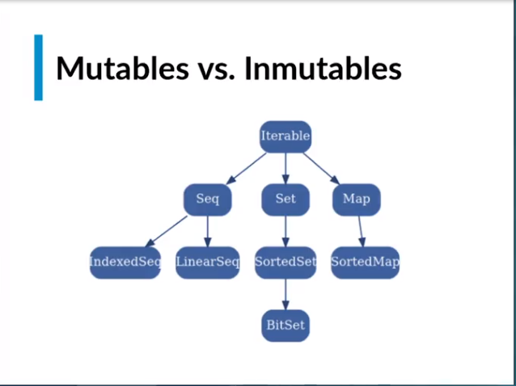

# Programacion funcional con scala

Los tipos de datos de scala son parecidos a los que tienen todos los lenguajes de programacion, lo diferente es como se relacionan estos tipos entre ellos

Scala mezcla conceptos de programacion orientada a objetos con programacion funcional, el polimorfismo generado opr la herencia de estos tipos de datos puede ser importante en algunas ocasiones

Existe un tipo de dato llamado `Any`, debajo de este tendremos otros dos, `AnyVal` y `AnyRef`



Los tipos que se relacionan con `AnyVal` son los tipos basicos que se pueden agrupar en 5 grupos

1. Boolean
2. Double, Float, Long, Int, Short -> tipos numericos
3. Byte -> datos binarios
4. Char -> strings
5. Unit -> Expresa la unidad o el vacio

Finalmente tendremos un tipo de dato llamado `Nothing`, expresa la nada

- Todos los datos provienen de `Any`, todos los tipos tienen en comun `Any`
  - Any es el top type

- Ningun tipo de dato puede provenir de `Nothing`
  - Nothing es un bottom type, el dato mas bajo

## Inmutabilidad

1. Scala es capas de inferir el tipo de dato
2. Cuando se define una variable con `var` permite mutacion, es decir, se puede cambiar el valor
3. Cuando se define una variable con `val` no permite cambiar su valor

    ```js
    var x = 1
    x = 2
    // mutated x

    val y = 1
    y = 2
    // error: reassigment to val
    ```

4. En programacion funcional, evitaremos siempre los datos mutables de ser posible
   1. La razon principal es que la mutabilidad va a dificultar razonar sobre el codigo

5. La mutabilidad deberia usarse cuando la eficiencia que ganamos agregandola es mayor que la complejidad cognitiva que genera el codigo

## Expresiones

1. Scala es un lenguaje orientado a expresiones, todo lo que escribamos va ser intrinsecamente una expresion

2. Bloques de codigo, que siempre retornaran un valor por esto no se usara la palabra clave `return`
   1. El ultimo valor del bloque es el valor de retorno
   2. Para devolver nada (void) devolvemos `Unit`
   3. El ultimo valor que este entre `()`, `{}` es lo que retornara el `return` implicito de escala
      1. Entre `()`  solo puede haber 1 expresion entre `{}`  varias

    ```js
      def x = (3)
      x: Int
      def x = 3
      x: Int
      def x = {3}
      x: Int

      def z = {1; 1+2}
      z
      // res0: Int = 3
    ```

## Funciones

1. Dominio: Datos de entrada
   1. Todo lo que puede entrar
2. Rango: Datos de salida
   1. Todo lo que puede salir

Las funciones transforman los datos  `f: D -> R`

1. Funciones de Orden superior
   1. Cuando tratamos una funcion como un valor mas, es decir, lo vamos a poder pasar como variable
   2. Tambien podremos retornar una funcion desde otra funcion!

2. Funciones anonimas o funciona lambdas
3. Funciones como objetos
4. Funciones como metodos

En escala las funciones basicamente se tratan igual que una definicion

```ts
def f(x: Int) = x * x
// f: (x:Int)Int
// f va recibir un x de tipo entero y va retornar un entero
f(4)
// res1: Int = 16
```

Una funcion anonima y su asignacion a una variable

```ts
(x: Int) => x * x
// res2: Int => Int = $$Lambda

val a = (x: Int) => x * x
```

En scala las funciones son tratadas como objetos

1. Para saber esto usamos `apply`
   1. Las funciones anonimas son tratadas como objetos

```ts
a.apply(2)
// res: Int=4

f.apply(2)
// Error
```

### Funciones de orden superior

1. Pasamos h(x) como parametro a g(x) -> g(h(x)) = h(3)
2. g(x) evalua el valor que nos devuelve evaluar la funcion cuando vale 3 h(3)
   1. Que pasaria si evaluamos g(x) cuando h es la funcion `f(x:Int) = x*x`
   2. h(3) = 9 -> Entonces g = 9

```js
def g(h: Int => Int) = h(3)
// g: (h: Int => Int) Int

g(f)
// res: Int = 9
```

1. Podemos encadenar entrada con currying

```js
def k(h: Int=>Int)(x: Int) = h(x)

k(f)(3)
// res: Int=9

k(f)(4)
// res: Int=16

// En versiones viejas se puede hacer
k f 4
```

## Secuencias, Conjus y Mapas -> Collections

1. Listas: Es el dato mas basico en lenguajes funcionales, son inmutables y algunos ejemplos son:
   1. List
   2. Seq
   3. Array

2. Conjuntos: Similar a una lista pero permite hacer las operaciones logicas de los conjuntos
   1. Set

3. Mapas: Tambien conocidos como diccionarios, informacion semiestructural
   1. Map



1. En programacion funcional no usaremos loops como `for` o `while`. Se usan funciones que recorren los elementos por nosotros como:
   1. `map()`
   2. `filter()`
   3. `forEach()`
   4. `find()`

    ```js
    val a1 = Seq(1,2,3)
    // a1: Seq[Int] = List(1,2,3)
    ```

2. Recordemos que estos elementos son inmutables, para agregar un elemento a la lista y poder usar ese nuevo array hay que crear otro elemento

    ```js
    a1.appended(4)
    // res: Seq[Int] = List(1,2,3,4)

    val a2 = a1.appended(4)
    // a2: Seq[Int] = List(1,2,3,4)
    ```

    - El appended se puede escribir de otra manera, `:+`
    - Tambien podemos cambiar el llamado de la funcion, usando `.` y `()`

    ```js
    a1 :+ 4
    // res: Seq[Int] = List(1,2,3,4)

    a1.:(4)
    // res: Seq[Int] = List(1,2,3,4)

    a1 appended 4
    // res: Seq[Int] = List(1,2,3,4)
    ```

3. Para entrar a los elementos de un list usamos el index -> `a2(0)`

4. Los conjuntos se definen con `Set` y para agregar elementos usamos `incl`

    ```js
    val c1 = Set(1,2,3)
    // c1: scala.collection.immutable.Sent[Int] = Set(1,2,3)

    c1.incl(4)
    // res: scala.collection.immutable.Sent[Int] = Set(1,2,3,4)

    val c2 = c1.incl(4)
    // c2: scala.collection.immutable.Sent[Int] = Set(1,2,3,4)

    val c2 = c1 + 4
    // c2: scala.collection.immutable.Sent[Int] = Set(1,2,3,4)
    ```

5. Los Maps se crean de a parejas, se pueden agregar elemento usando `+` de 2 maneras

    ```js
    val m1 = Map((1, "hola"))
    // m1: scala.collection.immutable.Map[Int,String] = Map(1 -> hola)

    val m1 = Map (1 -> "hola")
    // m1: scala.collection.immutable.Map[Int,String] = Map(1 -> hola)

    val m2 = m1 + ((2, "hello"))
    // m2: scala.collection.immutable.Map[Int,String] = Map(1 -> hola, 2 -> hello)

    val m2 = m1 + (2, -> "hello")
    // m2: scala.collection.immutable.Map[Int,String] = Map(1 -> hola, 2 -> hello)
    ```

6. Podemos recorrer toda la lista con `map()` pasandole una funcion anonima que modificara cada elemento

```js
c2.map(x => x+1)
// res: scala.collection.immutable.Set[Int] = Set(2,3,4,5)
```

## Tuplas y Objetos

1. Tuplas: Para agrupar distintos tipos de datos en una sola estructura
2. Objetos: Sirven como las tuplas pero nos permiten nombrarlos para programar de manera mas organizada

3. Las clases en Programacion Orientada a Objetos tendra atributos y metodos
4. En Programacion Funcional se separan clases que contienen atributos y clases que contienen metodos (operaciones)

    ```js
    val tupla = (1, "daniel", false)
    // tupla: (Int, String, Boolean) = (1,daniel,false)

    // Para definir objetos, primero se define un case class
    case class Persona(id:Int, nombre:String, activo:Boolean)
    // defined class Persona

    val p = Persona(1, "daniel", true)
    // p: Persona = Persona(1,daniel,true)
    ```

5. Para seleccionar en una tupla usamos `._x` donde x es la posicion empezando en 1.
   1. Para seleccionar en un objeto usamos `.propiedad`
   2. Podemos generar un objeto a partir de una tupla usando la propiedad `tupled()` de las clases
      1. Tambien se puede generar una tupla a partir de un objeto con `unapply`

    ```js
    tupla._1
    // res: Int=1

    p.id
    // res: Int=1

    Persona.tupled(tuple)
    // res: Person = Persona(1,daniel,false)

    Persona.unapply(p)
    // res: Option[(Int, String, Boolean)] = Some((1,daniel,true))
    ```

## Pattern Matching

En programacion funcional la herencia no suele ser tan importante como en programacion orientada a objetos pero la forma de los datos suelen importar mucho mas

Pattern matching nos permite definir casos de emparejamiento para hacer algo con los datos que cumplen dicho emparejamiento

- Basicamente pensar en switch
- Un `match` tiene un valor, la palabra clave `match` y al menos un `case`

1. "hola" se convierte en el operando izquierdo del `match`, en el lado derecho tenemos una expresion con 3 casos
   1. El ultimo caso `_` es un `catch all` para cualquier otro valor que no cumpla con los 2 casos

    ```js
    "hola" match {
    case "mundo" => "oo"
    case "hola" => "aa"
    case _ => "holi"
    }
    ```

    ```js
    def matchTest(x: Int): String = x match {
      case 1 => "one"
      case 2 => "two"
      case _ => "other"
    }
    matchTest(3)  // returns other
    matchTest(1)  // returns one
    ```

    ```js
    def g(x: Seq[Int]) = x match {
      case List(a,b,c) => a+b+c
      case List(a,b,c,d) => a+b+c+d
      case _ => 0
    }

    g(Seq(1,1,1)) // res: Int = 3
    g(Seq(1,1)) // res: Int = 0
    ```

2. Otro caso de uso es usar matching on case class
   1. Vamos a definir un class de tipo Persona
   2. Tendra 2 datos un nombre y edad
   3. Definimos 2 objetos de este tipo de dato
   4. Definimos una funcion `h(x)`
   5. Recibira un `x` de tipo `Persona`
   6. Emparejara con un `match` un caso donde:
      1. `y.edad` es mayor que 18

      2.

```js
case class Person(nombre: String, edad:Int)

val p1 = Persona("Maria",20)
val p2 = Persona("Freddy",15)

def h(x: Persona) = x match {
  case y if y.edad >= 18 => "Mayor de edad"
  case _ => "No es mayor de edad"
}

h(p1) // "Mayor de edad"
h(p2) // "No es mayor de edad"
```

## Tail recursion

La recursion es una manera de abordar los problemas donde una funcion se llama a si misma, es la manera clasica de programar en lenguajes funcionales

Tail recursion es una modificacion sobre la funcion con el objetivo de optimizar su ejecucion, se busca:

   1. No llenar el stack con llamadas
   2. Realizar la operacion que queremos y pasar su acumulacion al siguiente paso

```js
def factorial(n: Long): Long =
  if (n == 0) {
    1
  } else {
    n * factorial(n-1)
  }

factorial(3)

if (3==0) 1 else 3 * factorial(3-1)

3 * factorial(3)
3 * ( 2 * factorial (1))
3 * (2 * (1 * factorial (0)))
3 * (2 * (1 * 1))
24
```

## Agregacion

Cuando trabajamos con listas es usual usar acumuladores para entregar un resultado final, scala tiene algunas funciones que nos ayudan a realizar estos procesos

1. `foldLeft & foldRigh` permiten acumular sin necesidad de tener variables externas
   1. Generamos una lista con base en los numeros que queremos `(1 to 3)`
   2. Al ser lista tenemos disponibles las funciones de listas
   3. `foldLeft()` recibe un valor inicial y la funcion que se encargara de correr sobre cada uno de los elementos
      1. Esta funcion recibe 2 parametros, el acumulado que se devolvera luego de cada iteracion
      2. El elemento actual en el que se encuentra la iteracion

```js
val factorial = (1 to 3).foldLeft(1L)(
  (acum, n) => acum * n
)
```

## Funciones totales y parciales

Una funcion total es aquella que puede dar respuesta a todos los elementos de su dominio, las parciales no pueden dar respuesta a todos algunos ejemplos son:

1. get()
2. head()
3. tail()
4. last()

```js
val a = List(1,2,3)
a.head // 1 -> Devuelve el primer elemento
a.tail // List[Int] = List(2,3) -> Devuelve la lista sin el primer elemento

// Si creamos una lista vacia
val b = Nil // b: scala.collection.immutable.Nil.type = List()
b.head // error
b.tail // error

// Take es una funcion total
b.take(1) // List[Nothing] = List()
```

## Razonamiento inductivo

Es una manera de razonar donde el primer paso es encontrar lo que se conoce como caso base, un hecho concreto que usaremos para iniciar el modelo que queremos modelar

Posteriormente se modela la continuacion del proceso (paso inductivo) usando el caso base anterior

El resultado de este proceso se convierte el nuevo caso base y se continua iterando

## Razonamientos con tipos

1. Los tipos de datos son importantes al momento de crear sistemas que escalen
2. Los tipos mantienen la consistencia de un sistema y se vuelven una manera de probarlo
3. Los tipos son una parte critica para hacer abstracciones
4. Los tipos son proposiciones y nuestros programas son pruebas
   1. El compilador se convierte en un razones que prueba el software con base a las propociones o tipos que le damos

## Traits

Son tipos de datos abstractos que contienen ciertos campos y metodos, en la herencia de scala una `class` solopuede extender otra `class` pero puede extender multiples `traits`

```js
trait Greeter {
  def greet(name: Strin): Unit
}

// Tambien pueden tener valores por defecto
trait Greeter {
  def greet(name: Strin): Unit =
    println("Hello, " + name + "!")
}
```

Podemos extender traits con la palabra `extends` y tambien poder sobreescribir una implementacion con `override`

```js
class DefaultGreeter extends Greeter

class CustomizableGreeter(prefix: String, postfix: String) extends Greeter {
  override def greet(name: String): Unit = {
    println(prefix + name + postfix)
  }
}

val greeter = new DefaultGreeter()
greeter.greet("Scala developer") // Hello, Scala developer!

val customGreeter = new CustomizableGreeter("How are you, ", "?")
customGreeter.greet("Scala developer") // How are you, Scala developer?
```

## Tipos genericos

Son datos que el compilador determina al ejecutarse y depende del valor que le llega, basicamente son comodines

1. Para definir un tipo generico usamos `[]`

```js

val list: List[Any] = List(
  "a string",
  732,  // an integer
  'c',  // a character
  true, // a boolean value
  () => "an anonymous function returning a string"
)

list.foreach(element => println(element))

// a string
// 732
// c
// true
// <function>
```