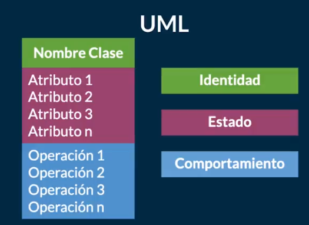
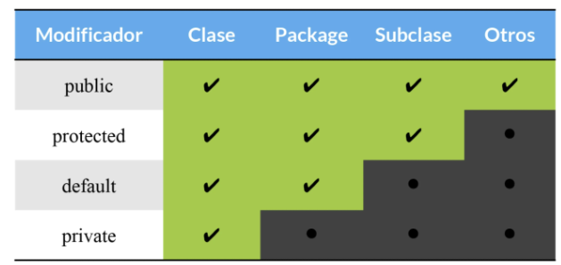
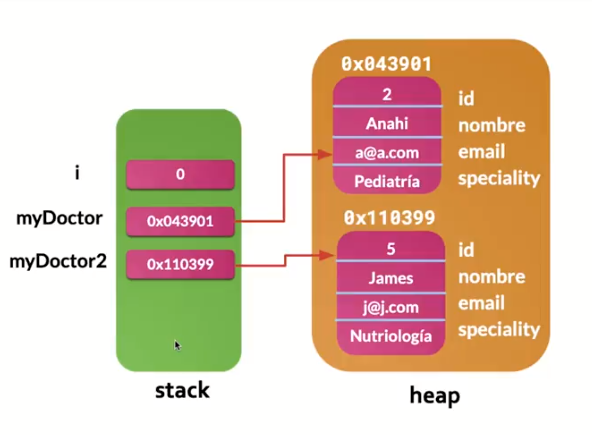
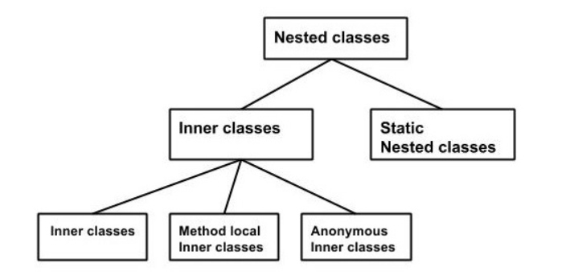
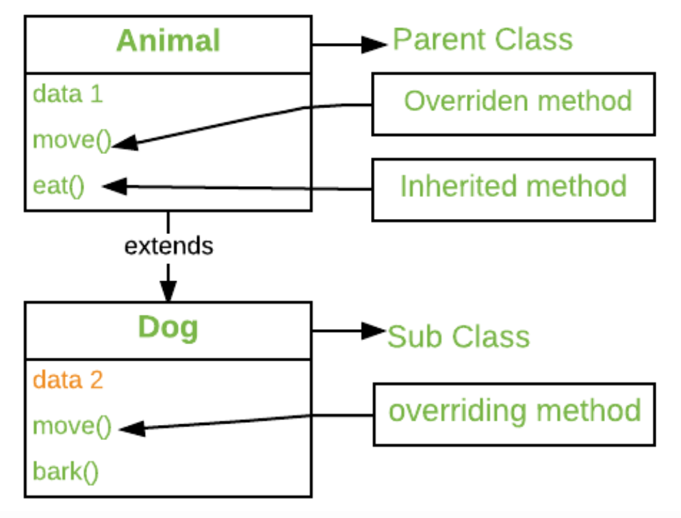
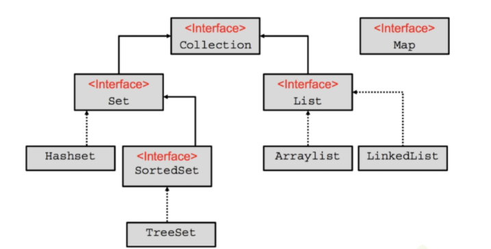
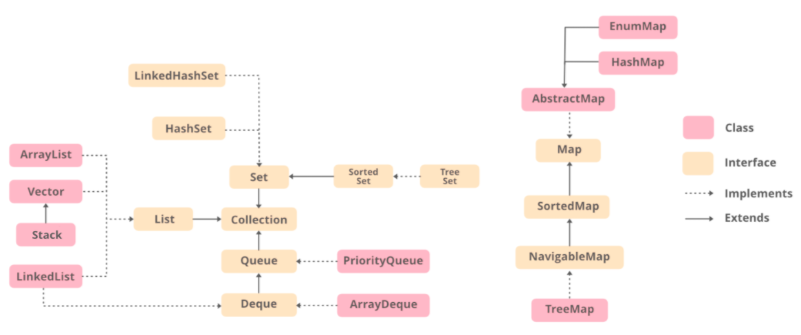
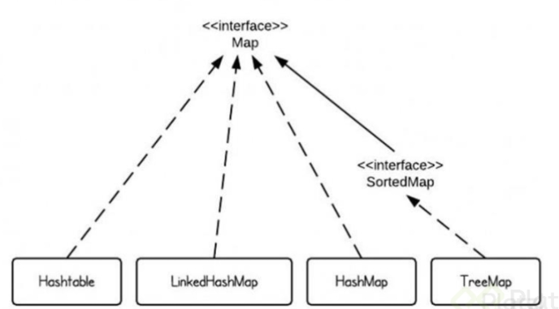
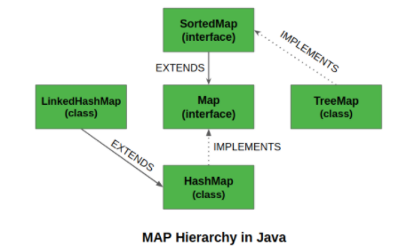
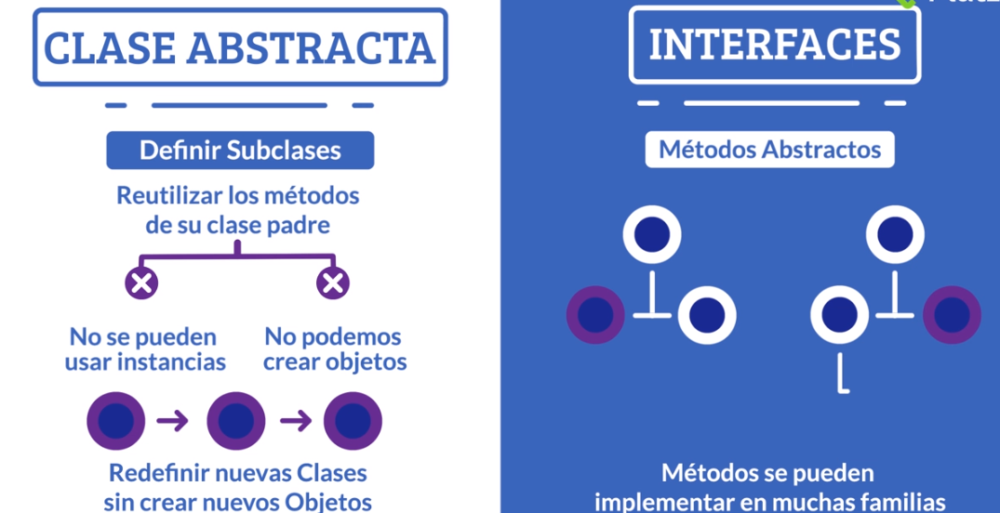

# Java SE Orientado Objetos

Paradigma -> Teoría de la base y modelo para resolver problemas y se compone de 4 elementos

1. Clases
2. Propiedades
3. Métodos
4. Objetos

Tiene 4 pilares

1. Encapsulamiento
2. Abstracción
3. Herencia
4. Polimorfismo

La orientación de objetos tiene que ver con UML (unified modeling language)

Los objetos son cualquier cosa que tiene propiedades y estos pueden ser físicos (un usuario) o conceptuales (la sesión de un usuario)

Las propiedades también se llaman atributos

Los comportamientos son los métodos del objeto

## Abstracción

1. Clase: Son los modelos de los cuales podemos construir objetos, es decir, son una abstracción de sus propiedades y comportamientos
   1. Las clases son templates para los objetos
   2. El objeto es la instancia de una clase

    
    

## Modularidad

Divide nuestro programa en diferente módulos de forma que puedan unirse o separarse sin romperse entre ellos o perder funcionalidad, nos ayuda a:

1. Reutilizar código
2. Evitar colapso
3. Mantenibilidad en el código
4. Mejorar la legibilidad

Las clases son la base de la modularidad

## Método constructor

Es el primer método que se ejecuta por defecto cuando creamos una clase, nos permite crear nuevas instancias de una clase

1. Tiene el mismo nombre que la clase que inicializa
2. Usa la palabra reservada `new` para invocarlo seguida del nombre con el que inicializamos la clase y paréntesis
3. El constructor nunca regresa un valor

```java
// nombreDeLaInstancia = new MétodoConstructor();
myDoctor = new Doctor();
```

Em compilador de Java crea un constructor cuando no lo definimos, pero es buena practica ponerlo

```java
public class Doctor {
  // Atributos...

  // Método Constructor:
  Doctor(/* parámetros */) {
    // Instrucciones que se ejecutan al crear/instanciar
    // un nuevo objeto con la clase Doctor...
  }
}
```

## Static: Variables y Métodos Estáticos

Los métodos y variables estáticos nos ayudan a ejecutar o conseguir algún código desde clases que no han sido instanciadas

The `static` keyword is mainly used for memory management

- Can be apply to variables, methods, blocks and nested classes

1. Sus valores se guardan en la memoria de nuestro programa, no en objetos instanciados
2. Las variables estáticas mantienen su valor durante el ciclo de vida del programa, su valor lo pueden consumir otras clases

```java
class Test
{
  // static variable
  static int a = 10;
  static int b;

  // static block
  static {
    System.out.println("Static block initialized.");
    b = a * 4;
  }

  public static void main(String[] args)
  {
    System.out.println("from main");
    System.out.println("Value of a : "+a);
    System.out.println("Value of b : "+b);
  }
}
```

Podemos importar las clases con la palabra clave `import static` y esto hará que podamos usar en el código las variables y métodos estáticos sin tener que llamar la clase

```java
import static java.lang.Math.*;

public class Principal{
  public static void main(String[] args){
    System.out.println(PI); // Nos ahorramos el Math.PI
  }
}
```

## Sobrecarga de métodos y constructores

A veces necesitamos que dos o mas métodos de una misma clase tengan el mismo nombre, pero con diferentes argumentos o distintos tipos de argumentos/valores de retorno

Java nos permite ejecutar código y métodos diferentes dependiendo de los argumentos que reciba nuestra clase

```java
public class Calculadora {
  // Los dos parámetros y el valor de retorno son de tipo int
  public int suma(int a, int b) {
    return a + b;
  }

  // Los dos parámetros y el valor de retorno son de tipo float
  public float suma(float a, float b) {
    return a + b;
  }

  // Un parámetro es de tipo int, mientras que el otro parámetro
  // y el valor de retorno son de tipo float
  public float suma(int a, float b) {
    return a + b;
  }
}
```

El uso mas común de la sobrecarga de métodos es la sobrecarga de constructores para instanciar objetos de formas distintas dependiendo de la cantidad de argumentos que enviamos

```java
public class Doctor {
  static int id = 0;
  String name;
  String specialty;

  public Doctor() {
    this.name = "Nombre por defecto";
    this.specialty = "Especialidad por defecto";
  }

  public Doctor(String name, String specialty) {
    this.name = name;
    this.specialty = specialty;
  }
}
```

## Encapsulamiento: Modificadores de acceso

Los modificadores de acceso nos ayudan a limitar dónde podemos leer o modificar atributos especiales de nuestra clase

Podemos definir que variables se pueden leer o editar por fuera de las clases donde fueron creadas, a esto se le conoce como encapsulamiento



## Getters & Setters

Nos permiten leer y escribir los valores de nuestras variables privadas desde fuera de la clase donde fueron creadas

```java
public class Patient {
  private String name;

  public String getName() {
    return "Patient name is " + this.name;
  }

  public void setName(String newName) {
    this.name = newName;
  }
}
```



## Nested Classes

Just like methods, variables of a class can have another class as its member.

1. The class written within is called the `nested class` and the class that holds the inner class is called the `outer class`

```java
class Outer_Demo {
   class Inner_Demo {
   }
}
```

Nested classes are divided into two types

1. `Non-static nested classes`
2. `Static nested classes`



### Inner Classes (Non-static Nested Classes)

Inner classes are a security mechanism in Java.

1. A class cannot be associated with the access modifier `private` but if we have the class as a member of other class, the `inner` class can be made private
   1. This is also used to access the private members of a class

Inner classes are of 3 types depending on **how** and **where** you define them

1. Inner Class
2. Method-local Inner Class
3. Anonymous Inner Class

#### Inner Class

1. Just write a class within a class
2. Inner class can be private and once your declare an inner class private, it cannot be accessed from an object outside the class

En el ejemplo creamos una clase y accedemos a ella, la clase inner es privada y accedemos a ella a traves de un método

1. `display_Inner()` es el method en el cual estamos instanciando la `inner class`
2. El método es invocado desde el `main`

```java
class Outer_Demo {
  int num;

  // inner class
  private class Inner_Demo {
    public void print() {
       System.out.println("This is an inner class");
    }
  }

  // Accessing he inner class from the method within
  void display_Inner() {
    Inner_Demo inner = new Inner_Demo();
    inner.print();
  }
}

public class My_class {

  public static void main(String args[]) {
    // Instantiating the outer class
    Outer_Demo outer = new Outer_Demo();

    // Accessing the display_Inner() method.
    outer.display_Inner();
  }
}
```

1. Necesitamos instanciar la clase interna y la externa

```java
public class Outer {
  public class Inner {

  }
}

public class Main {
  public static void main(String[] args){

    // Instanciamos la externa primero
    Outer outer = new Outer();

    // Instanciamos la interna una vez tenemos la externa
    Outer.Inner inner = outer.new Inner();
  }
}

```

#### Accessing the Private Members

1. Inner classes are also used to access the private members of a class

2. Suppose a class is having private members to access them

3. Write an inner class in it
   1. Return the private members from a method within the inner class `getValue()`

4. From another class from which you want to access the private members call the `getValue()` method of the inner class

5. To instantiate the inner class, you have to instantiate the outer class
   1. You instantiate the inner class with the object of the outer class

    ```java
    Outer_Demo outer = new Outer_Demo();
    Outer_Demo.Inner_Demo inner = outer.new Inner_Demo();
    ```

```java
class Outer_Demo {
    // private variable of the outer class
    private int num = 175;

    // inner class
    public class Inner_Demo {
        public int getNum() {
            System.out.println("This is the getnum method of the inner class");
            return num;
        }
    }
}

public class My_class2 {

    public static void main(String args[]) {
        // Instantiating the outer class
        Outer_Demo outer = new Outer_Demo();

        // Instantiating the inner class
        Outer_Demo.Inner_Demo inner = outer.new Inner_Demo();
        System.out.println(inner.getNum());
    }
}
```

#### Method-local Inner Class

We can write a class within a method and this will be a local type. Like local variables, the scope of the inner class is restricted within the method

A method-local inner class can be instantiated only within the method where the inner class is defined

```java
public class Outerclass {
   // instance method of the outer class
   void my_Method() {
      int num = 23;

      // method-local inner class
      class MethodInner_Demo {
         public void print() {
            System.out.println("This is method inner class "+num);
         }
      } // end of inner class

      // Accessing the inner class
      MethodInner_Demo inner = new MethodInner_Demo();
      inner.print();
   }

   public static void main(String args[]) {
      Outerclass outer = new Outerclass();
      outer.my_Method();
   }
}
```

### Static Nested Class

This is a nested class which is a static member of the outer class

1. Can be accessed without instantiating the outer class, using other static members
2. Does not have access to the instance variables and methods of the outer class

```java
public class Outer {
   static class Nested_Demo {
      public void my_method() {
         System.out.println("This is my nested class");
      }
   }

   public static void main(String args[]) {
      Outer.Nested_Demo nested = new Outer.Nested_Demo();
      nested.my_method();
   }
}
```

## Enum

1. Colección de constantes
2. Se usan cuando conocemos todos los valores posibles al tiempo de compilar
3. Se les pueden agregar atributos, métodos y constructores

```java
public enum Day {
  MONDAY("Lunes");
  TUESDAY("Jueves");
  FRIDAY("Viernes");
  SATURDAY("Sábado");
  SUNDAY("Domingo");

  private String spanish;
  private Day(String s) {
    spanish = s;
  }

  private String getSpanish() {
    return spanish;
  }
}


// A simple enum example where enum is declared
// outside any class (Note enum keyword instead of
// class keyword)
enum Color
{
  RED, GREEN, BLUE;
}

public class Test
{
  // Driver method
  public static void main(String[] args)
  {
    Color c1 = Color.RED;
    System.out.println(c1);
  }
}
```

## Herencia

La herencia consiste en crear nuevas clases a partir de otras clases, establecemos una relación padre e hijo entre nuestras clases.

Le indicamos a nuestras `subclases` de que `superclase` pueden heredar (`extend`) para reutilizar el código de algunos de sus métodos

```java
public class SuperClass {
  // ...
}

public class SubClass extends SuperClass {
  // ...
}
```

## Super & This

1. `super` se usa para hacer referencia a la clase padre, también podemos llamar al constructor de la clase padre desde una subclase usando `super();`

2. `this` hace referencia a la clase que estamos trabajando en ese momento

```java
public class User {
  int age = 1;

  public int getAge() {
    return this.age;
  }
}

public class Doctor extends User {
  String speciality = "Dentist";

  Doctor() {
    super.getAge(); // 1
    this.getSpeciality(); // Dentist
  }

  public int getSpeciality() {
    return this.speciality;
  }
}


/* Base class vehicle */
class Vehicle
{
  int maxSpeed = 120;
}


/* sub class Car extending vehicle */
class Car extends Vehicle
{
  int maxSpeed = 180;

  void display()
  {
    /* print maxSpeed of base class (vehicle) */
    System.out.println("Maximum Speed: " + super.maxSpeed);
  }
}

/* Driver program to test */
class Test
{
  public static void main(String[] args)
  {
    Car small = new Car();
    small.display();
  }
}
// Output: Maximum Speed: 120
```

## Polimorfismo: Sobreescritura de métodos

El polimorfismo es una característica de la programación orientada a objetos que consiste en sobrescribir métodos de la clase de la cual se hereda

Todas las clases por defecto heredan de `java.lang.Object`, es decir, todas las clases tienen `Object` como superclass

Los métodos marcados como `final` o `static` no se pueden sobrescribir

1. Inheritance lets us inherit attributes and methods from another class
2. Polymorphism uses those methods to perform different tasks
3. Think of a parent class called `Animal` that has a method called `animalSound()`
   1. Subclasses of Animals could be Pigs, Dogs, etc and they have their own sound

```java
class Animal {
  public void animalSound() {
    System.out.println("The animal makes a sound");
  }
}

class Pig extends Animal {
  public void animalSound() {
    System.out.println("The pig says: wee wee");
  }
}

class Dog extends Animal {
  public void animalSound() {
    System.out.println("The dog says: bow wow");
  }
}

class Main {
  public static void main(String[] args) {
    Animal myAnimal = new Animal();  // Create a Animal object
    Animal myPig = new Pig();  // Create a Pig object
    Animal myDog = new Dog();  // Create a Dog object
    myAnimal.animalSound();
    myPig.animalSound();
    myDog.animalSound();
  }
}
```

In any object-oriented programming language, overriding is a feature that allows a subclass or child class to provide a specific implementation of a method that is already provided by one of its super-classes



Method overriding is one of the way java achieve `Run Time Polymorphism`

1. The version of a method that is executed will be determined by **THE OBJECT** that is used to invoke the method

```java

// A Simple Java program to demonstrate
// method overriding in java

// Base Class
class Parent
{
  void show() { System.out.println("Parent's show()"); }
}

// Inherited class
class Child extends Parent
{
  // This method overrides show() of Parent
  @Override
  void show() { System.out.println("Child's show()"); }
}

// Driver class
class Main
{
  public static void main(String[] args)
  {
    // If a Parent type reference refers
    // to a Parent object, then Parent's
    // show is called
    Parent obj1 = new Parent();
    obj1.show();

    // If a Parent type reference refers
    // to a Child object Child's show()
    // is called. This is called RUN TIME
    // POLYMORPHISM.
    Parent obj2 = new Child();
    obj2.show();
  }
}

// OUTPUT
// Parent's show()
// Child's show()
```

## Interfaces

Es un tipo de referencia similar a una clase que contiene solo constantes y definiciones de métodos

Es otra manera de obtener abstracciones, se usa para agrupar métodos relacionados con cuerpos o bloques de código vacíos

``` java
// interface
interface Animal {
  public void animalSound(); // interface method (does not have a body)
  public void run(); // interface method (does not have a body)
}
```

1. To access the interface methods, the interface must be "implemented" (like inherited) by another class with the `implement` keyword (instead of `extends`).
2. The body of the interface is provided by the `implement`

```java
// Interface
interface Animal {
  public void animalSound(); // interface method (does not have a body)
  public void sleep(); // interface method (does not have a body)
}

// Pig "implements" the Animal interface
class Pig implements Animal {
  public void animalSound() {
    // The body of animalSound() is provided here
    System.out.println("The pig says: wee wee");
  }
  public void sleep() {
    // The body of sleep() is provided here
    System.out.println("Zzz");
  }
}
```

1. Like `abstract classes`, interfaces **cannot** be used to create objects
   1. No podemos crear un objeto `Animal`

2. Las interfaces no tienen cuerpo, el cuerpo se le asigna en la clase `implementada` con la palabra clave `implements`
3. On implementation of an interface, you must override all of its methods
4. Interface methods are by default `abstract` and `public`
5. Interface attributes are by default `public` `static` and `final`
6. No puede tener un constructor (porque no se puede usar para crear objetos)

7. Usamos interfaces para obtener seguridad, esconder ciertos detalles y mostrar solo lo deseado
8. Java no soporta multiple herencia, pero una clase si puede implementar multiples interfaces

```java
interface FirstInterface {
  public void myMethod(); // interface method
}

interface SecondInterface {
  public void myOtherMethod(); // interface method
}

class DemoClass implements FirstInterface, SecondInterface {
  public void myMethod() {
    System.out.println("Some text..");
  }
  public void myOtherMethod() {
    System.out.println("Some other text...");
  }
}
```

## Collections

Nos sirven para trabajar con colecciones de datos, específicamente con objetos

Los collections se diferencian de los arrays en que su tamaño es dinámico y no fijo



1. Collection y Map interfaces son las 2 `main root` interfaces de las clases collection



1. Set
   1. Almacena objetos únicos no repetidos
   2. La mayoría de las veces se almacenaran en desorden
   3. No tenemos indice

   4. De set tenemos:
      1. HashSet -> Interfaz SortedSet y de ella la clase TreeSet
      2. HashSet guarda elementos en desorden y gracias al mecanismo llamado hashing (obtiene un identificador del objeto) permite almacenar objetos únicos
      3. TreeSet -> almacena objetos únicos y gracias a su estructura de árbol el acceso es rápido

2. List
   1. Puede almacenar objetos repetidos
   2. Los objetos se almacenan en orden secuencial
   3. Tenemos acceso al indice

   4. `ArrayList` puede tener duplicados, no esta sincronizada por lo tanto es mas rápida
   5. `Vector` sincronizada, datos mas seguros pero es mas lento
   6. `LinkedList` puede contener elementos duplicados, no esta sincronizada (mas rápida)
      1. Es una estructura doblemente ligada, podemos añadir datos por encima de la pila o por debajo

3. Map -> tiene 3 implementaciones
   1. Map data viene como key-value pairs

      
      

   2. `HashMap`
      - No se ordenan los elementos
      - No aceptan claves duplicadas ni valores nulos

   3. `LinkedHashMap`
       - Ordena en orden de ingreso
       - Esto provoca que las búsquedas sean lentas

   4. `TreeMap`
      - El mapa lo ordena de forma "natural"
      - Si son valores enteros, los ordena de menor a mayor

Para iterar sobre un mapa debemos usar la interface `Iterator()` y para recorrerlo usamos `while`

```java
// Imprimimos el Map con un Iterator
Iterator it = map.keySet().iterator();
while(it.hasNext()){
  Integer key = it.next();
  System.out.println("Clave: " + key + " -> Valor: " + map.get(key));
}
```

## Clases abstractas

A veces no necesitamos implementar todos los métodos de una clase heredada o interfaz. No

1. No implementaremos todos los métodos
2. No crearemos instancias

Data abstraction is the process of hiding certain details and showing only essential information to the user

Abstraction can be achieved with `abstract classes` or `interfaces`

1. `Abstract class` -> Restricted class that cannot be used to create objects (to access it, must be inherited from another class)

2. `Abstract method` -> Can only be used on abstract class, does not have a body. The body is provided by the subclass

```java
abstract class Animal {
  public abstract void animalSound();
  public void sleep() {
    System.out.println("Zzz");
  }
}
```

Al usar clases abstractas y estas tener métodos abstractos, estos son los que se deben implementar o sino fallara la implementación

## Clases anónimas

Las clases anónimas son una forma de instanciar clases abstractas sin necesidad de usar sus clases hijas

Su ciclo de vida no es duradero, no las tendremos disponibles durante toda la ejecución del programa

```java
abstract class AnonymousInner {
  public abstract void myMethod();
}
public class Outer_class {
  public static void main(String args[]) {
    AnonymousInner inner = new AnonymousInner() {
      public void myMethod() {
        System.out.println("This is an example of anonymous inner class");
      }
    };
    inner.myMethod();
  }
}
```



A partir de Java 8, podemos tener implementación en métodos para heredar y reutilizar diferentes comportamientos

No todos los métodos de nuestras interfaces deben ser abstractos, ahora podemos usar el modificador de acceso `default` y desde Java 9 `private`

```java
public interface MyInterface {
  // Métodos default: nos permite heredar la definición
  // de la función y también su implementación...
  default void defaultMethod() {
    privateMethod("Hello from the default method!");
  }

  // Métodos private: nos permiten definir comportamiento,
  // pero solo se puede usar desde otras clases de esta
  // interfaz, no se hereda a la clase hija....
  private void privateMethod(final String message) {
    System.out.println(message);
  }

  // Métodos abstractos: recuerda que todos los métodos
  // son abstractos por defecto...
  void normalMethod();
}
```

## Herencia en interfaces

Las interfaces pueden heredar de otras interfaces utilizando la palabra clave `extends`, el concepto de herencia se aplica igual que en clases pero se pueden heredar multiples `interfaces`

```java
public interface IReadable {
  public void read();
}


public interface Visualizable extends IReadable, Serializable {
  public void setViewed();
  public Boolean isViewed();
  public String timeViewed();
}
```
