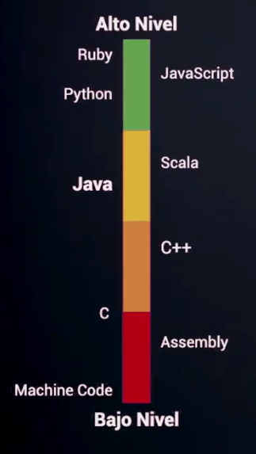
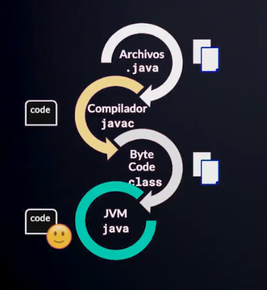
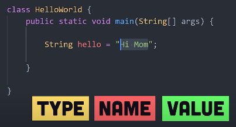
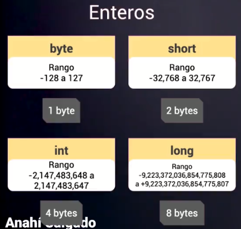
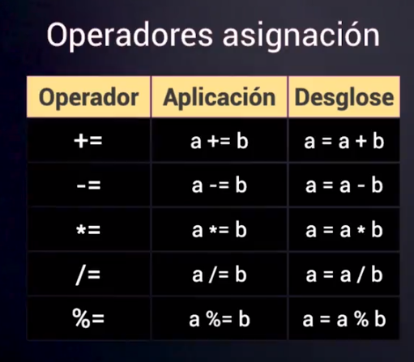
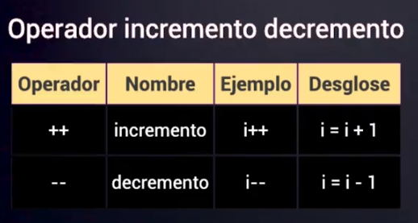
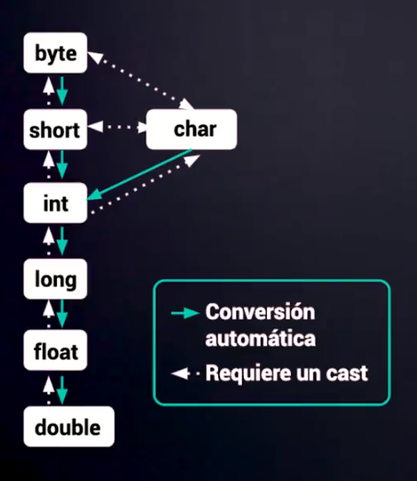
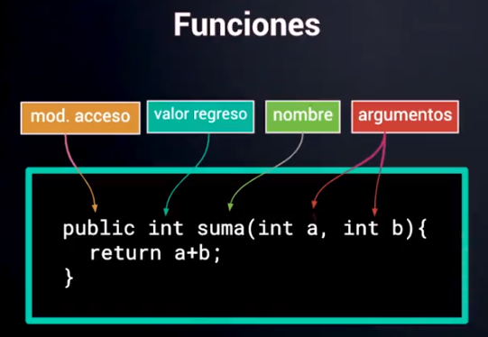

# Introducción Java SE (Standard Edition)

1. Curso básico de Java SE
2. Curso de Java SE: Orientado a Objetos
3. Curso de Java SE: Programación Funcional

Java es un lenguaje de programación de alto nivel, es decir, fácil de manipular, moderno.

Write Once Run Anywhere (WORA)



## Java Development Kit (JDK)

Se compone de 3 cosas principalmente

1. Java Runtime Environment JRE -> La máquina virtual de Java
2. Compilador de Java -> Traduce a bytecode para que lo interprete la máquina virtual
3. API de desarrollo -> Base de ayudas

4. Java SE 8 (LTS) -> Long Term Support, las otras van sacando actualizaciones cada 6 meses

5. OpenJDK -> Version open source de Java

6. Java 8 y 11 LTS son las mas usadas

En cuanto a servidores, la mas usada es Maven y Gravel. Integración de dependencias, compilación de código

En cuanto a frameworks, spring es muy importante

En cuanto a entorno de desarrollo o IDE (Integrated Development Environment)

- NetBeans
- eclipse
- IntelliJ IDEA

## Hola Mundo

1. Método main
   1. Es el punto de entrada de una aplicación Java, es lo primero que va ejecutar
   2. Sin el main, la aplicación no se ejecutara `In class NoMain: void main(String args[]) no esta definido`

```java
public class HolaMundo {
    public static void main(String[] args) {
        System.out.println("Hola mundo");
    }
}
```



1. `javac` corre el compilador y crea el código byte code (.class)
2. El código byte lo corre el JVM
3. Java es compilado e interpretado
   1. Existen lenguajes que unicamente son interpretados como JavaScript

## Variables en Java

Las variables son un espacio en memoria que le asignamos un contenido, puede ser numérico, texto etc

Las variables se compondrán de un nombre y valor previamente con el tipo de la variable



1. Las variables pueden ser asignadas, actualizadas, redefinidas dependiendo de las necesidades
2. Existen variables de tipo de instancia (objetos)
3. Existen variables estáticas `static` o variables de clase
   1. Solo pueden ser accedidas a partir del nombre de una clase y su alcance es mas global

4. Los nombres de las variables son sensibles a mayúsculas y minúsculas y nunca comenzar con un numero
5. Las constantes se escriben en mayúsculas y contienen `_`
6. Upper Camel Case -> La primera letra en mayúscula
   1. Para clases
7. Lower Camel Case -> La primera letra en minúscula
   1. Métodos, variables

## Tipos de datos numéricos



1. `int` Tiene un limite de 10 dígitos
2. Para declarar como long debemos terminar una L al final `long nL = 12345678901L;`

Cuando tenemos datos con decimales, tenemos 2 opciones float (4 bytes) y double (8bytes). Regularmente se usa double

```java
public class DataTypes {
  public static void main(String[] args) {

    int n = 1234567890;
    long nL = 12345678901L;

    double nD = 123.456;
    float nF = 123.456F;
  }
}
```

1. `char` es un dato primitivo que solo almacena 1 carácter o letra or ASCII value. Se usa comillas simple, para `String` si se usa comillas doble

A partir de JAVA 10 no es necesario definir el type antes de la variable, JAVA ya lo infiere `var a = "hola"`

```java
public class DataTypes {
  public static void main(String[] args){
    var salary = 1000;
  }
}
```

## Operadores de Asignación, Incremento y Decremento





1. Prefijo `++i` ->  Se incrementa y luego accede al dato de la variable
2. Posfijo `i++` -> Se accede al dato de la variable y después la incrementa

## Cast en variables: Estimación y Exactitud



When you assign a value of one primitive data type to another type, there are 2 types of casting

1. Widening Casting (automatically) -> Converting a smaller type to a larger type size
   1. `byte` -> `short` -> `char` -> `int` -> `long` -> `float` -> `double`

2. Narrowing Casting (manually) -> Larger to smaller
   1. `double` -> `float` -> `long` -> `int` -> `char` -> `short` -> `byte`

```java
// Widening
int myInt = 9;
double myDouble = myInt;

System.out.println(myInt); // 9
System.out.println(myDouble); // 9.0

// Narrowing
double myDouble = 9.8d;
int myInt = (int) myDouble;

System.out.println(myDouble); // 9.8
System.out.println(myInt); // 9
```

## Archivos .JAR (Java ARchive)

La extension de los archivos ejecutables de JAVA, son un tipo de comprimido que lee la maquina de java y podemos correr desde la consola. Es un ejecutable.

## If statement

El mismo if de JavaScript

```java
public class IfStatement {
  public static void main(String[] args) {

    if (condition) {
      // code to be executed
    } else if {

    } else {

    }
  }
}
```

1. Igualdad `==`
2. Desigualdad `!=`

Tambien existe el operador ternario en JAVA

```java
variable = (Expression1) ? Expression2:Expression3

if(Expression1)
{
  variable = Expression2;
}
else
{
  variable = Expression3;
}

```

## Switch

Igual a JavaScript, o mas bien JS es igual a JAVA

This is how it works:

1. The switch expression is evaluated once.
2. The value of the expression is compared with the values of each case.
3. If there is a match, the associated block of code is executed.
4. The break and default keywords are optional, and will be described later in this chapter

```java
switch(expression) {
  case x:
    // code block
    break;
  case y:
    // code block
    break;
  default:
    // code block
}
```

## Java Methods or Functions

Un método es un código que bloque que corre solo cuando es invocado

1. Puedes pasarle data, conocidos como `argumentos o parámetros`
2. Para reutilizar código, define el código una vez y reutilizarlo muchas veces



1. Cuando regresamos algo usamos `return`
2. Cuando no regresamos nada ponemos `void`

```java
public class Main {
  static void myMethod() {
    System.out.println("I just got executed!");
  }

  public static void main(String[] args) {
    myMethod();
    // Outputs "I just got executed!"
  }

  public static int sum(int a, int b){
    return a+b;
  }
}
```

1. Cuando los métodos comparten el main se debe usar `static`
2. Javadoc -> Documenta el código, genera documentación en HTML

```java
// Ejemplo de javadoc comment

 /**
   * Función privada que chequea los permisos sobre un recurso con base en los módulos asociados.
   * <p>
   * Tiene un caso especial, y es el de solo lectura.
   *
   * @param permissionType Tipo de permiso según el Enum Permission
   * @param groupId        El id del grupo.
   * @return Un tipo option. Si es None, es porque puede, si no, devuelve forbidden.
   */
```

## Arrays en JAVA

1. Para declarar un array le ponemos el `type` seguido del nombre y `[]` `int intArray[];`
2. Lo anterior declara el array, esto crea una referencia pero aun no se le da espacio en memoria al array para eso hay que iniciarlo

```java
int intArray[]; //declaring array
intArray = new int[20]; // allocating memory to array

int[] intArray = new int[20]; // combining both statements in one
```

Podemos recorrer un array con `for` y con `for each`

1. `for each`, aca declaramos una variable que es del mismo tipo que el tipo del array
   1. No tenemos control del indice

```java
for (type var : array)
{
  statements using var;
}

// Is equivalent to:
for (int i=0; i<arr.length; i++)
{
  type var = arr[i];
  statements using var;
}
```