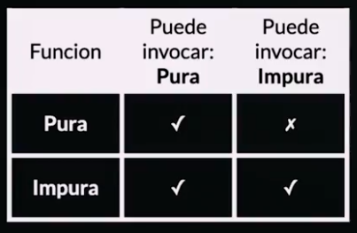
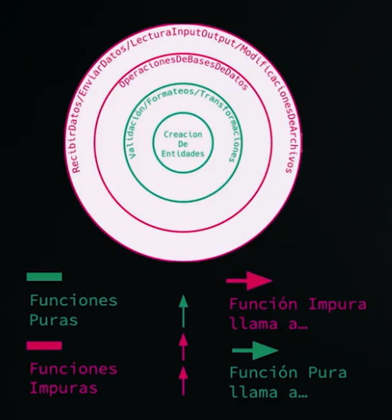
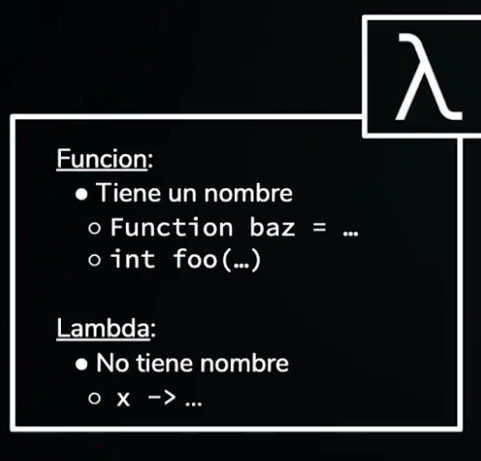
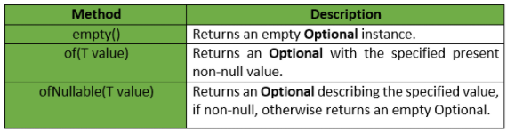

# Programación Funcional Java SE

1. Se enfoca en resolver, no importa la procedencia de la función
2. Datos mutables e inmutables

3. Legibilidad, las funciones son mas explicitas
4. Testing mas fácil
5. Concurrencia mas fácil
6. Comportamientos mas definidos
7. Menos manejo de estados
8. No hay que instalar nada adicional

## Funciones

1. Las funciones son ciudadanos de primera clase, se pueden usar como `type`
   1. Pueden ser parámetros o como retorno

2. Se pueden definir bajo demanda (básicamente anónimas)

## Tipos de funciones

1. Funciones "Puras" (Pure functions)
   - Siempre genera el mismo resultado para el mismo parámetro
   - No dependen del estado del sistema
   - Son deterministic, podemos predecir el resultado
   - No generan side effects, efectos secundarios. No modifica el estado

```java
public class FunctionTester {
  public static void main(String[] args) {
    int result = sum(2,3);
    System.out.println(result);

    result = sum(2,3);
    System.out.println(result);
  }
  static int sum(int a, int b){
    return a + b;
  }
}
```

Las funciones `puras` no pueden invocar una función `impura` porque ya no seria `pura`



### Side Effects

Todo cambio observable desde fuera del sistema

Si hacemos una operación y se observa desde afuera, por ejemplo cambiar el color de algo, hacer un CRUD a la base de datos

1. Leer/Crear/Modificar archivos
2. Leer bases de datos
3. Enviar Recibir una llamada a la red
4. Alterar un objeto usado por otra función

5. Los efectos secundarios son inevitables
6. Podemos reducir/controlar cuando suceden



## Funciones de orden mayor

1. Toma otra función como parámetro
2. Retorna una función como resultado

## Funciones lambda

1. Son funciones anónimas
2. Cuando usarlas?
3. Comportamientos de uso único
4. Regla que se requiere en un solo lugar
5. Es una función extremadamente simple



## Inmutabilidad

1. Una vez creado no se puede alterar
2. Facilita crear funciones puras
3. Facilitar usar threads/concurrencia

Desventajas

1. Nueva instancia por cada set de modificaciones
2. Requiere especial atención al diseño
3. Objetos mutables fuera de nuestro alcance

## Functional interfaces

1. Is an `interface` that contains only a single abstract (unimplemented) method
   1. SAM (Single Abstract Method)
2. Can contain default and static methods which do have an implementation, in addition to the single unimplemented method

Recordemos que a partir de Java 8 podemos usar métodos default en las interfaces

```java
// A simple program to Test Interface default
// methods in java
interface TestInterface
{
  // abstract method
  public void square(int a);

  // default method
  default void show()
  {
    System.out.println("Default Method Executed");
  }
}

class TestClass implements TestInterface
{
  // implementation of square abstract method
  public void square(int a)
  {
    System.out.println(a*a);
  }

  public static void main(String args[])
  {
    TestClass d = new TestClass();
    d.square(4);

    // default method executed
    d.show();
  }
}
// This will print
// 16
// Default Method Executed
```

1. This example is a `functional interface` because it only has a single method and that method has no implementation
   1. Normally a Java interface does not contain implementations of the methods it declares
   2. Can contain implementations in default methods or in static methods

```java
public interface MyFunctionalInterface {
  public void execute();
}
```

This is also a `functional interface` since it only contains a single `non-implemented` or `abstract` method

```java
public interface MyFunctionalInterface2{
  public void execute();

  public default void print(String text) {
    System.out.println(text);
  }

  public static void print(String text, PrintWriter writer) throws IOException {
    writer.write(text);
  }
}
```

## Functional Interfaces CAN BE IMPLEMENTED BY A LAMBDA EXPRESSION

1. A **LAMBA** implements a single method from a interface, therefore, the interface can only contain a single abstract method

```java
MyFunctionalInterface lambda = () -> {
  System.out.println("Executing...");
}
```

Otro ejemplo seria

1. Creamos una interface Square
2. Instanciamos el square y en esa instantiation definimos el método
3. El método es un lambda, que recibe un integer x y lo multiplica por si mismo

```java
public class HolaMundo {
// Java program to demonstrate lambda expressions to
// implement a user defined functional interface.

  @FunctionalInterface

  interface Square {
    int calculate(int x);
  }


  public static void main(String args[]){
    int a = 5;

    // lambda expression to define the calculate method
    Square s = (int x) -> x * x;

    // parameter passed and return type must be
    // same as defined in the prototype
    int ans = s.calculate(a);
    System.out.println(ans);
  }
}
```

## Built-in Functional Interface In Java

Java contiene un set de `functional interfaces` de uso comunes

### Function

La interfaz `Function` (java.util.function.Function) es una de las interfaces mas importantes en Java, esta interfaz representa una function (método) que recibe un solo parámetro y retorna un valor

```java
public interface Function<T,R>{
  public <R> apply(T parameter);
}
```

1. La interface `Function` viene con mas métodos pero todos vienen con `default`
2. El único método que hay para implementar es el `apply`
3. En la implementación el apply tomara un parámetro de tipo `Long` y retornara otro de tipo `Long`

```java
public class AddThree implements Function<Long, Long>{

  @Override
  public Long apply(Long aLong){
    return aLong + 3;
  }
}
```

La manera de implementar el código seria el siguiente:

1. Creamos una nueva instancia de `AddThree()`
2. Llamamos el método apply
3. Devolvemos el valor del resultado

```java
Function<Long, Long> adder = new AddThree();
Long result = adder.apply((long) 4);
System.out.println("result = " + result);
```

```java
Function<Long, Long> adder = (value) -> value + 3;
Long resultLambda = adder.apply((long) 8);
System.out.println("resultLambda = " + resultLambda);
```

### Predicate

Representa una función que recibe un valor como parámetro y retorna verdadero o falso

```java
public interface Predicate<T> {
  boolean test(T t);
}
```

Como se implementaría en clase y con un lambda

```java
public class CheckForNull implements Predicate {
  @Override
  public boolean test(Object o) {
    return o != null;
  }
}

Predicate predicate = (value) -> value != null;
```

Ejemplo simple de Predicate

```java
// Java program to illustrate Simple Predicate

import java.util.function.Predicate;
public class PredicateInterfaceExample1 {
  public static void main(String[] args)
  {
    // Creating predicate
    Predicate<Integer> lesserthan = i -> (i < 18);

    // Calling Predicate method
    System.out.println(lesserthan.test(10));
    // Return true
  }
}
```

### UnaryOperator & BinaryOperator

1. UnaryOperator `functional interface` que representa una operación que toma un solo parámetro y retorna un parámetro del mismo tipo
2. `UnaryOperator<T>` extiende the `Function` interface

```java
@FunctionalInterface
import java.util.function.UnaryOperator;

public interface UnaryOperator<T> extends Function<T, T>

UnaryOperator<Person> unaryOperator =
  (persona) -> { person.name = "New name"; return person;}


public class UnaryOperatorTest1 {
  public static void main(String[] args) {
    UnaryOperator<Integer> operator = t -> t * 2;   // lambda expression
    System.out.println(operator.apply(5));
    System.out.println(operator.apply(7));
    System.out.println(operator.apply(12));
  }
}
```

1. `BinaryOperator` -> Toma 2 parámetros y devuelve un valor, tanto parámetros como el return deben ser el mismo tipo

```java
BinaryOperator<MyValue> binaryOperator =
  (value1, value2) -> { value1.add(value2); return value1; };

import java.util.function.BinaryOperator;
public class Demo {
  public static void main(String args[]) {
    BinaryOperator<Integer> operator = (x, y) -> x * y;
    System.out.println(operator.apply(5, 7)); // 35
  }
}
```

### Supplier

1. Represents a function that supplies a value of some sorts
2. También se puede pensar como un `factory interface`
3. Supplier es instanciada con `lambda`, `method reference` or `default constructor`
4. The functional method of a `Supplier<T>` is the `get()`

```java
Supplier<Integer> supplier = () -> new Integer((int) (Math.random() * 1000D));
// Devuelve una instancia de Integer con un valor random entre 0 y 1000
```

```java
import java.util.*;
import java.util.function.*;

public class SupplierTest {
  public static void main(String args[]) {
    Supplier<String> supplier1 = () -> "TutorialsPoint";   // lambda expression
    System.out.println(supplier1.get());

    Supplier<Integer> supplier2 = () -> 7;    // lambda expression
    System.out.println(supplier2.get());

    Person p = new Person("Raja");
    Person p1 = get(() -> p);
    Person p2 = get(() -> p);
    System.out.println(p1.equals(p2));
  }
}
```

### Consumer

1. `Functional interface` that represents a function that consumes a value without returning any value
2. Esta interface representa una operación que acepta `un solo parámetro` y no retorna nada
3. Contiene un método `accept()`

```java
Consumer<Integer> consumer = (value) -> System.out.println(value);
```

```java
import java.util.*;
import java.util.function.*;

public class ConsumerBiConsumerTest {
  public static void main(String[] args) {
    Consumer<String> c = (x) -> System.out.println(x.toLowerCase());
    c.accept("Daniel"); // daniel

    Consumer<Integer> con = (x) -> System.out.println(x + 10);
    con.accept(10); // 20
  }
}
```

## Method References

One of the most welcome changes in Java 8 was the introduction of `lambda expressions`

`Method references` are a special type of lambda expressions

1. Reference to a Static Method
   - Tenemos un array de nombres y queremos poner mayúscula la primera letra
   - En vez de usar la lambda expression y llamar el método directamente podemos usar method reference `::`

```java
List<String> messages = Arrays.asList("hello", "world", "readers!");
messages.forEach(word -> StringUtils.capitalize(word));
messages.forEach(StringUtils::capitalize);
```

## Lambda Expressions

Lambda expression es un pedazo corto de código que toma parámetros y retorna un valor, similares a los métodos pero no necesitan un nombre y pueden ser implementados en el cuerpo de un método

1. Sintaxis: `parameter -> expression`
2. Mas de 1 parámetro: `(parameter 1, parameter 2) -> expression`
3. Las `expression` son limitadas, deben devolver algo. Para agregar mas funcionalidad podemos usar llaves
   1. `(parameter 1, parameter 2) -> { code block }`

Lambda expressions are usually passed as parameters to a function

```java
import java.util.ArrayList;

public class Main {
  public static void main(String[] args) {
    ArrayList<Integer> numbers = new ArrayList<Integer>();
    numbers.add(5);
    numbers.add(9);
    numbers.add(8);
    numbers.add(1);
    numbers.forEach( (n) -> { System.out.println(n); } );
  }
}
```

Lambdas pueden ser **almacenadas** en variables si el tipo de la variable es una `functional interface`.

La lambda debe tener el mismo numero de parámetros y el mismo tipo de retorno del método

```java
import java.util.ArrayList;
import java.util.function.Consumer;

public class Main {
  public static void main(String[] args) {
    ArrayList<Integer> numbers = new ArrayList<Integer>();
    numbers.add(5);
    numbers.add(9);
    numbers.add(8);
    numbers.add(1);
    Consumer<Integer> method = (n) -> { System.out.println(n); };
    numbers.forEach( method );
  }
}
```

## Default methods en functional interfaces

```java
public class StringFunctions {
  @FunctionalInterface
  interface StringOperation {
    int getAmount(); // Abstract method
  }

  default void operate(String text) {
    int x = getAmount();
    while(x-- > 0) {
      System.out.println(text)
    }
  }

  public static void main(String[] args) {
    StringOperation s = () -> 6;

    s.operate("Alumno");
    // Esto imprimiría 6 veces la palabra Alumno
  }
}
```

## compose() & andThen()

Ambos son métodos que tiene la `functional interface` Function

1. `compose()` -> Ejecuta la lambda y el resultado se lo pasa a la función que la llamo
2. `andThen()` -> Ejecuta la lambda después de haber evaluado la función que la llamo

```java
Function<Integer, Integer> multiply = (value) -> value * 2;
Function<Integer, Integer> add      = (value) -> value + 3;

Function<Integer, Integer> addThenMultiply = multiply.compose(add);

Integer result1 = addThenMultiply.apply(3);
System.out.println(result1); // 12

// Primero se sumara 3+3 y luego se multiplicara por 2
```

```java
Function<Integer, Integer> multiply = (value) -> value * 2;
Function<Integer, Integer> add      = (value) -> value + 3;

Function<Integer, Integer> multiplyThenAdd = multiply.andThen(add);

Integer result2 = multiplyThenAdd.apply(3);
System.out.println(result2); // 9

// Primero multiplicara 3*2 y luego le sumara 3
```

## Optional Class

Java 8 introduced a new class Optional in `java.util.package`, it can help with the null checks

By using Optional, we can specify alternate values to return or alternate code to run

```java
// Java program without Optional Class

public class OptionalDemo {
  public static void main(String[] args)
  {
    String[] words = new String[10];
    String word = words[5].toLowerCase();
    System.out.print(word);
  }
}

// Tirara un error
// Exception in thread "main" java.lang.NullPointerException
```

Podemos evitarlo con Optional

```java
// Java program with Optional Class

import java.util.Optional;

public class OptionalDemo {
  public static void main(String[] args)
  {
    String[] words = new String[10];
    Optional<String> checkNull
      = Optional.ofNullable(words[5]);
    if (checkNull.isPresent()) {
      String word = words[5].toLowerCase();
      System.out.print(word);
    }
    else
      System.out.println("word is null");
  }
}
```

1. Optional es un `container object` el cual puede o no tener un non-null value
2. If a value is present, `isPresent()` return true and `get()` will return the value
3. Methods that depends on presence or absence of a contained value are provided
   1. `orElse()` returns a default value if the value is not present
   2. `ifPresent()` executes a block of code if the value is present

Optional is `value-based` class, their instance are:

- Final and immutable (though may contain references to mutable objects)
- Considered equal solely based on equals(), not based on reference equality (==)
- Do not have accesible constructors

### Static methods

Static methods are the methods in Java that **CAN BE CALLED WITHOUT CREATING AN OBJECT OF THE CLASS**

They are referenced by the class name itself or reference to the object of that class

```java
public static void geek(String name)
{
 // code to be executed....
}

// Must have static modifier in their declaration.
// Return type can be int, float, String or user-defined data type.
```

Como los métodos `static` pertenecen a la clase, pueden ser llamados sin crear un OBJETO de la CLASE

- Static methods are associated with the class in which they reside, they can be called even WITHOUT creating an instance of the class
- They are designed with the aim to be SHARED among all objects created from the same class
- Can not be overridden, but can be overloaded since they are resolved using static binding by the compiler at build time

Métodos estáticos de la clase Optional



### Instance Methods

Son métodos que requieren un objeto de la clase antes de poder ser llamados

- Pertenecen al objeto de la clase, pueden ser llamados solo después de crear el objeto
- Cada objeto creado tiene su instancia del método
- Pueden ser overridden

```java
public void geek(String name)
{
 // code to be executed....
}
// Return type can be int, float String or user defined data type.
```

## Stream

Es una especie de lista que tiene elementos y se puede iterar

La diferencia entre un stream y una lista, es que el stream es autoiterable

El stream solo puede ser consumido 1 vez, luego de usarlo si se vuelve a usar en el código Java tirara error

1. Sequence of elements -> A stream provides a set of specific type in a sequential manner. A stream gets/computes elements on demand. It never stores the elements

2. Source -> Stream takes Collections, Arrays, or I/O resources as input source

3. Aggregate operations -> Stream supports aggregate operations like filter, map, limit, reduce, find, match, and so on

4. Pipelining -> Most of the stream operations return stream itself so that their result can be pipelined.

5. Streams don't change the original data structure, they only provide the result as per the pipelined methods

6. Intermediate Operations -> `map`, `filter`, `sorted`

7. Terminal Operations -> `collect`, `forEach`, `reduce`

```java
import java.util.ArrayList;
import java.util.List;

public class Test{
  public static void main(String[] args) {
    List<String> names = new ArrayList<String>();
    names.add("Jai");
    names.add("Mahesh");
    names.add("Ajay");
    names.add("Hemant");
    names.add("Vishal");
    //Using Stream and Lambda expression
    long count = names.stream().filter(str->str.length()<5).count();
      System.out.println(count+" strings with length less than 5");
  }
}
```

## Collectors

Una vez terminadas las operaciones con Stream lo usual es guardarlas ya sea en un `List` o un `JSON`

Existe una interfaz que obtiene todos los elementos de un Stream y se llama `Collector`

`Collect<T, A, R>` es una interfaz que:

1. Tomara datos del tipo `T` del Stream
2. Un dato mutable `A` donde se iran almacenando los elementos
3. Genera un resultado de tipo `R`

```java
public List<String> getJavaCourses(Stream<String> coursesStream) {
  List<String> javaCourses =
    coursesStream.filter(course -> course.contains("Java"))
      .collect(Collectors.toList());

  return javaCourses;
}
```

Usar `Collectors.toXXX` es el proceso inverso de usar `Collection.stream()`. Esto hace que sea fácil generar API que trabajen con estructuras/colecciones comunes

La única manera de obtener un dato que ya no sea un `Stream` es usando `Collectors`

Los streams vienen con un método `parallel()` que les permite usar todos los procesadores del computador

Si te importa el orden de los datos no se debe usar `parallel()` porque JAVA va devolviendo los valores a medida que están disponibles

### Operaciones terminales

Las operaciones terminales mas comunes que se encuentran en Stream son:

- `anyMatch()`
- `allMatch()`
- `noneMatch()`
- `findAny()`
- `findFirst()`
- `min()`
- `max()`
- `reduce()`
- `count()`
- `toArray()`
- `collect()`
- `forEach()`

### Operaciones terminales de coincidencia `anyMatch`, `allMatch`, `noneMatch`

Sirven para determinar si en un `Stream` hay elementos que cumplajn con un cierto `Predicate`, son terminales pues las 3 retornan un boolean

```java
//Nos indica si un stream contiene un elemento según el Predicate que le pasemos:
Stream numbersStream = Stream.of(1, 2, 3, 4, 5, 6, 7, 11);
boolean biggerThanTen = numbersStream.anyMatch(i -> i > 10); //true porque tenemos el 11

//allMatch
//Nos indica si todos los elementos de un Stream cumplen con un cierto Predicate:
Stream agesStream = Stream.of(19, 21, 35, 45, 12);
boolean allLegalDrinkingAge = agesStream.allMatch(age -> age > 18); //false, tenemos un menor

//noneMatch
//Nos indica si todos los elementos de un Stream NO CUMPLEN un cierto Predicate:
Stream oddNumbers = Stream.of(1, 3, 5, 7, 9, 11);
boolean allAreOdd = oddNumbers.noneMatch(i -> i % 2 == 0);
```

### Operaciones terminales de búsqueda `findAny`, `findFirst`

Retornan un `Optional` como resultado de buscar un elemento dentro del `Stream`

`findFirst` retornara un `Optional` conteniendo el primer elemento en el `Stream` si el `Stream` tiene definida previamente una operación de ordenamiento o para encontrar elementos. De lo contrario, funcionara igual que `findAny` tratando de devolver cualquier elementos presente en el `Stream` de forma no determinista

### reduce

Many times, we need to perform operations where a stream reduces to single resultant value, for example, maximum, minimum, sum, product, etc.

Reducing is the repeated process of combining all elements.

reduce operation applies a binary operator to each element in the stream where the first argument to the operator is the return value of the previous application and second argument is the current stream element.

Syntax

```java
T reduce(T identity, BinaryOperator<T> accumulator);

// Where, identity is initial value
// of type T and accumulator is a
// function for combining two values.
```

`sum()`, `min()`, `max()`, `count()` etc. are some examples of reduce operations. reduce() explicitly asks you to specify how to reduce the data that made it through the stream

Los conceptos claves de un reducer son:

1. Identity -> an element that is the initial value of the reduction operation and the default result if the stream is empty

2. Accumulator -> a function that takes two parameters:
   1. A partial result of the operation
   2. And the next element of the stream

3. Combiner -> A function used to combine the partial result of the reduction operation when the reduction is parallelized or when theres a mismatch between the types of the accumulator arguments and the types of the accumulator implementation

```java
List<Integer> numbers = Arrays.asList(1, 2, 3, 4, 5, 6);
int result = numbers
  .stream()
  .reduce(0, (subtotal, element) -> subtotal + element);
assertThat(result).isEqualTo(21);
```

1. Identity -> integer 0
2. Accumulator -> `(subtotal, element) -> subtotal + element`

Para hacer el código mas conciso, podemos usar `method reference` en vez de lambda expression

```java
int result = numbers.stream().reduce(0, Integer::sum);
assertThat(result).isEqualTo(21);
```