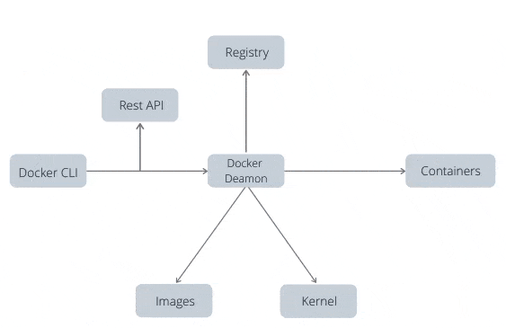
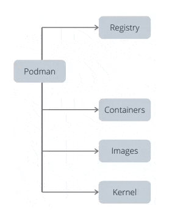
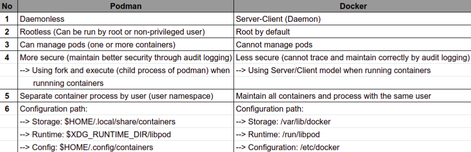

# Docker

Docker is an open platform for developing, shipping and running applications

Docker enables you to separate your applications from your infrastructure so you can deliver software quickly

Docker container makes it easy to quickly test a piece of software in a container, quicker than a virtual machine, and using less resources

## Simple use cases

1. I need to see the man page from a specific version of RHEL, CentOS or Fedora
2. Quickly verify the command line options of a program
3. Test the functionality of a specific version of software
4. I need a scratch pad that is NOT my system
5. I need a single daemon running, and I don't care what distribution of Linux it runs on

## Architecture

1. One of the key advantages of using Docker is it's centralized image management server called `Registry Server`

2. As one builds images, they are made up of `layers`
   1. These `layers` are shared together in what is called a `repository`

## The docker platform

1. Docker provides the ability to package and run an app in a loosely isolated environment called a container

2. The isolation and security allow to run many container simultaneously on a given host

3. Containers are lightweight and contain everything needed to run the app

## Container 101

A container is two different things, like a normal Linux program, containers really have 2 states - rest and running

1. When at rest, a container is a filet (or set of files) that is saved on disk.
   1. This is referred as a `Container Image` or `Container Repository`

2. When the command to start a container is used, the `Container Engine` (like Docker, Appc, LXD)
   1. Unpack the required `files and meta-data`
   2. Hand the files and data to the Linux kernel

3. Starting a container is very similar to starting a normal Linux process and requires an API call to the Linux kernel. This API call usually initiates extra isolation and mounts a copy of the files that were in the container image. Once running, Container are just a Linux process

The `Open Container Initiative` or `OCI` is an industry standard for:

1. Container Image Format Specification
    1. Defines the on-disk format for `container images`
    2. `meta-data` which defines things like `hardware architecture` & `operating system`
    3. `Container Runtime Specification`
    4. `Reference Runtime Implementation` called `RunC`. -> This reference implementation is commonly used by many container engines to communicate with the host kernel when creating containers

2. Container Engines(Docker, CRI-O, Railcar, RKT, LXC) -> Take the `Container Image` and turn it into a `Container` (aka running process)

## Container Image

In its simplest definition, is a file which is pulled down from a `Registry Server` and used locally as a `mount point` when starting `Containers`

Technically, it is much more complicated than a single file on a `Registry Server`. When people use the term `Container Image` they often mean to imply `Repository` and referring to a bundle of multiple container `Image Layers` as well as metadata which provides extra information about the layers

## Container Image Format

Almost all major tools and engines have moved to a format defined by the `Open Container Initiative (OCI)`. This image format defines the `layers and metadata` within a container image

1. The OCI image format defines a container image composed of tar files for each layer
2. A `manifest.json` file with the metadata

## Container Engine

Is a piece of software that accepts user requests, pulls images and runs the container

Going one layer deeper, most container engines don't actually run the containers, they rely on an OCI compliant runtime like `RunC`, the container engine is responsible for:

1. Handling user input
2. Handling input over an API, often from a `Container Orchestrator`
3. Pulling the `Container Images` from the Registry Server
4. Decompressing and expanding the container image on disk using a Graph Driver
5. Preparing a container mount point, typically on copy-on-write storage
6. Preparing the metadata which will be passed to the container `Container Runtime` to start the `Container` properly
   1. Using some defaults from the container image
   2. Using user input to override defaults in the container image
   3. Using defaults specified by the container image
7. Calling the `Container Runtime`

## Container

Is the runtime instantiation of a `Container Image`, is a standard Linux process typically created through a `clone()` system call instead of a `fork()` or `exec()`

## Container Host

Is the system that runs the containerized processes (container)

Once a container image (aka repository) is pulled from a `Registry Server` to the local container host it is said to be in the local cache

## Registry Server

A server used to store docker repositories

## Container Orchestration

Often teams start with installing a Container Host, then pulling some Container Images. Then they move on to building some new Container Images and pushing them to a Registry Server to share with others on their team. After a while they want to wire a few containers together and deploy them as a unit. Finally, at some point, they want to push that unit into a pipeline (Dev/QA/Prod) leading towards production. This is the path towards the realization that orchestration is needed.

A container orchestrator really does two things:

1. Dynamically schedules container workloads within a cluster of computers -> Distributed computing
2. Provides a standardized application definition file (kube yaml, docker compose)

This features provide this capabilities:

1. Allows containers within an app to be scheduled completely separately
2. It's easy to deploy new instances of the same application into new environments

**NOTE**
Kubernets is an open-source system for automating deployment, scaling, and management of containerized applications.

## PODMAN

Daemon -> is a computer program that runs as a background process, rather than being under the direct control of an interactive user





Is a daemonless, open source, tool designed to make it easy to find, run, build, share and deploy applications using OCI, Containers and Container Images

## Dockerfile

Es el archivo que construirá la imagen

```js
FROM node:16

WORKDIR /app

COPY next-prod.config.js /app/next.config.js
COPY .babelrc.js /app/
COPY externals.d.ts /app/
# COPY notDeclaredTypes.d.ts /app/
COPY tsconfig.json /app/
COPY yarn.lock /app/
COPY package.json /app/

COPY public /app/public
COPY styles /app/styles
COPY pages /app/pages
COPY src /app/src

ENV PORT=3000

RUN yarn
RUN yarn build

EXPOSE $PORT

RUN cd /app
ENTRYPOINT ["yarn", "run", "start"]
```

El Dockerfile es básicamente un script que se ejecuta en orden de linea

1. `FROM` -> Le decimos a Docker que trabaje con la imagen de Nodejs

2. `ENV PORT=3000` -> Environment variable `PORT=3000`

3. `WORKDIR /app`
   1. Use directory as its primary workspace (for carrying out processes)
   2. Set the working directory for any future
      - `RUN`, `CMD`, `ENTRYPOINT`, `COPY` & `ADD`

4. `COPY` -> Copiamos todos los archivos de configuración y los de componentes/estilos

5. Hacemos el `build` y exponemos el puerto

6. Entramos a nuestra aplicación
