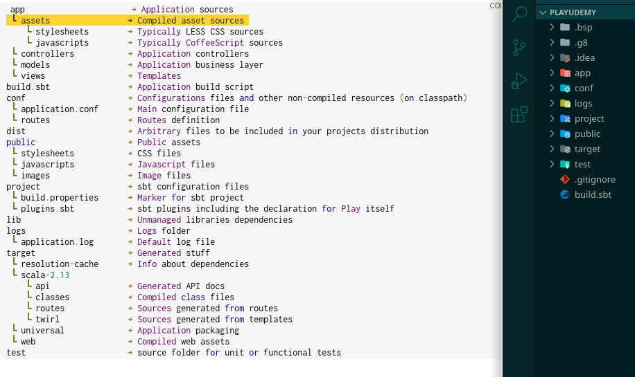

# Play Framework

## Activar el debug

1. Debemos correr `sbt -jvm-debug 9999 run` y posteriormente ir a `Add Configuration` -> `+` -> `Remote JVM Debug` -> Mismo puerto que el que pasamos en este caso 9999

    Ya podemos usar el debugger y lo ideal es crear un script para correr el debug, no olvidar darle execution rights `chmod +x filename`

    ```s
    #!/bin/sh
    sbt -jvm-debug 9999 run
    ```

2. SBT Basic Knowledge

  Existen 3 archivos básicos del SBT que hay que conocer

  1. `build.sbt` -> root del proyecto
  2. `project/build.properties`
  3. `project/plugins.sbt`

## The Play application layout

After the first successful compilation, the project structure looks like this

;

1. _app/ directory_

    - Contains all executable artifacts
    - Java and Scala source code, templates and compiled assets sources
    - En SISDEP agregamos `app/repository` y `app/utilities`

2. _public/ directory_

    - Resources stored here are static assets that are served directly by the web server
    - Has 3 sub-directories for images, CSS & JavaScript
    - En SISDEP aca agregamos el mapa

3. _config/ directory_

    Has all configuration files, there are 2 main configuration files:

    1. _application.conf_ is the main configuration file
    2. _routes_ routes definition file

    - Configuration specific to the app goes in _application.conf_
    - Library specific configuration, goes under the _conf_ folder

4. _lib/ directory_

    This folder is optional and has all the unmanaged library dependencies

5. _build.sbt_ -> Projects main build declarations

6. _project/ directory_ -> contains the sbt build definitions

    - _plugins.sbt_ -> defines sbt plugins used by this project
      - Tha play console and all of its development features like live reloading are implemented via an sbt plugin
      - Like the _sbt-native-packager_
    - _build.properties_ -> contains the sbt version to use to build the app

7. _target/_

    Contains everything generated by the build system, the following is generated

    1. _classes/_ -> contains all compiled classes
    2. _classes-managed/_ ->  contains only the classes managed by the framework such as the classes generated by the router or the template system
    3. _resource-managed/_ -> contains generated resources, typically compiled assets such as LESS, CSS and CoffeeScript compilation results
    4. _src-managed/_ -> Generated sources, such as the Scala sources generated by the template system
    5. _web/_ -> Assets processed by sbt-web. Like those from _app/assets_ and _public_ folders

Quick resume

- _/_ -> root folder of the app
- _/app_ -> Where the app code will be stored
- _/build.sbt_ -> sbt settings that describe building your app
- _/conf_ -> Config files for the app
- _/project_ -> Further build description information
- _/public_ -> Static, public assets storage for the app
- _/test_ -> Test code store

## sbt

sbt is a task engine, the build is represented as a tree of task dependencies that need to be executed

sbt break typical build executions up into very fine grained tasks, and any task at any point in the tree can be arbitrarily redefined in your build

sbt manage the complete development cycle of the app. sbt has an interactive mode (_shell_) or you can enter commands one at a time. The interactive mode can be faster over time

## Configuration API

Play uses the _Typesafe config library_ as the configuration library

  _Typesafe config library_ -> Configuration library for JVM languages

The configuration file of a Play application must be defined in _conf/application.conf_ and it uses the _HOCON format_

  _HOCON (Human-Optimized Config Object Notation)_ -> Primary goal is keep the semantics from JSON, but make it more convenient as a human-editable config file format

  Components:

  1. a _key_ is a string preceding a value
  2. a _value_ is a string, number, object, array or boolean following a _key_
  3. a _key-value separator_ separates keys from values and ca be either `:` or `=`
  4. a _comment_ is a prefixed with `#` or `//` typically serving to provide feedback or instructions

As well as the _application.conf_ file, configuration comes from:

1. Default settings from any _reference.conf_
   1. Most play JARs include a reference.conf with default settings, _application.conf_ will override settings in _reference.conf_

2. It's also possible to set configuration using system properties, this override _application.conf_

_NOTE:_ -> Akka will use the same config file as the one defined for your play application, meaning you can configure anything in Akka in the _application.conf_

### Extra _devSettings_

Extra settings for the `run` command on the `build.sbt`, these wont be used when deployed

`PlayKeys.devSettings += "play.server.http.port" -> "8080"`

### HTTP server settings in _application.conf_

In `run` mode the HTTP server part of Play starts before the app has been compiled -> HTTP server cannot access the _application.conf_

------------------------------------------------------------
------------------------------------------------------------

## HTTP programming

### Actions, Controllers and Results

_Actions_ most of the request received by a Play application are handled by an action

An actions is basically a Java method that processes the request parameters, and produces a result to be sent to the client

```java
public Result index(Http.Request request) {
  return ok("Got request " + request + "!");
}
```

An action returns a _play.mvc.Result_ value, representing the HTTP response to send to the web client

In the example, _ok_ constructs a 200 OK response containing a body

_Controller_ is a class that extends _play.mvc.Controller_ that groups several action methods

```java
package controllers;

import play.*;
import play.mvc.*;

public class Application extends Controller {

  public Result index() {
    return ok("It works!");
  }
}
```

The simplest syntax for defining an action is a method with no parameters that return a _Result_ value as shown above

An action method can also have parameters, this will be resolved by the _Router_ and will be filled with values from the request URL

  Parameters can be extracted from URL path o URL query string

```java
public Result index(String name) {
  return ok("Hello " + name);
}
```

_Results_ simple results has:

  1. An HTTP result with a status code
  2. A set of HTTP headers
  3. Body to be sent to the web client

These results are defined by _play.mvc.Result_.

The _play.mvc.Results_ class provides helpers to produce standard HTTP results, such as the `ok()` method

Redirecting the browser to a new URL is just another kind of simple result, these result types don't have a response body

```java
public Result index() {
  return redirect("/user/home");
}
```

------------------------------------------------------------
------------------------------------------------------------

### HTTP routing

#### The built-in HTTP router

The router is the component that translates each incoming HTTP request to an action call (a public method in a _controller_ class)

An HTTP request is seen as an event and has 2 major pieces of information

1. The request path (`/clients/154`) including the query string
2. The HTTP method (GET, POST, ...)

Las rutas son definidas en el _conf/routes_

#### Dependency Injection

Play's default routes generator creates a router class that accepts controller instances in an _@Inject_ annotated constructor

That means the class is suitable for use with dependency injection and can also be instantiated manually using the constructor

#### The routes file syntax

Lets see what a route definition looks like:

```java
GET   /clients/:id          controllers.Clients.show(id: Long)
```

Each route consist of

1. An HTTP method (GET)
2. URI pattern (/clients/:id)
3. Call to an action method (controllers.Clients.show(id: Long))
    - In the action call, the parameter type comes after the parameter name like in Scala

Es posible aplicar modificadores by preceding the route with a line starting with a `+`

This can change the behavior of certain Play components. One such modifier is the "nocsrf" modifier to bypass the CSRF filter

```java
+ nocsrf
POST  /api/new              controllers.Api.newThing()
```

#### Call to action generator method

You can pass the current request to an action method, just add it as a parameter:

```java
GET   /                     controllers.Application.dashboard(request: Request)

// In the corresponding action method:
public Result dashboard(Http.Request request) {
  return ok("Hello, your request path " + request.path());
}
```

Podemos ver un ejemplo también del backend de SISDEP

`GET           /api/seguridad/usuario/ego                               controllers.seguridad.UsuarioEgoController.get(request: Request)`

```java
@With({AuthAction.class})
public CompletionStage<Result> get(Http.Request request) {
  final UserInfoContext userInfo = request.attrs().get(AuthAction.userInfoKey);

  Future<Result> response = repository.findById(userInfo.userId).flatMap(
    dbResult -> Future.of(getHttpExecutionService(), () ->
      dbResult.fold(
        error -> notFound(Error.getError("No se halló el usuario.", error)),
        item -> ok(ItemJson.generateJson(repository.getEntityName(), item))
      )));

  return response
    .recover(ex -> {
      Logger.of("application").warn("Excepción en la consulta propio usuario. entityName: " + repository.getEntityName() + ", userInfo: " + userInfo, ex);
      return internalServerError(
        Error.getError("Error consultado", ex));
    })
    .toCompletableFuture();
}
```

_Routing priority_ If there is a conflict, the first route (in declaration order) is used

Play includes a _Default controller_ which provides a handful of useful actions that can be invoked directly from the routes file

```java
# Redirects to https://www.playframework.com/ with 303 See Other
GET   /about      controllers.Default.redirect(to = "https://www.playframework.com/")

# Responds with 404 Not Found
GET   /orders     controllers.Default.notFound

# Responds with 500 Internal Server Error
GET   /clients    controllers.Default.error

# Responds with 501 Not Implemented
GET   /posts      controllers.Default.todo

GET        /               controllers.Default.redirect(to = "/sisdep")
GET        /sisdep/        controllers.Default.redirect(to = "/sisdep")
```

------------------------------------------------------------
------------------------------------------------------------

### Manipulating results

#### Changing the default _Content-Type_

The result content type is automatically inferred

`Result textResult = ok("Hello World!");` will automatically set the _Content-Type_ header to `text/plain`

To change it you can use `as(newContentType)` method on a result

```java
Result htmlResult = ok("<h1>Hello World!</h1>").as("text/html");

// or even  better, using:

Result htmlResult = ok("<h1>Hello World!</h1>").as(MimeTypes.HTML);
```

#### Manipulating HTTP headers

Setting an HTTP header will automatically discard the previous value if it was existing in the original result

```java
public Result index() {
  return ok("<h1>Hello World!</h1>")
      .as(MimeTypes.HTML)
      .withHeader(CACHE_CONTROL, "max-age=3600")
      .withHeader(ETAG, "some-etag-calculated-value");
}
```

#### Setting and discarding cookies

Cookies are a special form of HTTP headers, you can easily add a Cookie to the HTTP response

```java
public Result index() {
  return ok("<h1>Hello World!</h1>")
      .as(MimeTypes.HTML)
      .withCookies(Cookie.builder("theme", "blue").build());
}
```

You can add more details like path, domain, expiry, etc

```java
public Result index() {
  return ok("<h1>Hello World!</h1>")
      .as(MimeTypes.HTML)
      .withCookies(
          Cookie.builder("theme", "blue")
              .withMaxAge(Duration.ofSeconds(3600))
              .withPath("/some/path")
              .withDomain(".example.com")
              .withSecure(false)
              .withHttpOnly(true)
              .withSameSite(Cookie.SameSite.STRICT)
              .build());
}
```

To discard a cookie in case you previously set a path or domain, make sure that you set the same path as the browser will only discard it if the name, path and domain match

```java
public Result index() {
  return ok("<h1>Hello World!</h1>").as(MimeTypes.HTML).discardingCookie("theme");
}
```

#### Changing the charset for text based HTTP responses

Play uses `utf-8` by default

For a text based HTTP response it is very important to handle the charset correctly

The charset is used to both convert the text response to the corresponding bytes to send over the network socket and to update the `Content-Type`
