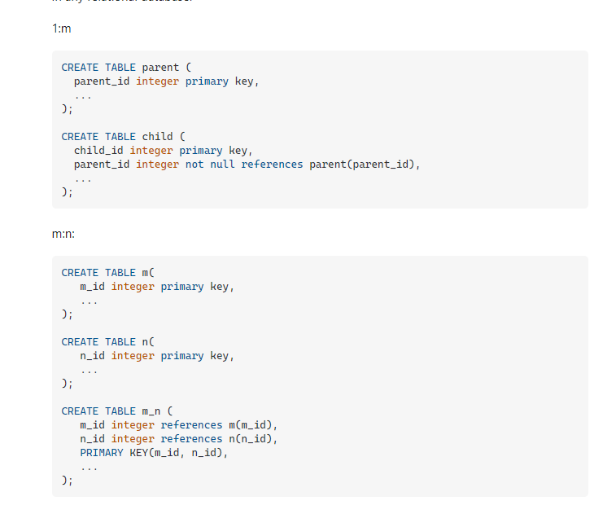

# Notes

- sudo service postgresql start
- sudo service postgresql start
- sudo service postgresql stop
- Connect to the postgres service and open the psql shell: sudo -u postgres psql
- sudo \du -> Users list
- \c -> connect to new db
- \dt list all table
- \list list dbs

- Example for CRUD POSTGRESQL [LINK](https://www.freecodecamp.org/news/fullstack-react-blog-app-with-express-and-psql/)

- Change user to superuser [LINK](https://chartio.com/resources/tutorials/how-to-change-a-user-to-superuser-in-postgresql/)

